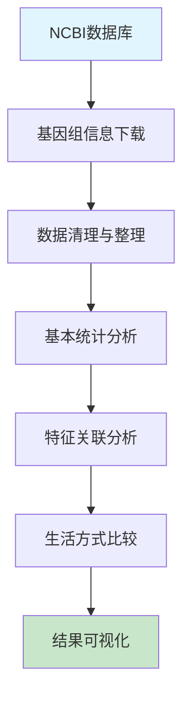

# 微生物基因组学课程 - 实践操作指南

---

# 实践操作：基因组数据库探索与特征分析

**课程**：微生物基因组学  
**第1次课实践部分**  
**时长**：2小时  
**难度**：⭐⭐⭐☆☆

---

## 📋 操作概览

### 实践目标
本次实践操作旨在让学生：
- 🎯 **掌握** NCBI基因组数据库的高效使用技巧
- 🎯 **理解** 微生物基因组的基本特征参数和生物学意义  
- 🎯 **应用** 生物信息学工具进行基因组特征统计分析
- 🎯 **分析** 不同生活方式微生物基因组特征的差异模式

### 知识前提
- ✅ 已完成第1次课理论学习
- ✅ 熟悉基本的生物信息学概念
- ✅ 具备Linux命令行基础操作能力

### 预期成果
- 📊 生成多种微生物基因组特征统计表
- 📈 完成基因组大小与GC含量关联分析
- 📝 撰写基因组特征与生活方式关系分析报告

---

## 🛠️ 环境准备

### 硬件要求
- **内存**：至少4GB RAM（推荐8GB）
- **存储**：至少5GB可用空间
- **网络**：稳定的互联网连接（用于数据库访问）
- **处理器**：多核处理器（推荐2核以上）

### 软件环境

#### 必需软件
```bash
# 核心软件列表
- Python (版本 >= 3.7)
- Biopython (版本 >= 1.78)  
- pandas (版本 >= 1.2.0)
- matplotlib (版本 >= 3.3.0)
- seaborn (版本 >= 0.11.0)
- wget 或 curl (用于数据下载)
```

#### 安装检查
```bash
# 验证软件安装
python3 --version
python3 -c "import Bio; print(Bio.__version__)"
python3 -c "import pandas; print(pandas.__version__)"
python3 -c "import matplotlib; print(matplotlib.__version__)"

# 预期输出示例
# Python 3.8.5
# 1.78
# 1.3.3
# 3.3.4
```

#### Python环境配置
```bash
# 安装必需的Python包
pip3 install biopython pandas matplotlib seaborn requests

# 或使用conda安装
conda install -c conda-forge biopython pandas matplotlib seaborn requests
```

### 数据准备

#### 创建工作目录
```bash
# 创建工作目录
mkdir -p ~/genomics_course/lesson1
cd ~/genomics_course/lesson1

# 创建子目录
mkdir -p data results figures

# 验证目录结构
tree . || ls -la
```

### 脚本文件准备

#### 脚本目录结构
```
第1次课-微生物基因组学概论与进化/
├── scripts/
│   ├── genome_analysis.py          # 基因组数据库分析
│   ├── sequence_analysis.py        # 序列特征分析
│   ├── lifestyle_analysis.py       # 生活方式关联分析
│   └── data_explorer.py           # 交互式数据探索
├── data/
├── results/
└── figures/
```

#### 脚本文件说明
| 脚本名称 | 功能描述 | 输入 | 输出 |
|----------|----------|------|------|
| genome_analysis.py | NCBI数据库信息分析和清理 | prokaryotes_summary.txt | cleaned_genome_data.csv |
| sequence_analysis.py | 基因组序列特征比较分析 | FASTA文件 | genome_comparison.csv, 比较图表 |
| lifestyle_analysis.py | 生活方式与基因组特征关联 | cleaned_genome_data.csv | lifestyle_categorized_data.csv, 分析图表 |
| data_explorer.py | 交互式数据探索工具 | cleaned_genome_data.csv | 控制台交互输出 |

**💡 重要说明**
- 所有程序代码均保存在scripts目录的独立脚本文件中
- 操作指南中只包含脚本调用命令和参数说明
- 学生可以查看和修改脚本文件进行深入学习和参数调优

#### 下载示例数据集
```bash
# 下载代表性基因组列表
wget "https://ftp.ncbi.nlm.nih.gov/genomes/GENOME_REPORTS/prokaryotes.txt" -O data/prokaryotes_summary.txt

# 下载几个代表性基因组序列（用于详细分析）
# E. coli K-12 MG1655 (自由生活)
wget "https://ftp.ncbi.nlm.nih.gov/genomes/all/GCF/000/005/825/GCF_000005825.2_ASM582v2/GCF_000005825.2_ASM582v2_genomic.fna.gz" -O data/ecoli_k12.fna.gz

# Buchnera aphidicola (专性共生)
wget "https://ftp.ncbi.nlm.nih.gov/genomes/all/GCF/000/009/605/GCF_000009605.1_ASM960v1/GCF_000009605.1_ASM960v1_genomic.fna.gz" -O data/buchnera.fna.gz

# Mycobacterium tuberculosis (病原菌)
wget "https://ftp.ncbi.nlm.nih.gov/genomes/all/GCF/000/195/955/GCF_000195955.2_ASM19595v2/GCF_000195955.2_ASM19595v2_genomic.fna.gz" -O data/mtb_h37rv.fna.gz

# 解压缩文件
gunzip data/*.gz
```

#### 数据文件说明
| 文件名 | 类型 | 大小 | 描述 |
|--------|------|------|------|
| prokaryotes_summary.txt | TSV | ~50MB | NCBI原核生物基因组汇总信息 |
| ecoli_k12.fna | FASTA | ~4.6MB | 大肠杆菌K-12完整基因组序列 |
| buchnera.fna | FASTA | ~640KB | 蚜虫共生菌基因组序列 |
| mtb_h37rv.fna | FASTA | ~4.4MB | 结核分枝杆菌标准株基因组 |

---

## 📚 背景知识回顾

### 相关理论
- **基因组大小变异**：微生物基因组大小范围从160kb到13Mb
- **GC含量**：反映基因组组成特征，与环境适应和系统发育相关
- **编码密度**：原核生物通常具有85-95%的编码区比例
- **生活方式分类**：自由生活、共生、病原等不同生态类型

### 分析流程概述


---

## 🔬 操作步骤

### 第一部分：NCBI基因组数据库探索 (40分钟)

#### 步骤1.1：数据库结构理解
```bash
# 检查原核生物汇总文件结构
head -n 5 data/prokaryotes_summary.txt

# 查看文件列数和行数
awk -F'\t' 'NR==1 {print NF " columns"}' data/prokaryotes_summary.txt
wc -l data/prokaryotes_summary.txt

# 查看列名
head -n 1 data/prokaryotes_summary.txt | tr '\t' '\n' | nl
```

**💡 操作提示**
- 注意观察文件是制表符分隔的格式
- 第一行包含列名信息
- 数据量较大，需要高效的处理方法

#### 步骤1.2：运行基因组数据分析脚本
```bash
# 运行基因组数据库分析脚本
python3 scripts/genome_analysis.py

# 检查脚本输出
ls -la results/

# 预期输出文件
# cleaned_genome_data.csv: 清理后的基因组数据
```

**🔧 脚本参数说明**
- 脚本位置：`scripts/genome_analysis.py`
- 主要功能：加载NCBI原核生物数据库信息，进行数据清理和基本统计分析
- 可调参数：可编辑脚本文件修改数据列选择和统计方法
- 输入文件：`data/prokaryotes_summary.txt`
- 输出文件：`results/cleaned_genome_data.csv`

#### 步骤1.3：运行基础数据分析
```bash
# 运行数据分析脚本
cd ~/genomics_course/lesson1
python3 scripts/genome_analysis.py

# 检查输出结果
ls -la results/
head results/cleaned_genome_data.csv
```

**📊 结果检查**
- ✅ 成功加载原核生物数据库信息
- ✅ 数据清理和格式转换完成
- ✅ 基本统计信息输出正常

---

### 第二部分：基因组序列特征分析 (50分钟)

#### 步骤2.1：运行基因组序列分析脚本
```bash
# 运行序列特征分析脚本
python3 scripts/sequence_analysis.py

# 查看生成的结果文件
ls -la results/
ls -la figures/
```

**🔧 脚本参数说明**
- 脚本位置：`scripts/sequence_analysis.py`
- 主要功能：分析代表性基因组的序列特征，进行多基因组比较
- 分析对象：E. coli K-12（自由生活）、Buchnera（专性共生）、M. tuberculosis（病原菌）
- 输出文件：
  - `results/genome_comparison.csv`：详细比较数据
  - `figures/genome_comparison.png`：比较图表

#### 步骤2.2：运行序列分析
```bash
# 运行序列分析
python3 scripts/sequence_analysis.py

# 检查生成的图表和结果
ls -la figures/
ls -la results/
```

**⏱️ 预计运行时间**：5-10分钟

**🎛️ 关键参数说明**
- 编码密度估算使用90%的经验值
- 平均基因长度假设为1kb
- GC含量计算包含所有核苷酸

#### 步骤2.3：运行生活方式关联分析脚本
```bash
# 运行生活方式关联分析脚本
python3 scripts/lifestyle_analysis.py

# 查看生成的结果
ls -la results/
ls -la figures/
```

**🔧 脚本参数说明**
- 脚本位置：`scripts/lifestyle_analysis.py`
- 主要功能：分析基因组特征与微生物生活方式的关联模式
- 分析内容：基因组大小分布、GC含量变异、生活方式分类统计
- 输出文件：
  - `results/lifestyle_categorized_data.csv`：包含生活方式分类的数据
  - `results/analysis_report.md`：详细分析报告
  - `figures/lifestyle_analysis.png`：综合分析图表（6个子图）

#### 步骤2.4：运行生活方式关联分析
```bash
# 运行生活方式分析
python3 scripts/lifestyle_analysis.py

# 查看生成的结果
ls -la results/
ls -la figures/
```

**📈 结果文件说明**
- `lifestyle_analysis.png`：包含6个子图的综合分析图表
- `analysis_report.md`：详细的分析报告
- `lifestyle_categorized_data.csv`：包含生活方式分类的数据

---

### 第三部分：结果整合与可视化 (30分钟)

#### 步骤3.1：创建综合分析报告
```bash
# 查看生成的分析报告
cat results/analysis_report.md

# 查看主要统计结果
head -20 results/lifestyle_categorized_data.csv
```

#### 步骤3.2：运行交互式数据探索工具（可选）
```bash
# 运行交互式数据探索工具（用于课堂演示或深入探索）
python3 scripts/data_explorer.py
```

**🔧 脚本参数说明**
- 脚本位置：`scripts/data_explorer.py`
- 主要功能：提供交互式界面探索基因组数据
- 功能选项：
  1. 查看数据基本信息
  2. 按分类群统计
  3. 查找特定基因组
  4. 极值分析
  5. 退出程序
- 使用场景：课堂演示、学生自主探索、数据验证

#### 步骤3.3：检查所有生成的结果
```bash
# 查看所有生成的文件
echo "=== 生成的结果文件 ==="
find results/ -name "*.csv" -o -name "*.md" | sort

echo -e "\n=== 生成的图表文件 ==="
find figures/ -name "*.png" | sort

echo -e "\n=== 使用的分析脚本 ==="
find scripts/ -name "*.py" | sort

# 查看脚本文件大小和修改时间
ls -lh scripts/
```

**📁 完整文件结构**
```
第1次课-微生物基因组学概论与进化/
├── scripts/
│   ├── genome_analysis.py          # 基因组数据库分析脚本
│   ├── sequence_analysis.py        # 序列特征分析脚本
│   ├── lifestyle_analysis.py       # 生活方式关联分析脚本
│   └── data_explorer.py           # 交互式数据探索脚本
├── data/                           # 原始数据文件
├── results/                        # 分析结果文件
└── figures/                        # 生成的图表文件
```

---

## 📊 结果解读

### 预期结果
完成所有操作后，您应该获得：

1. **基础统计结果**
   - 文件位置：`results/cleaned_genome_data.csv`
   - 关键信息：包含清理后的基因组基本信息
   - 正常范围：基因组大小0.1-15 Mb，GC含量25-75%

2. **序列比较分析**
   - 文件位置：`results/genome_comparison.csv`
   - 关键信息：三个代表性基因组的详细特征对比
   - 判断标准：共生菌基因组明显小于自由生活菌

3. **生活方式关联分析**
   - 文件位置：`results/analysis_report.md`
   - 关键信息：基因组特征与生活方式的统计关联
   - 生物学意义：揭示环境对基因组进化的塑造作用

### 结果验证
```bash
# 验证结果完整性
echo "检查结果文件..."
for file in results/cleaned_genome_data.csv results/genome_comparison.csv results/analysis_report.md; do
    if [ -f "$file" ]; then
        echo "✓ $file 存在"
        wc -l "$file"
    else
        echo "✗ $file 缺失"
    fi
done

# 检查图表文件
echo -e "\n检查图表文件..."
for file in figures/genome_comparison.png figures/lifestyle_analysis.png; do
    if [ -f "$file" ]; then
        echo "✓ $file 存在"
        ls -lh "$file"
    else
        echo "✗ $file 缺失"
    fi
done
```

### 生物学解释
- **基因组大小变异**：反映不同生活方式对基因组复杂性的需求差异
- **GC含量分布**：可能与环境适应、DNA修复机制和系统发育历史相关
- **编码密度**：原核生物保持高编码密度以提高复制效率
- **生活方式关联**：共生和寄生生活方式导致基因组缩减

---

## ❗ 常见问题与解决方案

### 问题1：数据下载失败
**症状**：wget命令报错或下载中断

**原因**：网络连接问题或NCBI服务器繁忙

**解决方案**：
```bash
# 检查网络连接
ping www.ncbi.nlm.nih.gov

# 使用备用下载方法
curl -L "https://ftp.ncbi.nlm.nih.gov/genomes/GENOME_REPORTS/prokaryotes.txt" -o data/prokaryotes_summary.txt

# 或使用浏览器手动下载后放入data目录
```

### 问题2：Python包导入错误
**症状**：ImportError: No module named 'Bio' 或类似错误

**解决方案**：
```bash
# 检查Python环境
python3 -c "import sys; print(sys.path)"

# 重新安装必需包
pip3 install --user biopython pandas matplotlib seaborn

# 或使用conda
conda install -c conda-forge biopython pandas matplotlib seaborn
```

### 问题3：内存不足
**症状**：程序运行缓慢或被系统终止

**解决方案**：
- 减少数据量：`head -10000 data/prokaryotes_summary.txt > data/prokaryotes_small.txt`
- 分批处理：修改脚本处理较小的数据子集
- 增加虚拟内存：`sudo swapon -s`

### 问题4：图表显示问题
**症状**：图表无法显示或中文乱码

**检查清单**：
- ✅ 确认matplotlib后端设置：`matplotlib.use('Agg')`
- ✅ 安装中文字体支持
- ✅ 检查显示环境（SSH连接可能需要X11转发）

---

## 🚀 扩展练习

### 基础扩展
1. **数据库比较**：比较NCBI RefSeq和GenBank数据库的基因组质量差异
2. **时间序列分析**：分析不同年份发布的基因组数量变化趋势
3. **分类群特异性**：深入分析特定细菌门（如变形菌门）的基因组特征

### 进阶挑战
1. **机器学习分类**：使用基因组特征训练模型预测微生物生活方式
2. **网络分析**：构建基于基因组相似性的微生物关系网络
3. **进化分析**：结合系统发育信息分析基因组特征的进化模式

### 创新探索
1. **多组学整合**：结合转录组或蛋白质组数据分析基因组功能
2. **环境关联**：分析环境因子（温度、pH等）与基因组特征的关系
3. **应用导向**：识别具有特定生物技术应用潜力的微生物基因组

---

## 📝 实践报告要求

### 报告结构
1. **实验目的**（200字）
   - 阐述微生物基因组多样性研究的意义
   - 说明本次实践的具体目标

2. **材料与方法**（300字）
   - 描述使用的数据库和数据集
   - 说明分析方法和软件工具
   - 列出关键参数设置

3. **结果与分析**（500字）
   - 展示基因组大小和GC含量分布特征
   - 比较不同生活方式微生物的基因组特征
   - 分析基因组特征之间的相关关系

4. **讨论与结论**（300字）
   - 讨论结果的生物学意义
   - 分析基因组特征与环境适应的关系
   - 总结微生物基因组多样性的主要特点

5. **参考文献**（至少5篇）

### 必须包含的内容
- [ ] NCBI数据库使用经验总结
- [ ] 至少3个基因组特征分析图表
- [ ] 生活方式与基因组特征关联分析
- [ ] 遇到的技术问题及解决方案
- [ ] 对微生物基因组进化的理解和思考

### 提交要求
- **格式**：PDF文件
- **命名**：`姓名_第1次课实践报告.pdf`
- **截止时间**：下次课前
- **提交方式**：课程网站或邮件提交

---

## 📚 参考资料

### 核心文献
1. Koonin, E.V. & Wolf, Y.I. Genomics of bacteria and archaea: the emerging dynamic view of the prokaryotic world. *Nucleic Acids Research*. 2008; 36(21): 6688-6719.
2. Ochman, H. et al. Lateral gene transfer and the nature of bacterial innovation. *Nature*. 2000; 405(6784): 299-304.
3. Moran, N.A. Microbial minimalism: genome reduction in bacterial pathogens. *Cell*. 2002; 108(5): 583-586.
4. Bentley, S.D. & Parkhill, J. Comparative genomic structure of prokaryotes. *Annual Review of Genetics*. 2004; 38: 771-792.
5. Fraser, C.M. et al. The minimal gene complement of Mycoplasma genitalium. *Science*. 1995; 270(5235): 397-403.

### 在线资源
- **NCBI Genome数据库**：https://www.ncbi.nlm.nih.gov/genome/
- **Biopython教程**：https://biopython.org/DIST/docs/tutorial/Tutorial.html
- **pandas数据分析**：https://pandas.pydata.org/docs/user_guide/

### 扩展阅读
- **基因组进化综述**：Treangen, T.J. & Rocha, E.P. Horizontal gene transfer in microbial ecology and evolution. *Nature Reviews Microbiology*. 2011; 9(10): 760-773.
- **共生基因组**：McCutcheon, J.P. & Moran, N.A. Extreme genome reduction in symbiotic bacteria. *Nature Reviews Microbiology*. 2012; 10(1): 13-26.
- **病原基因组**：Casadevall, A. & Pirofski, L.A. Host-pathogen interactions: redefining the basic concepts of virulence and pathogenicity. *Infection and Immunity*. 1999; 67(8): 3703-3713.

---

## 💬 讨论与反馈

### 课堂讨论点
1. 不同数据库（RefSeq vs GenBank）对分析结果的影响
2. 基因组大小与生活方式关系的例外情况
3. GC含量变异的进化和生态意义
4. 微生物基因组学在应用研究中的潜力

### 反馈收集
- 操作难度评价：⭐⭐⭐☆☆
- 时间安排合理性：⭐⭐⭐⭐☆
- 内容实用性：⭐⭐⭐⭐⭐
- 改进建议：欢迎提出具体建议

---

## 📞 技术支持

### 紧急情况处理
如遇到无法解决的技术问题：
1. 记录完整的错误信息和操作步骤
2. 截图保存关键界面
3. 联系助教或同学寻求帮助
4. 查阅软件官方文档
5. 必要时可申请延期提交

---

**版本信息**
- 创建日期：2024年
- 最后更新：2024年
- 版本号：v1.0.0
- 更新内容：初始版本，包含完整的基因组数据库探索和特征分析流程

---

*本操作指南基于开源工具和公开数据，遵循学术共享原则*