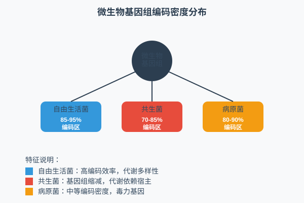
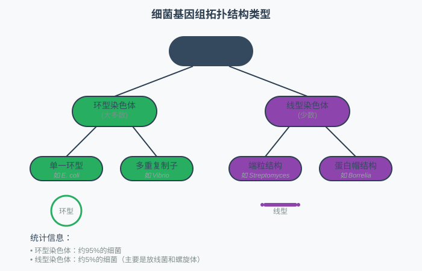
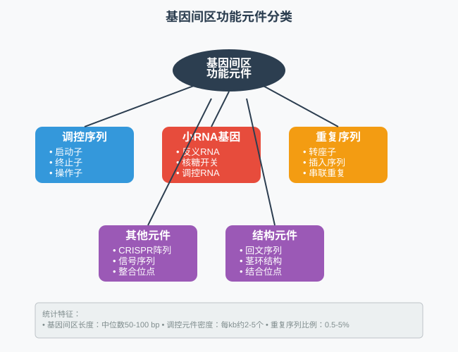
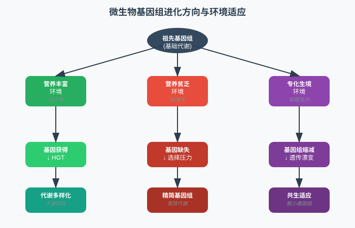
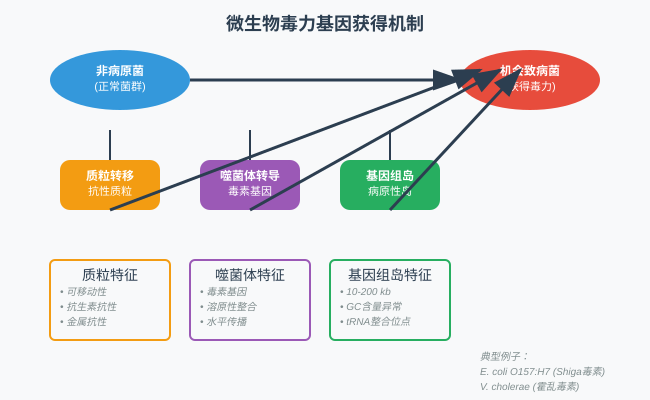

<style>
  .columns {
    display: grid;
    grid-template-columns: repeat(2, minmax(0, 1fr));
    gap: 1rem;
  }
  .small-text {
    font-size: 0.8em;
  }
  .tiny-text {
    font-size: 0.7em;
  }
  .micro-text {
    font-size: 0.6em;
  }
  .highlight {
    background-color: #fbbf24;
    color: #1f2937;
    padding: 0.2em 0.4em;
    border-radius: 0.25em;
  }
  .code-block {
    background-color: #374151;
    padding: 1em;
    border-radius: 0.5em;
    font-family: 'Courier New', monospace;
  }
  .compact {
    line-height: 1.2;
  }
  .compact h1, .compact h2, .compact h3 {
    margin: 0.5em 0;
  }
  .compact p, .compact li {
    margin: 0.3em 0;
  }
</style>


<!-- _class: lead -->
# 微生物基因组学
## 概论与进化

*王运生*  
**2025**  

---

<!-- _class: lead -->
## 📋 本次课程内容

<div class="columns">

**理论部分 (90分钟)**
- 🔬 微生物基因组多样性
- 📊 原核基因组结构特点 
- 🧬 微生物基因组进化机制
- 💡 基因组与生态适应

**互动环节 (30分钟)**
- 💭 思考讨论
- ❓ 问题解答
- 📝 知识检查

</div>

---

## 🎯 学习目标

完成本次课程后，学生应能够：

1. **理解** 微生物基因组的多样性特征和结构组织
2. **掌握** 原核基因组与真核基因组的根本差异  
3. **应用** 进化理论解释基因组结构变异现象
4. **分析** 环境因子对微生物基因组进化的影响

---

<!-- _class: lead -->
# 第一部分
## 微生物基因组多样性

---

## 📖 基因组大小的惊人变异

### 极端范围对比

- **最小基因组**：*Carsonella ruddii* (~160 kb, 182个基因)
- **最大基因组**：*Sorangium cellulosum* (~13 Mb, >9,000个基因)
- **典型范围**：大多数自由生活细菌 2-8 Mb

### 基因组大小影响因素

<div class="highlight">
生活方式是决定基因组大小的关键因素
</div>

---
<!-- fit -->

## 🔬 基因密度与编码效率

### 编码密度统计



---

### 编码效率特征

- **基因间隔区**：通常 < 100 bp
- **重叠基因**：相邻基因可重叠1-4个核苷酸
- **操纵子结构**：多基因共转录单元

---

## 📊 GC含量与系统发育


| 微生物类群 | GC含量范围 | 典型代表 |
|------------|------------|----------|
| 低GC革兰氏阳性菌 | 25-50% | *Clostridium*, *Bacillus* |
| 高GC革兰氏阳性菌 | 55-75% | *Streptomyces*, *Mycobacterium* |
| 变形菌门 | 35-70% | *E. coli*, *Pseudomonas* |
| 极端环境菌 | 30-68% | *Thermotoga*, *Deinococcus* |

### GC含量的生态意义

<div class="small-text">

*高GC含量通常与高温环境适应相关，但也受系统发育约束*

</div>

---

## ⚙️ 线型vs环型基因组结构

### 基因组拓扑结构



---

### 线型基因组特例

- **链霉菌属**：线型染色体 + 线型质粒
- **博德特氏菌**：线型染色体系统
- **进化意义**：可能与DNA修复机制相关

---

<!-- _class: lead -->
# 💭 思考时间

---

## 🤔 讨论问题

### 问题1
为什么共生细菌的基因组通常比自由生活细菌小得多？这种基因组缩减对宿主-共生体关系有什么影响？

### 问题2  
如果发现一个新的微生物基因组GC含量为65%，你能从中推断出什么信息？需要哪些额外数据来验证你的推测？

**讨论时间：5分钟**

---

<!-- _class: lead -->
# 第二部分
## 原核基因组结构特点

---

## 🧬 操纵子组织模式

### 操纵子结构优势

- **协调表达**：功能相关基因共调控
- **转录效率**：减少转录起始事件
- **进化灵活性**：整体获得或丢失

---

### 典型操纵子实例

<div class="code-block">

```
lac操纵子: P-lacI-P-lacZ-lacY-lacA
trp操纵子: P-trpE-trpD-trpC-trpB-trpA

P: 启动子区域
基因间距: 通常1-20 bp
```

</div>

### 操纵子进化动力学

- **基因顺序保守性**：功能约束维持基因排列
- **水平转移单元**：整个操纵子作为转移单位

---

## ⚙️ 基因间区域特征



---

### 基因间区长度分布

- **中位数长度**：50-100 bp
- **功能相关性**：调控复杂性影响长度
- **进化压力**：选择压力倾向于紧凑结构

---

## 📈 重复序列与转座元件

### 重复序列类型分布

**串联重复**
- rRNA操纵子：通常3-7个拷贝
- tRNA基因：40-100个拷贝
- CRISPR阵列：适应性免疫系统

---

**散在重复**
- 插入序列（IS）：0.5-5%基因组
- 转座子：完整或退化形式
- 反向重复：回文结构

### 转座元件的进化作用

<div class="highlight">
转座元件是基因组重排和基因水平转移的重要驱动力
</div>

---

## 🔗 质粒与染色体关系

### 质粒功能分类

<div class="columns">

**必需功能质粒**
- 大型线型质粒
- 携带必需基因
- 类似次级染色体

**附加功能质粒**  
- 抗性基因载体
- 代谢功能扩展
- 毒力因子携带

</div>

---

### 质粒-染色体基因交换

- **整合事件**：质粒基因整合到染色体
- **切除事件**：染色体基因转移到质粒
- **进化意义**：基因组灵活性和适应性

---

<!-- _class: lead -->
# 第三部分
## 微生物基因组进化机制

---

## 🚀 水平基因转移（HGT）

### HGT的三种机制

- **转化（Transformation）**
  - 自然感受态细胞
  - 外源DNA直接摄取
  - 同源重组整合

---

- **转导（Transduction）**
  - 噬菌体介导转移
  - 广义转导vs专一转导
  - 跨种属基因转移

---

- **接合（Conjugation）**
  - 质粒介导转移
  - 直接细胞接触
  - 可移动遗传元件

---

### HGT检测方法

<div class="highlight">
异常GC含量、密码子使用偏好性、系统发育不一致性
</div>

---

## 🔄 基因缺失与获得

### 基因组进化方向



---

### 基因缺失的分子机制

- **同源重组**：重复序列介导的缺失
- **滑动复制**：复制滑动导致缺失
- **转座介导**：转座子插入破坏基因

---

## ⚙️ 基因组重排机制

### 重排类型与机制

**大片段重排**
- 倒位：回文重复介导
- 易位：非同源重组
- 重复：不等交换

---

**小片段重排**
- 基因内重排
- 调控区域变异
- 启动子替换

---

### 重排的功能后果

- **基因表达调控**：启动子-基因关联改变
- **操纵子结构**：基因顺序重组
- **适应性进化**：新功能组合产生

---

## 🌟 生活方式与基因组进化

### 生活方式对基因组的塑造

<div class="columns">

**自由生活**
- 大基因组
- 代谢多样性
- 环境感应系统

**专性共生**  
- 基因组缩减
- 代谢依赖性
- 宿主特异性

</div>

---

### 基因组缩减的进化过程

1. **初期**：非必需基因积累突变
2. **中期**：假基因形成和缺失
3. **后期**：基因组结构重组
4. **稳定期**：最小基因集维持

---

<!-- _class: lead -->
# ❓ 知识检查

---

## 📝 快速测验

### 选择题

**1. 以下哪种微生物最可能具有最小的基因组？**
A) 土壤中的自由生活细菌  
B) 昆虫细胞内的共生细菌  
C) 海洋中的浮游细菌  
D) 极端环境中的古菌

### 简答题

**2. 请简述水平基因转移对微生物基因组进化的重要意义，并举例说明**


---

<!-- _class: lead -->
# 第四部分
## 基因组与生态适应

---

## 🌡️ 极端环境与基因组特征

### 高温适应机制

- **蛋白质稳定性**
  - 氨基酸组成偏好
  - 二硫键增加
  - 疏水相互作用增强

---

- **DNA稳定性**
  - 高GC含量（部分物种）
  - DNA结合蛋白
  - 修复系统增强

---

- **膜系统适应**
  - 脂肪酸组成变化
  - 膜蛋白结构优化
  - 渗透压调节

---

### 极端环境基因组案例

<div class="highlight">
*Pyrococcus furiosus*: 超嗜热古菌，生长温度100°C
</div>

---

## 🤝 共生关系与基因组缩减

### 共生类型与基因组特征

| 共生类型 | 基因组大小 | 主要特征 | 典型例子 |
|----------|------------|----------|----------|
| 兼性共生 | 2-6 Mb | 保持独立生存能力 | *Rhizobium* |
| 专性共生 | 0.5-2 Mb | 代谢依赖宿主 | *Buchnera* |
| 极端缩减 | 0.1-0.5 Mb | 最小基因集 | *Carsonella* |

---

### 基因组缩减的代价与收益

**代价**
- 代谢能力丧失
- 环境适应性降低
- 遗传多样性减少

**收益**
- 复制成本降低
- 宿主资源获得
- 生态位专化

---

## 🦠 病原性与毒力基因进化

### 毒力基因获得机制



---

### 病原性岛特征

- **大小**：通常10-200 kb
- **GC含量**：与宿主基因组差异显著
- **整合位点**：tRNA基因附近
- **可移动性**：携带整合酶和切除酶

---

## 🔄 代谢网络与环境适应

### 代谢灵活性策略

**代谢多样性**
- 多种碳源利用
- 替代代谢途径
- 应激响应系统

---

**代谢专化**
- 特定底物高效利用
- 代谢途径优化
- 竞争优势获得

---

### 环境驱动的基因组进化

- **营养限制**：代谢基因扩增或缺失
- **毒性环境**：解毒基因获得
- **竞争压力**：抗菌化合物产生
- **物理胁迫**：保护机制增强

---

<!-- _class: lead -->
# 📚 课程总结

---

## 🎯 关键要点回顾

### 核心概念

1. **基因组多样性** - 大小、结构、组成的巨大变异
2. **结构特征** - 操纵子、紧凑性、重复序列组织  
3. **进化机制** - HGT、重排、缺失获得的动态过程
4. **生态适应** - 环境塑造基因组结构和功能

---

### 技术方法

- 基因组比较分析：识别进化模式
- 系统发育分析：追踪进化历史
- 功能注释：理解适应机制

---

## 🔄 知识体系连接

### 与前序课程的联系

- 建立在分子生物学和微生物学基础上
- 深化了对基因表达调控的理解
- 整合了进化生物学理论

---

### 为后续课程的准备

- 为基因组组装和注释奠定理论基础
- 提供比较基因组学分析的生物学背景
- 支撑代谢网络重建的进化视角

---

## 📖 扩展阅读

### 必读文献

1. Koonin, E.V. & Wolf, Y.I. Genomics of bacteria and archaea: the emerging dynamic view of the prokaryotic world. *Nucleic Acids Research*. 2008
2. Ochman, H. et al. Lateral gene transfer and the nature of bacterial innovation. *Nature*. 2000

---

### 推荐资源

- **在线资源**：NCBI Genome数据库和分析工具
- **软件工具**：Artemis基因组浏览器，MAUVE比较分析
- **数据集**：RefSeq代表性微生物基因组集合

---

<!-- _class: lead -->
# 🔜 下次课预告

---

## 📅 第2次课：基因组组装策略与评估

### 主要内容

- **理论部分**：微生物基因组组装的特殊挑战和策略选择
- **实践部分**：SPAdes组装优化和质量评估实战

### 预习要求

- 阅读：高通量测序技术原理复习
- 准备：安装SPAdes和相关质量评估工具
- 下载：示例测序数据集

---

## 📝 课后作业

### 必做作业

1. **概念梳理**：绘制微生物基因组进化机制的概念图

2. **深入探索**：选择一个极端环境微生物，调研其基因组适应特征
32. **数据探索**：浏览NCBI Genome数据库，比较不同生活方式微生物的基因组特征

**提交截止时间：下次课前**

---

<!-- _class: lead -->
# 💬 讨论与答疑

---

## ❓ 问题讨论

### 开放性问题

- 对微生物基因组的多样性有什么新的认识？
- 哪些进化机制最让你感到意外？
- 如何将基因组特征与生态功能联系起来？

---

### 交流

- 分享你了解的有趣微生物基因组案例
- 讨论基因组进化研究的技术挑战
- 探讨基因组学在应用研究中的潜力

**答疑时间：15分钟**
