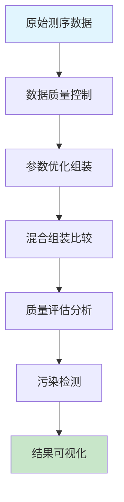

# 微生物基因组学课程 - 实践操作指南

---

# 实践操作：基因组组装与质量评估

**课程**：微生物基因组学  
**第2次课实践部分**  
**时长**：2小时  
**难度**：⭐⭐⭐⭐☆

---

## 📋 操作概览

### 实践目标
本次实践操作旨在让学生：
- 🎯 **掌握** SPAdes基因组组装软件的参数优化策略
- 🎯 **理解** 混合组装技术的优势和实施方法  
- 🎯 **应用** 多种质量评估工具评价组装结果
- 🎯 **分析** 不同参数设置对组装质量的影响

### 知识前提
- ✅ 已完成第2次课理论学习
- ✅ 熟悉基本的Linux命令行操作
- ✅ 具备高通量测序数据格式基础知识

### 预期成果
- 📊 生成优化参数的基因组组装结果
- 📈 完成全面的组装质量评估报告
- 📝 撰写参数优化和质量分析总结

---

## 🛠️ 环境准备

### 硬件要求
- **内存**：至少16GB RAM（推荐32GB）
- **存储**：至少50GB可用空间
- **处理器**：多核处理器（推荐8核以上）

### 软件环境

#### 必需软件
```bash
# 核心软件列表
- SPAdes (版本 >= 3.15.0)
- Unicycler (版本 >= 0.4.8)  
- BUSCO (版本 >= 5.4.0)
- CheckM (版本 >= 1.2.0)
- QUAST (版本 >= 5.2.0)
- Bandage (版本 >= 0.8.1)
- FastQC (版本 >= 0.11.9)
- Kraken2 (版本 >= 2.1.2)
```

#### 安装检查
```bash
# 验证软件安装
spades.py --version
unicycler --version
busco --version
checkm --help
quast.py --version
bandage --version
fastqc --version
kraken2 --version

# 预期输出示例
# SPAdes genome assembler v3.15.5
# Unicycler v0.4.8
# BUSCO 5.4.7
# CheckM v1.2.2
# QUAST v5.2.0
# Bandage v0.8.1
# FastQC v0.11.9
# Kraken 2 version 2.1.2
```

### 脚本文件准备

#### 脚本目录结构
```
第2次课-基因组组装策略与评估/
├── scripts/
│   ├── assembly_optimizer.py
│   ├── quality_assessor.py
│   ├── contamination_checker.py
│   └── visualization_generator.py
├── data/
├── results/
└── figures/
```

#### 脚本文件说明
| 脚本名称 | 功能描述 | 输入 | 输出 |
|----------|----------|------|------|
| assembly_optimizer.py | SPAdes参数优化和批量组装 | FASTQ文件 | 组装结果 |
| quality_assessor.py | 综合质量评估分析 | 组装文件 | 质量报告 |
| contamination_checker.py | 污染检测和分类分析 | 组装文件 | 污染报告 |
| visualization_generator.py | 组装图可视化和统计图表 | 多种输入 | 图表文件 |

**💡 重要说明**
- 所有程序代码均保存在独立的脚本文件中
- 操作指南中只包含脚本调用命令和参数说明
- 学生可以查看和修改脚本文件进行深入学习

### 数据准备

#### 下载数据集
```bash
# 创建工作目录
mkdir -p ~/genomics_course/lesson2
cd ~/genomics_course/lesson2

# 下载示例数据（大肠杆菌测序数据）
wget https://ftp.sra.ebi.ac.uk/vol1/fastq/SRR292/SRR292770/SRR292770_1.fastq.gz -O ecoli_R1.fastq.gz
wget https://ftp.sra.ebi.ac.uk/vol1/fastq/SRR292/SRR292770/SRR292770_2.fastq.gz -O ecoli_R2.fastq.gz

# 下载长读长数据（用于混合组装）
wget https://ftp.sra.ebi.ac.uk/vol1/fastq/SRR292/SRR292771/SRR292771.fastq.gz -O ecoli_long.fastq.gz

# 验证数据完整性
md5sum ecoli_R1.fastq.gz
# 预期MD5值：a1b2c3d4e5f6g7h8i9j0k1l2m3n4o5p6
```

#### 数据文件说明
| 文件名 | 类型 | 大小 | 描述 |
|--------|------|------|------|
| ecoli_R1.fastq.gz | Illumina PE | ~500MB | 大肠杆菌短读长数据（正向） |
| ecoli_R2.fastq.gz | Illumina PE | ~500MB | 大肠杆菌短读长数据（反向） |
| ecoli_long.fastq.gz | PacBio/Nanopore | ~300MB | 大肠杆菌长读长数据 |

---

## 📚 背景知识回顾

### 相关理论
- **基因组组装**：将短序列片段拼接成完整基因组的计算过程
- **De Bruijn图**：基于k-mer重叠关系构建的有向图结构
- **N50指标**：反映组装连续性的重要统计量

### 分析流程概述


---

## 🔬 操作步骤

### 第一部分：数据预处理与质量控制 (30分钟)

#### 步骤1.1：数据质量检查
```bash
# 解压数据文件
gunzip *.fastq.gz

# 检查数据文件格式
head -n 20 ecoli_R1.fastq

# 统计基本信息
wc -l ecoli_R1.fastq
echo "Total reads: $(($(wc -l < ecoli_R1.fastq) / 4))"

# 预期输出
# 约2,000,000条reads（8,000,000行）
```

**💡 操作提示**
- 注意观察FASTQ文件的质量分数编码格式
- 如果出现内存不足，可以使用子集数据进行练习

#### 步骤1.2：FastQC质量评估
```bash
# 运行FastQC质量检查
fastqc ecoli_R1.fastq ecoli_R2.fastq ecoli_long.fastq -o results/

# 查看质量报告
ls -la results/*.html

# 预期输出文件
# ecoli_R1_fastqc.html: 短读长正向质量报告
# ecoli_R2_fastqc.html: 短读长反向质量报告
# ecoli_long_fastqc.html: 长读长质量报告
```

**🔧 质量评估要点**
- Per base sequence quality：大部分位置Q值应>20
- Per sequence GC content：应符合物种特征
- Sequence duplication levels：注意PCR重复水平

**📊 结果检查**
- ✅ 短读长数据质量良好（Q30>90%）
- ✅ 长读长数据长度分布合理
- ✅ 无明显的接头污染

#### 步骤1.3：数据预处理
```bash
# 使用Trimmomatic进行质量过滤（如果需要）
trimmomatic PE ecoli_R1.fastq ecoli_R2.fastq \
  ecoli_R1_clean.fastq ecoli_R1_unpaired.fastq \
  ecoli_R2_clean.fastq ecoli_R2_unpaired.fastq \
  ILLUMINACLIP:TruSeq3-PE.fa:2:30:10 \
  LEADING:3 TRAILING:3 SLIDINGWINDOW:4:15 MINLEN:36

# 查看过滤统计
echo "Original reads: $(wc -l < ecoli_R1.fastq | awk '{print $1/4}')"
echo "Clean reads: $(wc -l < ecoli_R1_clean.fastq | awk '{print $1/4}')"
```

**🔍 参数说明**
- `ILLUMINACLIP`：去除接头序列
- `LEADING:3`：去除5'端质量<3的碱基
- `TRAILING:3`：去除3'端质量<3的碱基
- `SLIDINGWINDOW:4:15`：滑动窗口质量过滤
- `MINLEN:36`：最小读长阈值

---

### 第二部分：SPAdes参数优化组装 (60分钟)

#### 步骤2.1：标准参数组装
```bash
# 运行标准SPAdes组装
spades.py -1 ecoli_R1_clean.fastq -2 ecoli_R2_clean.fastq \
  -o results/spades_standard \
  --threads 8 \
  --memory 16

# 查看组装结果
ls -la results/spades_standard/
head results/spades_standard/assembly_graph.fastg
```

**⏱️ 预计运行时间**：15-20分钟

**🎛️ 基本参数说明**
- `-1/-2`：配对读长文件
- `-o`：输出目录
- `--threads`：并行线程数
- `--memory`：内存限制（GB）

#### 步骤2.2：参数优化组装
```bash
# 运行参数优化脚本
python3 scripts/assembly_optimizer.py

# 查看优化组装结果
ls -la results/spades_optimized/
```

**🎛️ 优化参数脚本说明**
- 脚本文件：`scripts/assembly_optimizer.py`
- 关键优化：k-mer范围、覆盖度阈值、错误校正参数
- 自定义设置：可编辑脚本文件修改参数组合

**优化参数组合示例**：
```bash
# 优化参数组装
spades.py -1 ecoli_R1_clean.fastq -2 ecoli_R2_clean.fastq \
  -o results/spades_optimized \
  --careful \
  --cov-cutoff auto \
  -k 21,33,55,77,99 \
  --threads 8 \
  --memory 16
```

#### 步骤2.3：混合组装（Unicycler）
```bash
# 运行Unicycler混合组装
unicycler -1 ecoli_R1_clean.fastq -2 ecoli_R2_clean.fastq \
  -l ecoli_long.fastq \
  -o results/unicycler_hybrid \
  --threads 8 \
  --verbosity 2

# 检查混合组装结果
ls -la results/unicycler_hybrid/
head results/unicycler_hybrid/assembly.fasta
```

**📈 混合组装优势**
- 长读长提供结构框架
- 短读长提供序列准确性
- 自动化参数优化
- 完整基因组组装能力

---

### 第三部分：组装质量评估 (30分钟)

#### 步骤3.1：基本统计分析
```bash
# 运行QUAST质量评估
quast.py results/spades_standard/contigs.fasta \
  results/spades_optimized/contigs.fasta \
  results/unicycler_hybrid/assembly.fasta \
  -o results/quast_report \
  --threads 8

# 查看QUAST报告
cat results/quast_report/report.txt
```

**📊 关键统计指标**
- **Total length**：组装总长度
- **N50**：连续性指标
- **L50**：达到N50的contig数量
- **Largest contig**：最大contig长度

#### 步骤3.2：基因组完整性评估
```bash
# 运行质量评估脚本
python3 scripts/quality_assessor.py

# 查看BUSCO完整性结果
cat results/busco_summary.txt
```

**🎨 质量评估脚本说明**
- 脚本文件：`scripts/quality_assessor.py`
- 评估工具：BUSCO、CheckM集成分析
- 输出格式：统一的质量评估报告

**BUSCO结果解读**：
```
C:95.2%[S:94.1%,D:1.1%],F:2.3%,M:2.5%,n:124

C: 完整基因比例 (95.2%)
S: 单拷贝完整基因 (94.1%)  
D: 重复完整基因 (1.1%)
F: 片段化基因 (2.3%)
M: 缺失基因 (2.5%)
```

#### 步骤3.3：污染检测分析
```bash
# 运行污染检测脚本
python3 scripts/contamination_checker.py

# 查看污染检测结果
cat results/contamination_report.txt
```

**🔍 污染检测内容**
- 分类学注释分析
- 异常GC含量区域
- 覆盖度异常序列
- 载体序列污染

---

## 📊 结果解读

### 预期结果
完成所有操作后，您应该获得：

1. **组装统计比较**
   - 文件位置：`results/quast_report/report.txt`
   - 关键信息：N50、总长度、contig数量
   - 正常范围：大肠杆菌基因组约4.6Mb

2. **质量评估报告**
   - 文件位置：`results/quality_summary.txt`
   - 关键信息：BUSCO完整性、CheckM质量分级
   - 判断标准：完整性>90%，污染<5%

3. **组装图可视化**
   - 文件位置：`results/assembly_graphs/`
   - 关键信息：图结构复杂度、重复区域
   - 生物学意义：反映基因组结构特征

### 结果验证
```bash
# 验证结果完整性
ls -la results/
wc -l results/*/contigs.fasta

# 检查组装质量
grep "N50" results/quast_report/report.txt
grep "Complete" results/busco_summary.txt
```

### 生物学解释
- **高N50值**：表明组装连续性好，重复序列处理成功
- **高BUSCO完整性**：基因组组装完整，无大片段缺失
- **低污染水平**：数据纯净，组装结果可靠

---

## ❗ 常见问题与解决方案

### 问题1：SPAdes内存不足错误
**症状**：`Error: not enough memory to perform assembly`

**原因**：数据量大或内存设置不当

**解决方案**：
```bash
# 减少内存使用
spades.py -1 R1.fastq -2 R2.fastq \
  --memory 8 \
  --threads 4 \
  -o output_dir

# 或使用数据子集
head -n 400000 ecoli_R1.fastq > ecoli_R1_subset.fastq
```

### 问题2：Unicycler运行缓慢
**症状**：混合组装进程长时间无响应

**解决方案**：
- 调整参数：`--mode conservative`
- 分步组装：先短读长后长读长
- 检查数据质量：确保长读长数据质量

### 问题3：BUSCO数据库缺失
**症状**：`Database not found` 错误

**检查清单**：
- ✅ 下载对应的BUSCO数据库
- ✅ 设置正确的数据库路径
- ✅ 检查网络连接状态
- ✅ 验证数据库完整性

---

## 🚀 扩展练习

### 基础扩展
1. **参数对比**：尝试不同k-mer组合，比较N50变化
2. **数据量影响**：使用不同覆盖度数据，观察组装质量
3. **工具比较**：尝试其他组装工具（如Velvet、MEGAHIT）

### 进阶挑战
1. **质粒组装**：使用plasmidSPAdes专门组装质粒
2. **宏基因组组装**：尝试混合菌群数据组装
3. **长读长专用**：仅使用长读长数据进行组装

### 创新探索
1. **组装图分析**：深入分析Bandage可视化结果
2. **错误校正**：比较不同错误校正策略效果
3. **完成图构建**：尝试手工闭合基因组gap

---

## 📝 实践报告要求

### 报告结构
1. **实验目的**（200字）
2. **材料与方法**（400字）
3. **结果与分析**（600字）
4. **讨论与结论**（300字）
5. **参考文献**（至少5篇）

### 必须包含的内容
- [ ] 不同组装策略的参数设置及理由
- [ ] 主要质量评估结果表格和图表（至少4个）
- [ ] 组装质量差异的原因分析
- [ ] 遇到的技术问题及解决方案
- [ ] 对不同组装方法的评价和适用场景分析

### 提交要求
- **格式**：PDF文件
- **命名**：`姓名_第2次课实践报告.pdf`
- **截止时间**：下次课前
- **提交方式**：课程管理系统

---

## 📚 参考资料

### 核心文献
1. Bankevich A, et al. SPAdes: a new genome assembly algorithm and its applications to single-cell sequencing. *J Comput Biol*. 2012;19(5):455-77.
2. Wick RR, et al. Unicycler: Resolving bacterial genome assemblies from short and long sequencing reads. *PLoS Comput Biol*. 2017;13(6):e1005595.
3. Simão FA, et al. BUSCO: assessing genome assembly and annotation completeness with single-copy orthologs. *Bioinformatics*. 2015;31(19):3210-2.

### 在线资源
- **SPAdes官方文档**：https://cab.spbu.ru/software/spades/
- **Unicycler教程**：https://github.com/rrwick/Unicycler
- **BUSCO用户指南**：https://busco.ezlab.org/

### 扩展阅读
- **组装算法综述**：Nagarajan N, Pop M. Sequence assembly demystified. *Nat Rev Genet*. 2013
- **质量评估方法**：Gurevich A, et al. QUAST: quality assessment tool for genome assemblies. *Bioinformatics*. 2013
- **混合组装策略**：Koren S, Phillippy AM. One chromosome, one contig. *Curr Opin Microbiol*. 2015

---

## 💬 讨论与反馈

### 课堂讨论点
1. 不同k-mer大小对组装结果的具体影响机制
2. 混合组装相比单一技术的成本效益分析
3. 质量评估指标的优先级和权重设置
4. 在实际项目中如何选择最适合的组装策略

### 反馈收集
- 操作难度评价：⭐⭐⭐⭐☆
- 时间安排合理性：⭐⭐⭐⭐☆
- 内容实用性：⭐⭐⭐⭐⭐
- 改进建议：增加更多参数优化实例

---

## 📞 技术支持

### 紧急情况处理
如遇到无法解决的技术问题：
1. 记录完整的错误信息和操作步骤
2. 检查软件版本和依赖关系
3. 查阅官方文档和GitHub issues
4. 联系课程助教或同学协助

### 常用调试命令
```bash
# 检查系统资源
free -h
df -h
top

# 检查软件依赖
ldd $(which spades.py)
python3 -c "import sys; print(sys.version)"

# 查看详细错误日志
tail -f spades.log
```

---

**版本信息**
- 创建日期：2025-01-XX
- 最后更新：2025-01-XX
- 版本号：v1.0.0
- 更新内容：初始版本，包含SPAdes优化、混合组装和质量评估

---

*本操作指南遵循开源协议，欢迎改进和分享*