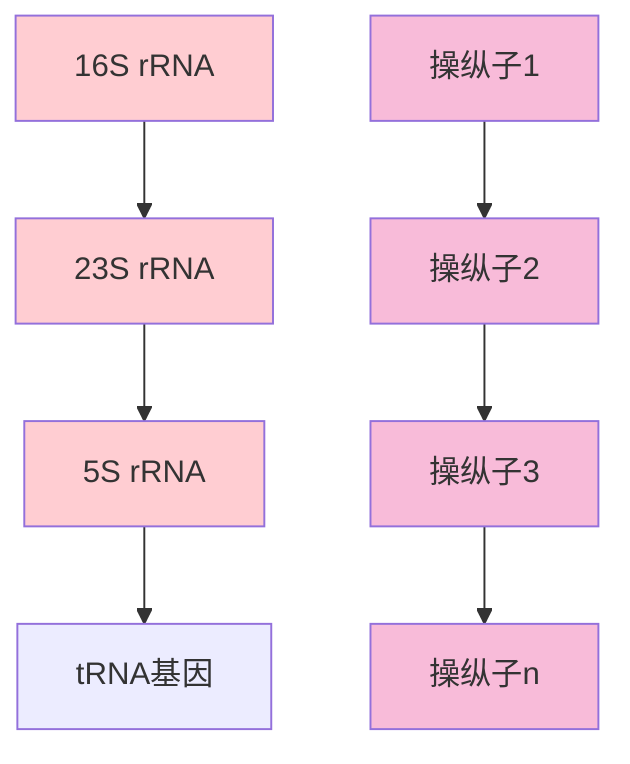
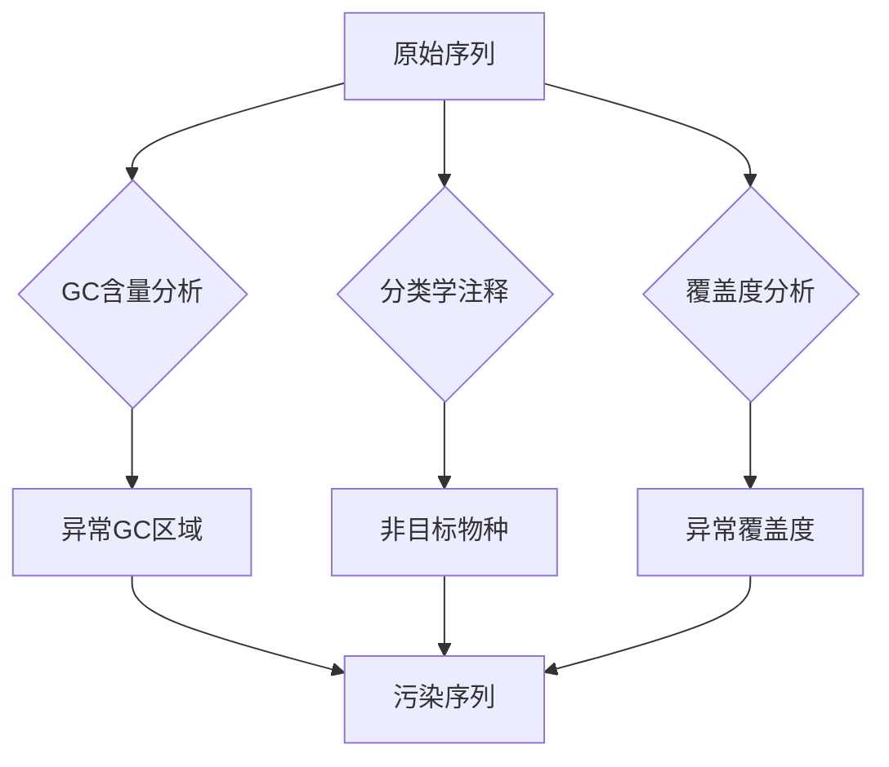
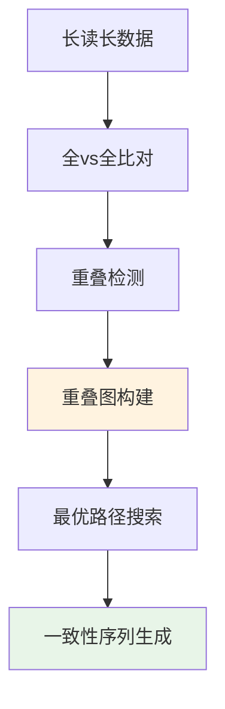
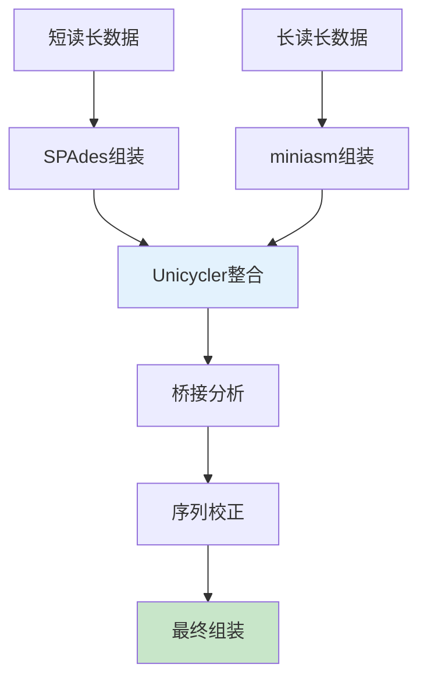
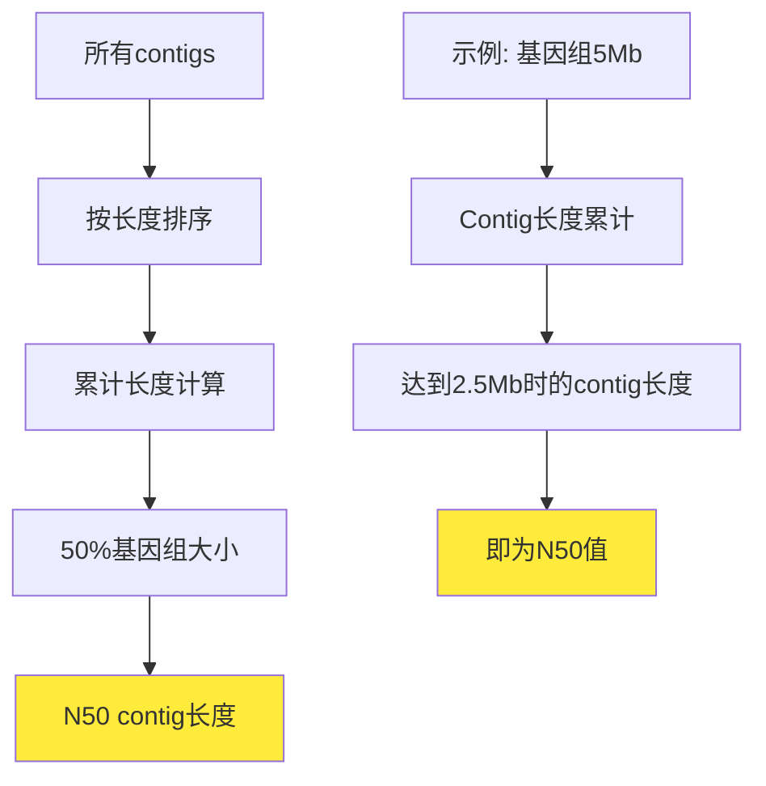
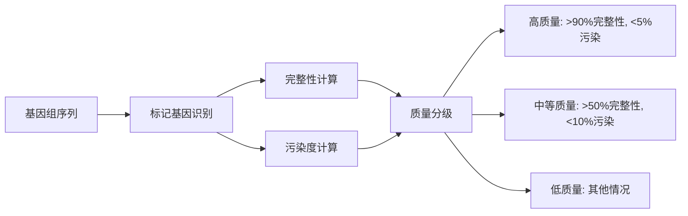
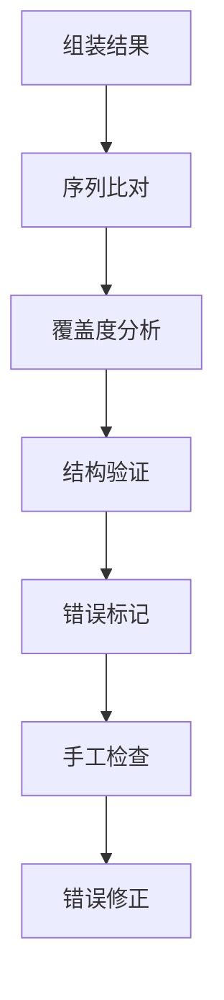
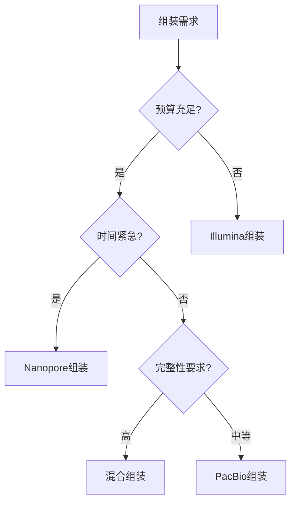

<style>
  .columns {
    display: grid;
    grid-template-columns: repeat(2, minmax(0, 1fr));
    gap: 1rem;
  }
  .small-text {
    font-size: 0.8em;
  }
  .highlight {
    background-color: #fbbf24;
    color: #1f2937;
    padding: 0.2em 0.4em;
    border-radius: 0.25em;
  }
  .code-block {
    background-color: #374151;
    padding: 1em;
    border-radius: 0.5em;
    font-family: 'Courier New', monospace;
  }
</style>

<!-- _class: lead -->
# 微生物基因组学
## 基因组组装策略与评估

*授课教师：王运生*  
*日期：2025*  


---

<!-- _class: lead -->

## 📋 本次课程内容

<div class="columns">

**理论部分 (90分钟)**
- 🧬 微生物基因组组装特殊性
- 🔧 组装策略选择与优化
- 📊 组装质量评估标准
- 💡 最佳实践与案例分析

**互动环节 (30分钟)**
- 💭 组装策略讨论
- ❓ 质量评估问题
- 📝 参数优化检查

</div>

---

## 🎯 学习目标

完成本次课程后，学生应能够：

1. **理解** 微生物基因组组装的特殊挑战和技术要求
2. **掌握** 不同组装策略的原理、优势和适用场景
3. **应用** 质量评估工具和指标来评价组装结果
4. **分析** 组装参数对结果质量的影响并进行优化

---

<!-- _class: lead -->
# 第一部分
## 微生物基因组组装特殊性

---

## 🧬 微生物基因组结构特点

### 基因组组织特征

- **紧凑的基因组结构**：基因密度高（85-95%）
- **操纵子组织**：多基因共转录单元
- **重复序列分布**：rRNA操纵子、转座元件、串联重复
- **质粒与染色体**：多分子基因组系统

### 组装复杂性来源

<div class="highlight">
重复序列是微生物基因组组装的主要挑战
</div>

---

## 🔄 重复序列挑战

### rRNA操纵子问题



- **高度保守序列**：99%以上相似性
- **多拷贝存在**：通常3-7个拷贝
- **组装断点**：导致contig断裂

---

## 🧩 转座元件与重复序列

### 转座元件类型

| 元件类型 | 长度范围 | 拷贝数 | 组装影响 |
|----------|----------|--------|----------|
| IS元件 | 0.7-2.5 kb | 10-100+ | 高 |
| 转座子 | 2-40 kb | 1-20 | 中等 |
| 串联重复 | 变异 | 变异 | 高 |

### 组装策略影响

- **短读长限制**：无法跨越长重复区域
- **图结构复杂**：多路径和环路
- **错误组装风险**：重复序列错配

---

## 🦠 质粒组装困难

### 质粒特征

<div class="columns">

**结构特点**
- 环状DNA分子
- 大小变异大（1-500 kb）
- 拷贝数变异
- 重复序列丰富

**组装挑战**
- 覆盖度不均匀
- 与染色体序列混合
- 小质粒丢失风险
- 大质粒断裂问题

</div>

---

## 🔍 基因组完整性要求

### 完整性标准

- **染色体完整性**：单个环状contig
- **质粒完整性**：独立环状分子
- **基因完整性**：无基因断裂
- **功能完整性**：代谢通路完整

### 质量分级

<div class="highlight">
完成图 > 高质量草图 > 标准草图 > 片段化组装
</div>

---

## 🚨 污染序列识别

### 污染来源

- **宿主DNA污染**：培养基、载体序列
- **环境DNA污染**：土壤、水体微生物
- **试剂污染**：酶制剂、试剂盒污染
- **交叉污染**：样品间污染

### 检测方法



---

<!-- _class: lead -->
# 💭 思考时间

---

## 🤔 讨论问题

### 问题1
为什么微生物基因组的rRNA操纵子会成为组装的主要障碍？如何在实验设计阶段减少这种影响？

### 问题2  
质粒DNA的拷贝数变异如何影响测序覆盖度？这对组装策略有什么启示？

**讨论时间：5分钟**

---

<!-- _class: lead -->
# 第二部分
## 组装策略选择与优化

---

## 📏 短读长组装局限性

### Illumina测序特点

- **读长限制**：150-300 bp
- **高准确性**：错误率 < 0.1%
- **高通量**：数据产出大
- **成本效益**：相对经济

### 组装局限性

<div class="code-block">

```
重复序列长度 > 读长 → 组装断裂
|----重复区域----|
    |--read--|
        |--read--|
            无法确定连接关系
```

</div>

---

## 🔗 短读长组装算法

### 基于图的组装方法


### SPAdes算法优势

- **多k-mer策略**：自动选择最优k值
- **错误校正**：BayesHammer算法
- **重复处理**：图简化和路径解析
- **质粒检测**：plasmidSPAdes模块

---

## 📐 长读长组装优势

### PacBio/Oxford Nanopore特点

| 技术平台 | 读长范围 | 错误率 | 优势 | 劣势 |
|----------|----------|--------|------|------|
| PacBio HiFi | 10-25 kb | <0.5% | 高准确性 | 成本高 |
| PacBio CLR | 5-50 kb | 10-15% | 超长读长 | 错误率高 |
| Nanopore | 1-100+ kb | 5-15% | 实时测序 | 错误率高 |

### 组装优势

<div class="highlight">
长读长可以跨越大部分重复序列，实现完整基因组组装
</div>

---

## 🔧 长读长组装算法

### 重叠-布局-一致性（OLC）



### 主要算法

- **Canu**：适合高错误率数据
- **Flye**：基于重复图的方法
- **Hifiasm**：专为HiFi数据优化

---

## 🤝 混合组装最佳实践

### 混合组装策略

<div class="columns">

**短读长 + 长读长**
- 长读长：结构框架
- 短读长：序列校正
- 优势互补：准确性+完整性

**组装流程**
1. 长读长初步组装
2. 短读长序列校正
3. 结构验证优化
4. 质量评估确认

</div>

---

### Unicycler工作流程



---

## ⚙️ 参数优化策略

### k-mer大小选择

- **小k值**：敏感性高，特异性低
- **大k值**：特异性高，敏感性低
- **多k值策略**：SPAdes自动优化

---

### 覆盖度阈值

<div class="code-block">

```bash
# SPAdes参数示例
spades.py -1 reads_R1.fastq -2 reads_R2.fastq \
  --careful \
  --cov-cutoff auto \
  -k 21,33,55,77 \
  -o output_dir
```

</div>

---

## 🧪 单细胞基因组组装挑战

### 技术特点

- **DNA量极少**：fg级别起始量
- **扩增偏好性**：MDA扩增不均匀
- **覆盖度不均**：0-1000x变异
- **等位基因分离**：杂合位点问题

---

### 专用算法

- **SPAdes-sc**：单细胞模式
- **IDBA-UD**：不均匀覆盖度处理
- **参数调整**：降低覆盖度阈值

---

<!-- _class: lead -->
# 第三部分
## 组装质量评估标准

---

## 📊 连续性指标

### N50统计量



### 相关指标

| 指标 | 定义 | 意义 |
|------|------|------|
| N50 | 50%基因组长度对应contig大小 | 连续性 |
| L50 | 达到N50需要的contig数量 | 片段化程度 |
| N90 | 90%基因组长度对应contig大小 | 整体质量 |
| 最大contig | 最长contig长度 | 组装能力 |

---

## 🎯 基因组完整性评估

### BUSCO评估原理

<div class="columns">

**单拷贝直系同源基因**
- 在相关物种中保守
- 通常单拷贝存在
- 基因组完整性指示

---

**评估类别**
- Complete (C): 完整基因
- Fragmented (F): 片段化基因
- Missing (M): 缺失基因
- Duplicated (D): 重复基因

</div>

---

### BUSCO结果解读

<div class="code-block">

```
C:95.2%[S:94.1%,D:1.1%],F:2.3%,M:2.5%,n:124

C: 完整基因比例 (95.2%)
S: 单拷贝完整基因 (94.1%)  
D: 重复完整基因 (1.1%)
F: 片段化基因 (2.3%)
M: 缺失基因 (2.5%)
```

</div>

---

## 🔍 CheckM质量评估

### 评估维度



### 质量标准

- **高质量草图**：完整性>90%，污染<5%
- **中等质量草图**：完整性>50%，污染<10%
- **低质量草图**：不满足上述标准

---

## 🚨 污染水平检测

### 污染类型识别

<div class="columns">

**分类学污染**
- 非目标物种序列
- 宿主DNA残留
- 环境微生物污染

**技术污染**
- 载体序列残留
- 接头序列污染
- 试剂污染

</div>

### 检测工具

- **Kraken2**：快速分类学注释
- **ContEst16S**：16S rRNA污染检测
- **CheckM**：系统性污染评估

---

## ❌ 组装错误识别

### 错误类型

| 错误类型 | 描述 | 检测方法 |
|----------|------|----------|
| 错配 | 单碱基错误 | 短读长回比 |
| 插入缺失 | 小片段错误 | 覆盖度分析 |
| 结构变异 | 大片段错误 | 长读长验证 |
| 嵌合体 | 错误连接 | 配对读长分析 |

---

### 质量控制流程



---

## 📈 组装图可视化分析

### Bandage可视化

- **节点**：序列片段（contigs）
- **边**：连接关系
- **路径**：可能的基因组结构
- **复杂区域**：重复序列和分支

### 图结构解读

<div class="highlight">
理想的微生物基因组组装图应该是简单的环状结构
</div>

---

<!-- _class: lead -->
# 💭 知识检查

---

## 📝 快速测验

### 选择题

**1. 以下哪个指标最能反映基因组组装的连续性？**
A) BUSCO完整性     B) N50长度  
C) 污染水平        D) GC含量

### 简答题

**2. 请简述混合组装相比单一技术组装的主要优势**

---

<!-- _class: lead -->
# 第四部分
## 技术比较与最佳实践

---

## 🔄 组装技术比较

### 技术平台对比

| 技术组合 | 成本 | 时间 | 完整性 | 准确性 | 适用场景 |
|----------|------|------|--------|--------|----------|
| 仅Illumina | 低 | 短 | 中等 | 高 | 常规分析 |
| 仅PacBio | 高 | 中等 | 高 | 高 | 完成图 |
| 仅Nanopore | 中等 | 短 | 高 | 中等 | 快速组装 |
| 混合组装 | 中等 | 中等 | 很高 | 很高 | 高质量需求 |

---

### 选择决策树



---

## 🏆 最佳实践案例

### 案例1：病原菌完成图

**研究背景**
- 目标：获得高质量病原菌完成图
- 需求：准确的毒力基因定位

---

**技术方案**
- PacBio HiFi + Illumina混合组装
- Unicycler自动化流程
- 手工验证和修正

**结果评估**
- 单个环状染色体 + 2个质粒
- BUSCO: 99.2%完整性
- 无组装错误

---

## 📊 参数优化实例

### SPAdes参数调优

<div class="code-block">

```bash
# 标准参数
spades.py -1 R1.fastq -2 R2.fastq -o standard

# 优化参数
spades.py -1 R1.fastq -2 R2.fastq \
  --careful \                    # 错误校正
  --cov-cutoff auto \           # 自动覆盖度阈值
  -k 21,33,55,77,99 \          # 多k-mer策略
  --plasmid \                   # 质粒检测
  -m 64 \                       # 内存限制
  -t 16 \                       # 线程数
  -o optimized
```

</div>

### 参数影响分析

- **k-mer范围**：影响组装连续性
- **覆盖度阈值**：影响错误校正效果
- **内存设置**：影响处理速度

---

## 🔧 质量改进策略

### 组装后优化

<div class="columns">

**序列校正**
- Pilon短读长校正
- Racon长读长校正
- 多轮迭代校正

**结构验证**
- 光学图谱验证
- Hi-C染色体构象
- 长读长跨越验证

</div>

### 手工检查要点

1. **rRNA操纵子区域**：检查拷贝数和完整性
2. **质粒序列**：确认环状结构
3. **重复区域**：验证组装正确性
4. **基因边界**：检查基因完整性

---

## 🚀 新兴技术趋势

### 超长读长技术

- **PromethION**：超高通量Nanopore
- **PacBio Revio**：新一代HiFi技术
- **读长延伸**：>100kb常规读长

---

### 组装算法发展

- **图神经网络**：AI辅助组装
- **云计算平台**：大规模并行处理
- **实时组装**：边测序边组装

### 质量评估进展

<div class="highlight">
多维度质量评估：序列质量 + 结构质量 + 功能完整性
</div>

---

## 💡 实际应用建议

### 项目规划建议

1. **明确目标**：完成图 vs 高质量草图
2. **预算评估**：技术选择和成本控制
3. **时间安排**：测序周期和分析时间
4. **质量标准**：设定合理的质量阈值

---

### 常见问题避免

- **过度追求N50**：忽略准确性
- **参数盲目调整**：缺乏系统性
- **质量评估不足**：仅看连续性指标
- **污染检测忽视**：影响后续分析

---

<!-- _class: lead -->
# 📚 课程总结

---

## 🎯 关键要点回顾

### 核心概念

1. **组装挑战** - 重复序列、质粒、污染是主要障碍
2. **技术选择** - 根据需求和资源选择合适的组装策略
3. **质量评估** - 多维度评估确保组装质量

---

### 技术方法

- **短读长组装**：成本低，准确性高，连续性有限
- **长读长组装**：连续性好，成本高，错误率高
- **混合组装**：优势互补，是当前最佳选择

---

## 🔄 知识体系连接

### 与前序课程的联系

- 建立在基因组结构特点基础上
- 深化了对测序技术的理解

### 为后续课程的准备

- 为基因预测和注释提供高质量序列
- 为比较基因组学提供可靠的基因组数据

---

## 📖 扩展阅读

### 必读文献

1. Koren S, Phillippy AM. One chromosome, one contig: complete microbial genomes from long-read sequencing and assembly. *Curr Opin Microbiol*. 2015
2. Wick RR, et al. Unicycler: Resolving bacterial genome assemblies from short and long sequencing reads. *PLoS Comput Biol*. 2017

---

### 推荐资源

- **软件工具**：SPAdes, Unicycler, Flye, Canu
- **质量评估**：BUSCO, CheckM, QUAST
- **可视化**：Bandage, IGV

---

<!-- _class: lead -->
# 🔜 下次课预告

---

## 📅 第3次课：基因预测与功能注释系统

### 主要内容

- **理论部分**：原核基因预测优化、特殊基因预测、自动注释流程
- **实践部分**：注释软件比较、手工修正、非编码RNA注释

### 预习要求

- 复习分子生物学中心法则
- 了解基因结构和转录调控
- 安装Prokka和相关注释软件

---

## 📝 课后作业

### 必做作业

1. **文献阅读**：阅读Unicycler论文并撰写500字总结
2. **概念梳理**：绘制基因组组装技术选择决策树

### 选做作业

1. **参数测试**：使用不同参数组装同一数据集，比较结果
2. **质量评估**：使用多种工具评估组装质量

**提交截止时间：下次课前**

---

<!-- _class: lead -->
# 💬 讨论与答疑

---

## ❓ 问题讨论

### 开放性问题

- 在实际项目中如何平衡成本和质量需求？
- 组装质量评估中哪些指标最重要？
- 如何处理复杂的重复序列区域？

---

### 交流

- 分享组装经验和遇到的问题
- 讨论不同软件的使用心得
- 探讨组装技术的发展趋势
