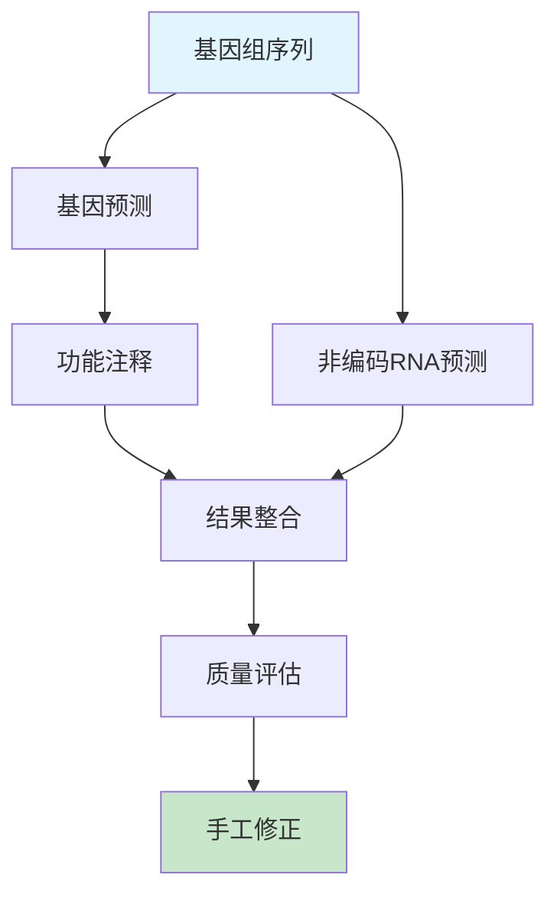

# 微生物基因组学课程 - 实践操作指南

---

# 实践操作：基因注释与非编码RNA分析

**课程**：微生物基因组学  
**第3次课实践部分**  
**时长**：2小时  
**难度**：⭐⭐⭐⭐☆

---

## 📋 操作概览

### 实践目标
本次实践操作旨在让学生：
- 🎯 **掌握** 多种基因注释工具的使用和结果比较
- 🎯 **理解** 基因预测和功能注释的质量评估方法  
- 🎯 **应用** 非编码RNA预测工具进行全面基因组注释
- 🎯 **分析** 注释结果的一致性和差异性，进行手工修正

### 知识前提
- ✅ 已完成第3次课理论学习
- ✅ 熟悉基因组组装和质量评估
- ✅ 具备Linux命令行和Python编程基础

### 预期成果
- 📊 生成多工具基因注释结果比较表
- 📈 完成非编码RNA预测和功能分类
- 📝 撰写基因注释质量评估和优化建议报告

---

## 🛠️ 环境准备

### 硬件要求
- **内存**：至少8GB RAM（推荐16GB）
- **存储**：至少15GB可用空间
- **处理器**：多核处理器（推荐4核以上）
- **网络**：稳定的互联网连接（用于数据库下载）

### 软件环境

#### 必需软件
```bash
# 核心软件列表
- Prokka (版本 >= 1.14.6)
- Prodigal (版本 >= 2.6.3)  
- tRNAscan-SE (版本 >= 2.0.9)
- RNAmmer (版本 >= 1.2)
- Infernal (版本 >= 1.1.4)
- BLAST+ (版本 >= 2.10.0)
- Python (版本 >= 3.7)
- Biopython (版本 >= 1.78)
```

#### 安装检查
```bash
# 验证软件安装
prokka --version
prodigal -v
tRNAscan-SE -h | head -5
RNAmmer -h | head -5
cmscan -h | head -5
blastp -version

# 预期输出示例
# prokka 1.14.6
# Prodigal V2.6.3
# tRNAscan-SE v.2.0.9
# RNAmmer - 1.2
# # INFERNAL 1.1.4
# blastp: 2.10.0+
```

#### 数据库准备
```bash
# 下载必要的数据库
# Prokka数据库（如果未安装）
prokka --setupdb

# Rfam数据库（用于非编码RNA预测）
mkdir -p ~/databases/rfam
cd ~/databases/rfam
wget ftp://ftp.ebi.ac.uk/pub/databases/Rfam/CURRENT/Rfam.cm.gz
gunzip Rfam.cm.gz
cmpress Rfam.cm
```

### 脚本文件准备

#### 脚本目录结构
```
第3次课-基因预测与功能注释系统/
├── scripts/
│   ├── annotation_comparison.py
│   ├── ncrna_analyzer.py
│   ├── quality_assessor.py
│   └── visualization_generator.py
├── data/
├── results/
└── figures/
```

#### 脚本文件说明
| 脚本名称 | 功能描述 | 输入 | 输出 |
|----------|----------|------|------|
| annotation_comparison.py | 比较不同注释工具结果 | GFF文件 | 比较统计表 |
| ncrna_analyzer.py | 非编码RNA分析和分类 | 基因组序列 | ncRNA注释文件 |
| quality_assessor.py | 注释质量评估 | 注释结果 | 质量报告 |
| visualization_generator.py | 生成可视化图表 | 统计数据 | 图表文件 |

### 数据准备

#### 下载示例数据
```bash
# 创建工作目录
mkdir -p ~/genomics_course/lesson3
cd ~/genomics_course/lesson3

# 下载示例基因组（大肠杆菌K-12 MG1655）
wget ftp://ftp.ncbi.nlm.nih.gov/genomes/all/GCF/000/005/825/GCF_000005825.2_ASM582v2/GCF_000005825.2_ASM582v2_genomic.fna.gz -O ecoli_genome.fna.gz
gunzip ecoli_genome.fna.gz

# 下载参考注释（用于比较）
wget ftp://ftp.ncbi.nlm.nih.gov/genomes/all/GCF/000/005/825/GCF_000005825.2_ASM582v2/GCF_000005825.2_ASM582v2_genomic.gff.gz -O ecoli_reference.gff.gz
gunzip ecoli_reference.gff.gz

# 验证数据完整性
ls -lh *.fna *.gff
wc -l ecoli_reference.gff
grep -c ">" ecoli_genome.fna
```

#### 数据文件说明
| 文件名 | 类型 | 大小 | 描述 |
|--------|------|------|------|
| ecoli_genome.fna | FASTA | ~4.6MB | 大肠杆菌基因组序列 |
| ecoli_reference.gff | GFF3 | ~2.1MB | NCBI官方注释结果 |

---

## 📚 背景知识回顾

### 相关理论
- **基因预测算法**：HMM模型、神经网络、协方差模型
- **功能注释策略**：同源性搜索、结构域预测、通路分析
- **非编码RNA类型**：tRNA、rRNA、sRNA、核糖开关

### 分析流程概述


---

## 🔬 操作步骤

### 第一部分：多工具基因注释比较 (45分钟)

#### 步骤1.1：Prokka快速注释
```bash
# 使用Prokka进行快速注释
prokka \
  --outdir prokka_results \
  --prefix ecoli_prokka \
  --genus Escherichia \
  --species coli \
  --strain K-12 \
  --gram neg \
  --cpus 4 \
  ecoli_genome.fna

# 检查Prokka输出
ls -la prokka_results/
head -20 prokka_results/ecoli_prokka.gff
```

**💡 操作提示**
- Prokka会自动进行基因预测和功能注释
- 注意观察不同类型特征的注释数量
- 如果运行时间过长，可以减少CPU核心数

#### 步骤1.2：Prodigal基因预测
```bash
# 使用Prodigal进行基因预测
prodigal \
  -i ecoli_genome.fna \
  -o prodigal_results.gff \
  -a prodigal_proteins.faa \
  -d prodigal_genes.fna \
  -f gff \
  -p single

# 检查Prodigal输出
wc -l prodigal_results.gff
grep -c "CDS" prodigal_results.gff
head -10 prodigal_proteins.faa
```

**🔧 参数说明**
- `-f gff`：输出GFF格式
- `-p single`：单个基因组模式
- `-a`：输出氨基酸序列
- `-d`：输出核苷酸序列

#### 步骤1.3：注释结果比较
```bash
# 运行注释比较脚本
python3 scripts/annotation_comparison.py

# 查看比较结果
cat results/annotation_comparison.txt
```

**📊 比较脚本功能**
- 脚本位置：`scripts/annotation_comparison.py`
- 主要功能：比较不同工具的基因预测数量和位置
- 输出文件：基因数量统计、重叠分析、差异基因列表

**📊 结果检查**
- ✅ 基因预测数量差异在合理范围内（<5%）
- ✅ 大部分基因位置重叠
- ✅ 差异基因主要为短基因或假基因

---

### 第二部分：非编码RNA预测 (45分钟)

#### 步骤2.1：tRNA基因预测
```bash
# 使用tRNAscan-SE预测tRNA
tRNAscan-SE \
  -B \
  -o trna_results.txt \
  -f trna_structure.txt \
  -m trna_stats.txt \
  ecoli_genome.fna

# 查看tRNA预测结果
cat trna_results.txt
wc -l trna_results.txt
```

**🔍 输出文件说明**
- `trna_results.txt`：tRNA基因位置和类型
- `trna_structure.txt`：tRNA二级结构预测
- `trna_stats.txt`：预测统计信息

#### 步骤2.2：rRNA基因预测
```bash
# 使用RNAmmer预测rRNA
RNAmmer \
  -S bac \
  -m lsu,ssu,tsu \
  -gff rrna_results.gff \
  -h rrna_results.hmmreport \
  ecoli_genome.fna

# 查看rRNA预测结果
cat rrna_results.gff
grep -c "rRNA" rrna_results.gff
```

**🎛️ 参数说明**
- `-S bac`：细菌模式
- `-m lsu,ssu,tsu`：预测大亚基、小亚基和5S rRNA
- `-gff`：输出GFF格式
- `-h`：输出HMM详细报告

#### 步骤2.3：小RNA预测
```bash
# 使用Infernal搜索Rfam数据库
cmscan \
  --cpu 4 \
  --tblout small_rna_results.tbl \
  --fmt 2 \
  --clanin \
  ~/databases/rfam/Rfam.cm \
  ecoli_genome.fna > small_rna_results.out

# 过滤高质量匹配
awk '$3 < 0.01' small_rna_results.tbl > small_rna_filtered.tbl

# 查看小RNA预测结果
wc -l small_rna_filtered.tbl
head -10 small_rna_filtered.tbl
```

**⏱️ 预计运行时间**：15-20分钟

#### 步骤2.4：非编码RNA分析整合
```bash
# 运行非编码RNA分析脚本
python3 scripts/ncrna_analyzer.py

# 查看整合结果
ls -la results/ncrna_*
cat results/ncrna_summary.txt
```

**🧬 分析脚本功能**
- 脚本文件：`scripts/ncrna_analyzer.py`
- 整合所有非编码RNA预测结果
- 分类统计不同类型ncRNA
- 生成基因组ncRNA分布图

---

### 第三部分：注释质量评估与优化 (30分钟)

#### 步骤3.1：注释完整性评估
```bash
# 运行质量评估脚本
python3 scripts/quality_assessor.py

# 查看质量评估报告
cat results/quality_assessment.txt
```

**📈 质量评估指标**
- **基因密度**：每kb基因数量
- **编码密度**：编码序列占基因组比例
- **功能注释覆盖率**：有功能注释的基因比例
- **假设蛋白比例**：功能未知基因比例

#### 步骤3.2：与参考注释比较
```bash
# 比较自动注释与NCBI参考注释
bedtools intersect \
  -a prokka_results/ecoli_prokka.gff \
  -b ecoli_reference.gff \
  -wo > annotation_overlap.txt

# 统计重叠情况
awk '{print $3}' annotation_overlap.txt | sort | uniq -c
```

**🔍 比较分析**
- 计算基因预测的敏感性和特异性
- 识别预测缺失的基因
- 分析功能注释的准确性

#### 步骤3.3：手工注释修正示例
```bash
# 提取功能未知的基因
grep "hypothetical protein" prokka_results/ecoli_prokka.gff > hypothetical_genes.gff

# 对选定基因进行BLAST搜索
head -5 hypothetical_genes.gff | while read line; do
  # 提取基因序列并进行BLAST搜索
  # （这里展示概念，实际操作需要更复杂的脚本）
  echo "Processing: $line"
done
```

**🔧 手工修正策略**
- 重新BLAST搜索功能未知基因
- 检查基因边界预测准确性
- 验证操纵子结构预测
- 整合实验证据和文献信息

---

## 📊 结果解读

### 预期结果
完成所有操作后，您应该获得：

1. **基因预测比较结果**
   - 文件位置：`results/annotation_comparison.txt`
   - 关键信息：不同工具预测的基因数量差异
   - 正常范围：差异应小于5%

2. **非编码RNA注释结果**
   - 文件位置：`results/ncrna_summary.txt`
   - 关键信息：tRNA (~86个)、rRNA (~7个)、sRNA (~80-100个)
   - 判断标准：数量应与已知大肠杆菌数据相符

3. **注释质量评估报告**
   - 文件位置：`results/quality_assessment.txt`
   - 关键信息：基因密度、功能覆盖率等指标
   - 生物学意义：评估注释的完整性和准确性

### 结果验证
```bash
# 验证结果完整性
ls -la results/
wc -l results/*.txt

# 检查关键统计数据
grep "Total genes" results/quality_assessment.txt
grep "tRNA count" results/ncrna_summary.txt
```

### 生物学解释
- **基因密度差异**：反映不同预测算法的敏感性
- **ncRNA分布**：揭示基因组调控复杂性
- **功能注释质量**：影响后续比较基因组学分析

---

## ❗ 常见问题与解决方案

### 问题1：Prokka运行失败
**症状**：`Can't locate Bio/SeqIO.pm in @INC`

**原因**：Perl Bio模块未正确安装

**解决方案**：
```bash
# 重新安装BioPerl
cpan Bio::SeqIO
# 或使用conda
conda install -c bioconda perl-bioperl
```

### 问题2：数据库下载失败
**症状**：Rfam数据库下载中断或损坏

**解决方案**：
```bash
# 使用镜像站点
wget http://ftp.ebi.ac.uk/pub/databases/Rfam/CURRENT/Rfam.cm.gz
# 验证文件完整性
md5sum Rfam.cm.gz
```

### 问题3：内存不足
**症状**：程序运行时出现内存错误

**解决方案**：
- 减少并行线程数：`--cpu 2`
- 分批处理大基因组
- 增加系统交换空间

---

## 🚀 扩展练习

### 基础扩展
1. **参数优化**：尝试不同的tRNAscan-SE参数，比较结果
2. **物种比较**：使用不同细菌基因组重复分析
3. **工具评估**：测试其他注释工具（如RAST、PGAP）

### 进阶挑战
1. **自定义流程**：编写完整的注释流水线脚本
2. **质量改进**：开发注释质量自动评估系统
3. **数据库更新**：使用最新的功能数据库重新注释

### 创新探索
1. **机器学习**：尝试基于机器学习的基因预测方法
2. **比较注释**：多物种基因组注释质量比较
3. **实验验证**：设计实验验证预测的非编码RNA功能

---

## 📝 实践报告要求

### 报告结构
1. **实验目的**（200字）
2. **材料与方法**（400字）
3. **结果与分析**（600字）
4. **讨论与结论**（300字）
5. **参考文献**（至少5篇）

### 必须包含的内容
- [ ] 不同注释工具结果比较表
- [ ] 非编码RNA预测统计图表
- [ ] 注释质量评估指标分析
- [ ] 手工修正案例说明
- [ ] 方法优缺点评价

### 提交要求
- **格式**：PDF文件
- **命名**：`姓名_第3次课实践报告.pdf`
- **截止时间**：下次课前

---

## 📚 参考资料

### 核心文献
1. Seemann T. Prokka: rapid prokaryotic genome annotation. *Bioinformatics*. 2014;30(14):2068-9.
2. Hyatt D, et al. Prodigal: prokaryotic gene recognition and translation initiation site identification. *BMC Bioinformatics*. 2010;11:119.
3. Lowe TM, Eddy SR. tRNAscan-SE: a program for improved detection of transfer RNA genes in genomic sequence. *Nucleic Acids Res*. 2007;25(5):955-64.

### 在线资源
- **Prokka文档**：https://github.com/tseemann/prokka
- **Rfam数据库**：http://rfam.xfam.org/
- **NCBI基因组**：https://www.ncbi.nlm.nih.gov/genome/

### 扩展阅读
- **注释质量评估**：Richardson EJ, Watson M. The automatic annotation of bacterial genomes. *Brief Bioinform*. 2013;14(1):1-12.
- **非编码RNA功能**：Storz G, et al. Regulation by small RNAs in bacteria. *Mol Cell*. 2011;43(6):880-91.

---

## 💬 讨论与反馈

### 课堂讨论点
1. 不同注释工具的优势和适用场景
2. 如何平衡注释速度和准确性
3. 非编码RNA在基因调控中的作用
4. 注释质量对下游分析的影响

### 反馈收集
- 操作难度评价：⭐⭐⭐⭐☆
- 时间安排合理性：⭐⭐⭐⭐☆
- 内容实用性：⭐⭐⭐⭐⭐
- 改进建议：[具体建议]

---

## 📞 技术支持

### 紧急情况处理
如遇到无法解决的技术问题：
1. 检查软件版本和依赖关系
2. 查看错误日志文件
3. 搜索官方文档和FAQ
4. 联系课程助教或同学讨论

---

**版本信息**
- 创建日期：2025年
- 最后更新：2025年
- 版本号：v1.0.0
- 更新内容：初始版本

---

*本操作指南遵循开源协议，欢迎改进和分享*