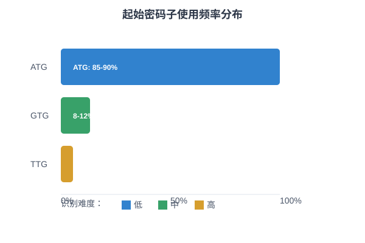
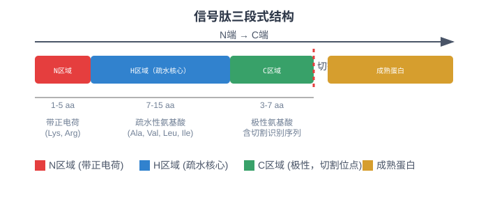
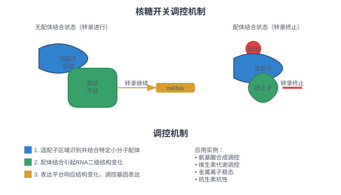
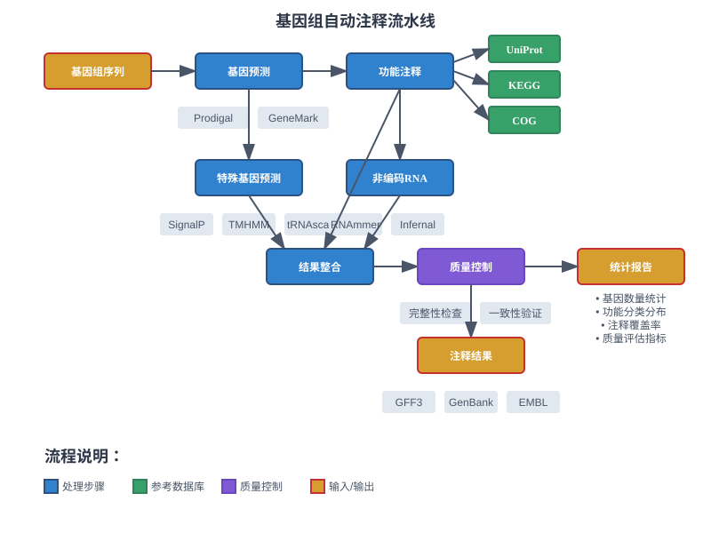

<style>
  .columns {
    display: grid;
    grid-template-columns: repeat(2, minmax(0, 1fr));
    gap: 1rem;
  }
  .small-text {
    font-size: 0.8em;
  }
  .tiny-text {
    font-size: 0.7em;
  }
  .micro-text {
    font-size: 0.6em;
  }
  .highlight {
    background-color: #fbbf24;
    color: #1f2937;
    padding: 0.2em 0.4em;
    border-radius: 0.25em;
  }
  .code-block {
    background-color: #374151;
    padding: 1em;
    border-radius: 0.5em;
    font-family: 'Courier New', monospace;
  }
  .compact {
    line-height: 1.2;
  }
  .compact h1, .compact h2, .compact h3 {
    margin: 0.5em 0;
  }
  .compact p, .compact li {
    margin: 0.3em 0;
  }
</style>

<!-- _class: lead -->
# 微生物基因组学
## 基因预测与功能注释系统

*王运生*  
**2025**  

---

<!-- _class: lead -->
## 📋 本次课程内容

<div class="columns">

**理论部分 (90分钟)**
- 🔬 原核基因预测优化
- 📊 特殊基因预测方法 
- 🧬 非编码RNA预测
- 💡 自动注释流程设计

**互动环节 (30分钟)**
- 💭 思考讨论
- ❓ 问题解答
- 📝 知识检查

</div>

---

## 🎯 学习目标

完成本次课程后，学生应能够：

1. **理解** 原核基因预测的特殊性和优化策略
2. **掌握** 特殊基因类型的预测方法和原理  
3. **应用** 非编码RNA预测工具进行基因组注释
4. **分析** 自动注释流程的设计原则和质量控制

---

<!-- _class: lead -->
# 第一部分
## 原核基因预测优化

---

## 📖 原核基因预测的特殊挑战

### 与真核基因预测的根本差异

- **无内含子结构**：连续编码序列，但存在假基因
- **操纵子组织**：多基因共转录，起始位点识别困难
- **基因密度高**：平均每1000bp含1个基因
- **重叠基因**：约15-25%基因存在重叠现象

### 预测准确性的关键因素

<div class="highlight">
起始密码子识别准确率直接影响整体注释质量
</div>

---

## 🔬 起始密码子识别优化

### 起始密码子使用频率



---

| 起始密码子 | 使用频率 | 识别难度 | 优化策略 |
|------------|----------|----------|----------|
| ATG | 85-90% | 低 | 标准识别 |
| GTG | 8-12% | 中 | 上游序列分析 |
| TTG | 2-5% | 高 | Shine-Dalgarno序列 |

### Shine-Dalgarno序列分析

- **保守序列**：AGGAGG（理想）
- **位置特征**：起始密码子上游5-9bp
- **物种差异**：不同菌株SD序列变异显著

---

## ⚙️ 开放阅读框重叠处理

### 重叠类型分析

<div class="columns">

**同向重叠**
- 下游基因起始在上游基因内部
- 通常为真实的基因重叠
- 需要精确边界确定

**反向重叠**
- 互补链基因重叠
- 可能存在调控关系
- 需要表达证据支持

</div>

---

### 重叠解析策略

1. **同源性证据**：与已知蛋白比对
2. **表达证据**：RNA-seq数据支持
3. **进化保守性**：跨物种比较分析
4. **功能域分析**：蛋白结构域完整性

---

## 📊 基因模型训练与优化

### 隐马尔可夫模型（HMM）训练

<div class="code-block">

```bash
# GeneMark-ES自训练流程
gmhmmp -m MetaGeneMark_v1.mod -A proteins.faa -D nucleotides.fna

# 参数优化
--gc-content: GC含量调整
--genetic-code: 遗传密码表选择
--motif: 启动子motif识别
```

</div>

---

### 物种特异性参数

- **GC含量偏好**：影响密码子使用偏好
- **基因长度分布**：不同功能基因长度特征
- **基因间距离**：操纵子结构特征
- **启动子序列**：转录起始信号

---

<!-- _class: lead -->
# 💭 思考时间

---

## 🤔 讨论问题

### 问题1
为什么原核生物的基因预测准确率通常高于真核生物，但在某些情况下仍然面临挑战？

### 问题2  
如何处理基因预测中的假阳性和假阴性问题？哪种错误类型对下游分析影响更大？

**讨论时间：5分钟**

---

<!-- _class: lead -->
# 第二部分
## 特殊基因预测

---

## 🧬 信号肽预测算法

### 信号肽结构特征



---

**三段式结构**
- **N区域**：带正电荷（1-5个氨基酸）
- **H区域**：疏水性核心（7-15个氨基酸）  
- **C区域**：极性区域，含切割位点

### 预测算法比较

| 算法 | 原理 | 优势 | 局限性 |
|------|------|------|--------|
| SignalP | 神经网络 | 准确率高 | 需要训练数据 |
| Phobius | HMM模型 | 区分信号肽/跨膜 | 计算复杂 |
| PrediSi | 位置权重矩阵 | 速度快 | 准确率中等 |

---

## ⚙️ 跨膜蛋白识别

### 跨膜螺旋预测

**疏水性分析方法**
- **Kyte-Doolittle量表**：经典疏水性评分
- **滑动窗口分析**：识别疏水区域
- **螺旋倾向性**：α螺旋形成概率

### TMHMM算法原理

<div class="small-text">

1. **状态定义**：膜内、膜外、跨膜区域
2. **转移概率**：状态间转换概率矩阵
3. **发射概率**：每个状态的氨基酸概率
4. **Viterbi算法**：最优路径搜索

</div>

---

## 🔬 分泌蛋白预测

### 分泌系统类型

<div class="columns">

**Sec途径**
- 信号肽依赖
- 大多数分泌蛋白
- SecA/SecYEG复合体

**Tat途径**
- 双精氨酸信号
- 折叠蛋白转运
- TatABC系统

</div>

---

### 预测流程整合

1. **信号肽检测**：SecretomeP, SignalP
2. **亚细胞定位**：PSORTb, LocateP
3. **功能验证**：GO注释, 文献证据
4. **实验验证**：蛋白质组学数据

---

## 🧪 抗菌肽基因识别

### 抗菌肽特征

**序列特征**
- 短肽序列（10-50个氨基酸）
- 阳离子性质（净正电荷）
- 两亲性结构（疏水/亲水区域）

**基因组特征**
- 前体蛋白结构
- 信号肽序列
- 成熟肽区域

---

### 预测工具应用

- **CAMP数据库**：已知抗菌肽收集
- **APD3**：抗菌肽数据库和预测
- **DBAASP**：活性数据整合
- **机器学习方法**：SVM, 随机森林

---

<!-- _class: lead -->
# 第三部分
## 非编码RNA预测

---

## 📖 tRNA基因结构与预测


---

**保守结构元件**
- **D臂**：二氢尿嘧啶修饰
- **反密码子臂**：氨基酸特异性
- **TψC臂**：假尿嘧啶修饰
- **可变环**：长度可变区域

---

### tRNAscan-SE算法

<div class="small-text">

**两步预测策略**
1. **初筛**：tRNAscan快速扫描
2. **精筛**：Cove协方差模型验证

**评分系统**
- **结构得分**：二级结构稳定性
- **序列得分**：保守位点匹配
- **综合得分**：结构+序列整合

</div>

---

## 🔬 rRNA基因识别挑战

### rRNA基因特点

**序列特征**
- **16S rRNA**：~1500bp，系统发育标记
- **23S rRNA**：~2900bp，催化活性中心
- **5S rRNA**：~120bp，结构稳定性

**预测困难**
- 序列长度变异大
- 二级结构复杂
- 假基因干扰

---

### RNAmmer预测策略

1. **HMM模型训练**：基于已知rRNA序列
2. **多物种模型**：细菌、古菌、真菌特异
3. **结构约束**：二级结构信息整合
4. **后处理过滤**：假阳性结果去除

---

## 🧬 小RNA（sRNA）预测

### sRNA功能类型

<div class="columns">

**调控sRNA**
- mRNA结合调控
- 蛋白质结合调控
- 代谢调控网络

**结构sRNA**
- tmRNA（转移-信使RNA）
- RNase P RNA
- SRP RNA

</div>

---

### 预测方法整合

**计算预测**
- **Rfam数据库**：RNA家族协方差模型
- **sRNAPredict**：机器学习方法
- **SIPHT**：sRNA预测流水线

**实验验证**
- **RNA-seq**：转录组测序
- **sRNA-seq**：小RNA特异测序
- **CLIP-seq**：RNA-蛋白相互作用

---

## ⚙️ 核糖开关识别

### 核糖开关结构



---

**功能机制**
- **适配子区域**：小分子结合
- **表达平台**：结构变化响应
- **调控效应**：转录/翻译调控

### 预测工具

- **Riboswitch Scanner**：已知motif搜索
- **RibEx**：从头预测方法
- **Infernal**：协方差模型搜索
- **RNAz**：结构保守性分析

---

<!-- _class: lead -->
# 💭 知识检查

---

<!-- _class: compact -->
## 📝 快速测验

<!-- fit -->

### 选择题

**1. 原核基因预测中最关键的序列元件是？**
A) 启动子序列  
B) Shine-Dalgarno序列  
C) 终止子序列  
D) 增强子序列

### 简答题

**2. 请简述信号肽预测的基本原理和主要挑战**

**答题时间：3分钟**

---

<!-- _class: lead -->
# 第四部分
## 自动注释流程设计

---

## 🚀 注释流水线构建

### 流程设计原则

**模块化设计**
- 独立功能模块
- 标准输入输出接口
- 错误处理机制
- 并行计算支持

**质量控制**
- 每步结果验证
- 统计信息收集
- 异常情况处理
- 结果一致性检查

### 典型流程架构



---

## 📊 数据库选择策略

### 功能注释数据库

| 数据库 | 覆盖范围 | 更新频率 | 注释质量 | 推荐用途 |
|--------|----------|----------|----------|----------|
| UniProt | 全面 | 每月 | 高 | 主要功能注释 |
| KEGG | 代谢通路 | 每季度 | 高 | 通路分析 |
| COG | 直系同源 | 年度 | 中 | 功能分类 |
| Pfam | 蛋白域 | 年度 | 高 | 结构域注释 |

---

### 数据库整合策略

<div class="small-text">

**优先级设置**
1. 实验验证 > 计算预测
2. 手工注释 > 自动注释  
3. 模式生物 > 非模式生物
4. 近期文献 > 历史文献

</div>

---

## ⚙️ 结果整合方法

### 注释冲突解决

**证据权重评估**
- **序列相似性**：E-value, 覆盖度
- **结构域证据**：Pfam, InterPro匹配
- **功能一致性**：GO术语层次
- **物种特异性**：分类学距离

---

### 置信度评分

<div class="code-block">

```python
# 注释置信度计算示例
def calculate_confidence(blast_score, domain_score, 
                        taxonomy_distance):
    weights = [0.4, 0.3, 0.3]  # 权重分配
    scores = [blast_score, domain_score, 
              1/taxonomy_distance]
    return sum(w*s for w,s in zip(weights, scores))
```

</div>

---

## 🔍 质量控制标准

### 注释完整性评估

**基本统计指标**
- 基因预测数量和密度
- 功能注释覆盖率
- 非编码RNA数量

**功能分布分析**
- COG功能分类分布
- KEGG通路完整性
- GO术语层次分布
- 必需基因检测

---

### 异常检测

<div class="highlight">
注释异常往往反映基因组组装或预测质量问题
</div>

- **基因密度异常**：可能的组装错误
- **功能缺失**：必需通路基因缺失
- **注释冲突**：同一基因多种功能
- **长度异常**：过长或过短基因

---

## 📈 注释工具比较

### 主流注释工具

<div class="columns">

**Prokka**
- 快速注释
- 标准数据库
- 易于使用
- 适合批量处理

**RAST**
- 在线平台
- 代谢重建
- 比较分析
- 社区支持

</div>

---

**PGAP (NCBI)**
- 官方标准
- 高质量注释
- 严格质控
- 计算资源需求高

### 工具选择建议

- **快速分析**：Prokka
- **高质量注释**：PGAP
- **代谢分析**：RAST
- **定制化需求**：自建流程

---

<!-- _class: lead -->
# 📚 课程总结

---

## 🎯 关键要点回顾

### 核心概念

1. **原核基因预测** - 起始密码子识别和重叠基因处理
2. **特殊基因预测** - 信号肽、跨膜蛋白和分泌蛋白识别  
3. **非编码RNA** - tRNA、rRNA和调控RNA预测方法

### 技术方法

- **HMM模型**：基因结构建模和预测
- **神经网络**：信号肽和功能预测
- **协方差模型**：RNA结构预测
- **流水线设计**：自动化注释系统

---

## 🔄 知识体系连接

### 与前序课程的联系

- 建立在基因组组装质量基础上
- 深化了对基因组结构的理解

### 为后续课程的准备

- 为比较基因组学提供注释基础
- 提供功能分析的数据支撑

---

## 📖 扩展阅读

### 必读文献

1. Hyatt D, et al. Prodigal: prokaryotic gene recognition and translation initiation site identification. *BMC Bioinformatics*. 2010
2. Seemann T. Prokka: rapid prokaryotic genome annotation. *Bioinformatics*. 2014

### 推荐资源

- **在线工具**：RAST服务器 (rast.nmpdr.org)
- **软件工具**：Prokka, tRNAscan-SE, RNAmmer
- **数据库**：UniProt, Pfam, Rfam

---

<!-- _class: lead -->
# 🔜 下次课预告

---

## 📅 第4次课：比较基因组学与泛基因组

### 主要内容

- **理论部分**：泛基因组概念、基因组可塑性分析
- **实践部分**：泛基因组构建与核心基因组系统发育

### 预习要求

- 复习：基因组注释结果格式（GFF, GenBank）
- 准备：多个相关物种基因组数据
- 安装：Roary, OrthoFinder等比较基因组学工具

---

## 📝 课后作业

### 必做作业

1. **注释比较**：使用不同工具注释同一基因组，比较结果差异
2. **流程设计**：设计一个针对特定菌群的注释流程

### 选做作业

1. **文献调研**：调研某一类特殊基因的预测方法进展
2. **工具测试**：测试新的注释工具并评估性能


---

<!-- _class: lead -->
# 💬 讨论与答疑

---

## ❓ 问题讨论

### 开放性问题

- 如何平衡注释速度和准确性？
- 人工智能在基因注释中的应用前景？
- 如何处理新发现基因的功能注释？

### 实践经验分享

- 注释流程优化经验
- 质量控制最佳实践
- 常见问题解决方案

