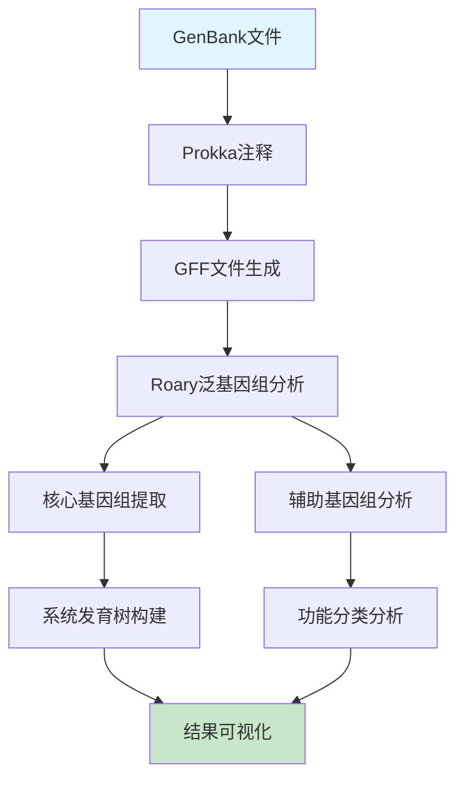

# 微生物基因组学课程 - 实践操作指南

---

# 实践操作：泛基因组构建与分析

**课程**：微生物基因组学  
**第4次课实践部分**  
**时长**：2小时  
**难度**：⭐⭐⭐☆☆

---

## 📋 操作概览

### 实践目标
本次实践操作旨在让学生：
- 🎯 **掌握** 使用Roary进行泛基因组构建的完整流程
- 🎯 **理解** 核心基因组和辅助基因组的识别与分析方法  
- 🎯 **应用** 系统发育分析方法构建核心基因组进化树
- 🎯 **分析** 可变基因组的功能分类和生物学意义

### 知识前提
- ✅ 已完成第4次课理论学习
- ✅ 熟悉基本的Linux命令行操作
- ✅ 具备基因组注释和GFF格式文件基础

### 预期成果
- 📊 生成泛基因组统计报告和可视化图表
- 📈 完成核心基因组系统发育树构建
- 📝 撰写可变基因组功能分析报告

---

## 🛠️ 环境准备

### 硬件要求
- **内存**：至少8GB RAM（推荐16GB）
- **存储**：至少15GB可用空间
- **处理器**：多核处理器（推荐4核以上）

### 软件环境

#### 必需软件
```bash
# 核心软件列表
- Roary (版本 >= 3.13.0)
- Prokka (版本 >= 1.14.6)  
- FastTree (版本 >= 2.1.11)
- R (版本 >= 4.0.0)
- Python3 (版本 >= 3.7)
```

#### 安装检查
```bash
# 验证软件安装
roary --version
prokka --version
FastTree -help | head -1
R --version
python3 --version

# 预期输出示例
# roary 3.13.0
# prokka 1.14.6
# FastTree version 2.1.11
# R version 4.0.0
# Python 3.8.0
```

### 脚本文件准备

#### 脚本目录结构
```
第4次课-比较基因组学与泛基因组/
├── scripts/
│   ├── pangenome_analysis.py
│   ├── core_phylogeny.py
│   ├── functional_analysis.py
│   └── visualization.R
├── data/
├── results/
└── figures/
```

#### 脚本文件说明
| 脚本名称 | 功能描述 | 输入 | 输出 |
|----------|----------|------|------|
| pangenome_analysis.py | 泛基因组统计分析 | Roary输出文件 | 统计报告 |
| core_phylogeny.py | 核心基因组系统发育 | 核心基因比对 | 进化树文件 |
| functional_analysis.py | 功能分类分析 | 基因注释文件 | 功能统计 |
| visualization.R | 数据可视化 | 分析结果 | 图表文件 |

**💡 重要说明**
- 所有程序代码均保存在独立的脚本文件中
- 操作指南中只包含脚本调用命令和参数说明
- 学生可以查看和修改脚本文件进行深入学习

### 数据准备

#### 下载数据集
```bash
# 创建工作目录
mkdir -p ~/genomics_course/lesson4
cd ~/genomics_course/lesson4

# 下载示例基因组数据（大肠杆菌菌株）
wget https://ftp.ncbi.nlm.nih.gov/genomes/all/GCF/000/005/825/GCF_000005825.2_ASM582v2/GCF_000005825.2_ASM582v2_genomic.gbff.gz -O ecoli_K12.gbff.gz
wget https://ftp.ncbi.nlm.nih.gov/genomes/all/GCF/000/008/865/GCF_000008865.2_ASM886v2/GCF_000008865.2_ASM886v2_genomic.gbff.gz -O ecoli_O157H7.gbff.gz
wget https://ftp.ncbi.nlm.nih.gov/genomes/all/GCF/000/010/385/GCF_000010385.1_ASM1038v1/GCF_000010385.1_ASM1038v1_genomic.gbff.gz -O ecoli_CFT073.gbff.gz

# 解压文件
gunzip *.gbff.gz

# 验证数据完整性
ls -la *.gbff
wc -l *.gbff
```

#### 数据文件说明
| 文件名 | 类型 | 大小 | 描述 |
|--------|------|------|------|
| ecoli_K12.gbff | GenBank | ~5MB | 大肠杆菌K-12实验室菌株 |
| ecoli_O157H7.gbff | GenBank | ~5.5MB | 大肠杆菌O157:H7病原菌株 |
| ecoli_CFT073.gbff | GenBank | ~5.2MB | 大肠杆菌CFT073尿路感染菌株 |

---

## 📚 背景知识回顾

### 相关理论
- **泛基因组**：一个物种中所有基因的总和，包括核心、辅助和独特基因组
- **Roary算法**：基于蛋白质序列相似性的快速泛基因组分析工具
- **核心基因组系统发育**：基于保守基因构建可靠的进化关系

### 分析流程概述


---

## 🔬 操作步骤

### 第一部分：基因组注释与预处理 (30分钟)

#### 步骤1.1：使用Prokka进行基因组注释
```bash
# 为每个基因组创建注释
prokka --outdir ecoli_K12_annotation --prefix ecoli_K12 ecoli_K12.gbff
prokka --outdir ecoli_O157H7_annotation --prefix ecoli_O157H7 ecoli_O157H7.gbff
prokka --outdir ecoli_CFT073_annotation --prefix ecoli_CFT073 ecoli_CFT073.gbff

# 检查注释结果
ls -la */
head ecoli_K12_annotation/ecoli_K12.gff

# 预期输出
# 每个目录包含.gff, .faa, .ffn等注释文件
# GFF文件包含基因位置和功能注释信息
```

**💡 操作提示**
- 注意观察Prokka的运行日志，确认基因预测数量合理
- 如果出现内存不足错误，可以添加--cpus参数限制线程数

#### 步骤1.2：准备Roary输入文件
```bash
# 收集所有GFF文件到一个目录
mkdir gff_files
cp */*.gff gff_files/

# 检查GFF文件格式
ls -la gff_files/
grep -c "CDS" gff_files/*.gff

# 预期输出文件
# ecoli_K12.gff: 约4300个CDS
# ecoli_O157H7.gff: 约5400个CDS
# ecoli_CFT073.gff: 约5300个CDS
```

**🔧 文件格式说明**
- GFF文件包含基因位置、方向和功能注释
- Roary要求GFF文件符合标准格式规范
- 可调参数：基因预测的最小长度和可信度阈值

**📊 结果检查**
- ✅ 每个基因组的基因数量在合理范围内（4000-6000个）
- ✅ GFF文件格式正确无误
- ✅ 注释质量良好（大部分基因有功能注释）

#### 步骤1.3：质量控制检查
```bash
# 运行质量检查脚本
python3 scripts/pangenome_analysis.py --mode qc --input gff_files/

# 查看质量报告
cat results/quality_report.txt
```

**🔍 质量指标**
- 基因数量分布：各菌株基因数量应在合理范围
- 注释完整性：功能注释比例应>70%
- 序列质量：无异常短序列或N含量过高

---

### 第二部分：泛基因组构建 (60分钟)

#### 步骤2.1：运行Roary泛基因组分析
```bash
# 运行Roary进行泛基因组分析
roary -p 4 -e -n -v gff_files/*.gff

# 查看运行日志（如果有）
tail -f roary.log
```

**⏱️ 预计运行时间**：15-20分钟

**🎛️ Roary参数说明**
- `-p 4`：使用4个CPU线程
- `-e`：创建多序列比对文件
- `-n`：快速核心基因组比对
- `-v`：详细输出模式

#### 步骤2.2：分析泛基因组结果
```bash
# 检查Roary输出文件
ls -la
head gene_presence_absence.csv
head summary_statistics.txt

# 运行统计分析脚本
python3 scripts/pangenome_analysis.py --mode stats --input ./

# 查看统计结果
cat results/pangenome_statistics.txt
```

**📈 主要输出文件说明**
- `gene_presence_absence.csv`：基因存在/缺失矩阵
- `summary_statistics.txt`：泛基因组统计摘要
- `core_gene_alignment.aln`：核心基因组多序列比对
- `accessory_binary_genes.fa`：辅助基因序列

#### 步骤2.3：核心基因组和辅助基因组分析
```bash
# 提取核心基因组信息
grep "99" gene_presence_absence.csv | wc -l

# 分析辅助基因组
grep -v "99" gene_presence_absence.csv | head -10

# 运行功能分析脚本
python3 scripts/functional_analysis.py --input gene_presence_absence.csv
```

---

### 第三部分：系统发育分析与可视化 (30分钟)

#### 步骤3.1：构建核心基因组系统发育树
```bash
# 使用FastTree构建进化树
FastTree -nt -gtr core_gene_alignment.aln > core_genome_tree.newick

# 检查进化树文件
cat core_genome_tree.newick
```

**📊 系统发育分析说明**
- 基于核心基因组的串联比对构建进化树
- 使用GTR+Gamma模型进行核苷酸替换
- 输出Newick格式的进化树文件

#### 步骤3.2：可变基因组功能分析
```bash
# 分析可变基因的功能分类
python3 scripts/functional_analysis.py --mode accessory --input ./

# 查看功能分类结果
cat results/accessory_functions.txt
head results/strain_specific_genes.txt
```

**🎨 功能分析内容**
- COG功能分类统计
- 菌株特异性基因识别
- 毒力因子和抗性基因注释

#### 步骤3.3：结果可视化
```bash
# 运行R可视化脚本
Rscript scripts/visualization.R

# 查看生成的图表
ls -la figures/
```

**🎨 可视化脚本说明**
- 脚本文件：`scripts/visualization.R`
- 图表类型：可在脚本中自定义图表样式和类型
- 输出格式：默认PNG格式，可修改为PDF或SVG

**🎨 可视化输出**
- `pangenome_curve.png`：展示泛基因组增长曲线
- `core_accessory_pie.png`：展示核心与辅助基因组比例
- `phylogenetic_tree.png`：展示系统发育树与基因分布热图

---

## 📊 结果解读

### 预期结果
完成所有操作后，您应该获得：

1. **泛基因组统计结果**
   - 文件位置：`summary_statistics.txt`
   - 关键信息：总基因数、核心基因数、辅助基因数
   - 正常范围：核心基因组约占40-60%

2. **系统发育关系**
   - 文件位置：`core_genome_tree.newick`
   - 关键信息：菌株间的进化距离和分支关系
   - 判断标准：分支支持值>0.7认为可靠

3. **功能分析结果**
   - 文件位置：`results/functional_analysis/`
   - 关键信息：可变基因的功能分类和生物学意义
   - 生物学意义：反映菌株间的适应性差异

### 结果验证
```bash
# 验证结果完整性
ls -la results/
wc -l gene_presence_absence.csv

# 检查分析质量
grep "Core genes" summary_statistics.txt
grep "Total genes" summary_statistics.txt
```

### 生物学解释
- **核心基因组**：反映物种的基本生物学特征和保守功能
- **辅助基因组**：体现菌株间的适应性差异和生态位特化
- **系统发育关系**：揭示菌株间的进化历史和亲缘关系

---

## ❗ 常见问题与解决方案

### 问题1：Roary运行内存不足
**症状**：程序运行中断，提示内存不足

**原因**：基因组数量过多或单个基因组过大

**解决方案**：
```bash
# 减少并行线程数
roary -p 2 -e -n -v gff_files/*.gff

# 或者分批处理较少的基因组
roary -p 4 -e -n -v gff_files/ecoli_K12.gff gff_files/ecoli_O157H7.gff
```

### 问题2：GFF文件格式错误
**症状**：Roary报告GFF文件格式不兼容

**解决方案**：
- 检查Prokka版本：`prokka --version`
- 重新运行Prokka注释：`prokka --force --outdir new_annotation genome.fasta`
- 验证GFF格式：`grep "##gff-version" *.gff`

### 问题3：系统发育树构建失败
**症状**：FastTree运行错误或输出空文件

**检查清单**：
- ✅ 核心基因组比对文件存在且非空
- ✅ 比对文件格式正确（FASTA格式）
- ✅ 序列长度一致
- ✅ FastTree软件正确安装

---

## 🚀 扩展练习

### 基础扩展
1. **参数优化**：尝试不同的Roary参数（-i身份阈值，-cd核心基因定义），比较结果差异
2. **数据比较**：添加更多大肠杆菌菌株，观察泛基因组大小变化
3. **方法对比**：使用PGAP或Panaroo重复分析，比较不同工具的结果

### 进阶挑战
1. **流程自动化**：编写shell脚本自动化从GenBank文件到最终结果的整个流程
2. **批量处理**：处理一个完整的细菌物种数据集（10-20个基因组）
3. **功能富集**：对辅助基因组进行GO或KEGG功能富集分析

### 创新探索
1. **新方法尝试**：尝试基于k-mer的泛基因组分析方法
2. **可视化改进**：创建交互式泛基因组浏览器
3. **生物学应用**：结合表型数据分析基因型-表型关联

---

## 📝 实践报告要求

### 报告结构
1. **实验目的**（200字）
2. **材料与方法**（300字）
3. **结果与分析**（500字）
4. **讨论与结论**（300字）
5. **参考文献**（至少5篇）

### 必须包含的内容
- [ ] Roary参数设置及选择理由
- [ ] 泛基因组统计结果图表（至少3个）
- [ ] 核心基因组系统发育树分析
- [ ] 辅助基因组功能分类结果
- [ ] 生物学意义讨论和方法评价

### 提交要求
- **格式**：PDF文件
- **命名**：`姓名_第4次课实践报告.pdf`
- **截止时间**：下次课前

---

## 📚 参考资料

### 核心文献
1. Page, A.J. et al. Roary: rapid large-scale prokaryote pan genome analysis. *Bioinformatics*. 2015; 31(22): 3691-3693.
2. Tettelin, H. et al. Genome analysis of multiple pathogenic isolates of Streptococcus agalactiae. *Proc Natl Acad Sci USA*. 2005; 102(39): 13950-13955.
3. Medini, D. et al. The microbial pan-genome. *Curr Opin Genet Dev*. 2005; 15(6): 589-594.

### 在线资源
- **Roary官方文档**：https://sanger-pathogens.github.io/Roary/
- **Prokka教程**：https://github.com/tseemann/prokka
- **泛基因组分析教程**：https://github.com/microgenomics/tutorials

### 扩展阅读
- **综述文章**：Vernikos, G. et al. Ten years of pan-genome analyses. *Curr Opin Microbiol*. 2015
- **方法比较**：Tonkin-Hill, G. et al. Producing polished prokaryotic pangenomes with the Panaroo pipeline. *Genome Biol*. 2020
- **应用案例**：Brockhurst, M.A. et al. The ecology and evolution of pangenomes. *Curr Biol*. 2019

---

## 💬 讨论与反馈

### 课堂讨论点
1. 不同身份阈值对泛基因组大小的影响
2. Roary与其他泛基因组分析工具的优缺点比较
3. 核心基因组系统发育的可靠性评估
4. 辅助基因组在细菌适应性进化中的作用

### 反馈收集
- 操作难度评价：⭐⭐⭐☆☆
- 时间安排合理性：⭐⭐⭐⭐☆
- 内容实用性：⭐⭐⭐⭐⭐
- 改进建议：[具体建议]

---

## 📞 技术支持

### 紧急情况处理
如遇到无法解决的技术问题：
1. 记录错误信息和操作步骤
2. 检查软件版本和依赖关系
3. 查阅Roary官方文档和GitHub issues
4. 联系老师或同学寻求帮助

---

**版本信息**
- 创建日期：2025年
- 最后更新：2025年
- 版本号：v1.0.0
- 更新内容：初始版本

---

*本操作指南遵循开源协议，欢迎改进和分享*