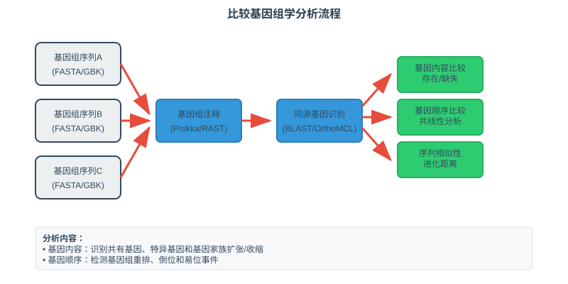
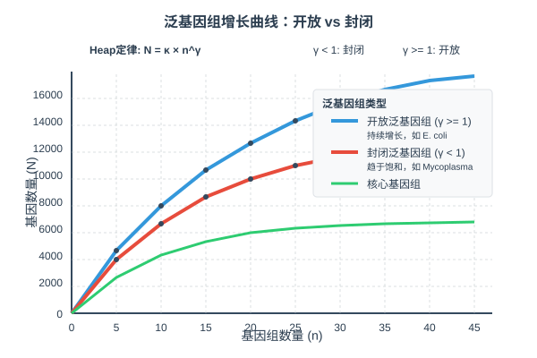
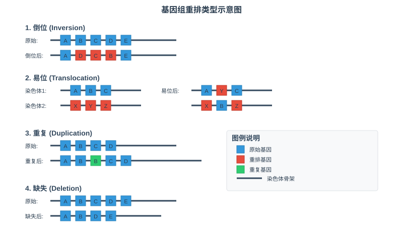
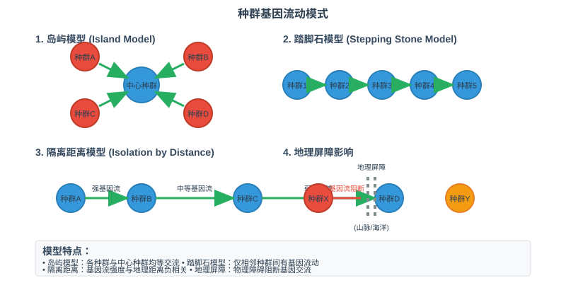
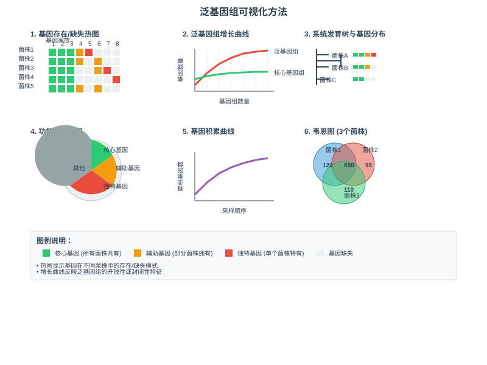

<style>
  .columns {
    display: grid;
    grid-template-columns: repeat(2, minmax(0, 1fr));
    gap: 1rem;
  }
  .small-text {
    font-size: 0.8em;
  }
  .highlight {
    background-color: #fbbf24;
    color: #1f2937;
    padding: 0.2em 0.4em;
    border-radius: 0.25em;
  }
  .code-block {
    background-color: #374151;
    padding: 1em;
    border-radius: 0.5em;
    font-family: 'Courier New', monospace;
  }
  /* 自动缩放内容以适应页面 */
  .auto-fit {
    transform-origin: top left;
    transform: scale(var(--scale-factor, 1));
  }
  /* 紧凑布局 - 减少间距 */
  .compact {
    line-height: 1.2;
  }
  .compact h1, .compact h2, .compact h3 {
    margin: 0.5em 0;
  }
  .compact p, .compact li {
    margin: 0.3em 0;
  }
  /* 小字体变体 */
  .tiny-text {
    font-size: 0.7em;
  }
  .micro-text {
    font-size: 0.6em;
  }
</style>

<!-- _class: lead -->
# 微生物基因组学
## 比较基因组学与泛基因组

*王运生*  
**2025**  

---

<!-- _class: lead -->

## 📋 本次课程内容

<div class="columns">

**理论部分 (90分钟)**
- 🔬 比较基因组学基础概念
- 📊 泛基因组理论与数学模型 
- 🧬 基因组可塑性机制
- 💡 种群基因组学应用

**互动环节 (30分钟)**
- 💭 思考讨论
- ❓ 问题解答
- 📝 知识检查

</div>

---

## 🎯 学习目标

完成本次课程后，学生应能够：

1. **理解** 比较基因组学的基本概念和泛基因组的组成结构
2. **掌握** 基因组可塑性的分子机制和进化动力学  
3. **应用** 种群基因组学方法分析微生物适应性进化
4. **分析** 泛基因组数据的生物学意义和生态功能关联

---

<!-- _class: lead -->
# 第一部分
## 比较基因组学基础

---

## 📖 比较基因组学概述

### 核心概念

- **比较基因组学**：通过比较不同物种或菌株的基因组序列，识别保守和可变的基因组区域
- **同源基因**：来源于共同祖先的基因，包括直系同源和旁系同源
- **基因组共线性**：不同基因组间基因顺序和方向的保守性

### 研究层次

<div class="highlight">
种间比较 → 种内比较 → 菌株间比较
</div>

---

## 🔬 比较基因组学方法

### 序列比较策略



---

### 主要分析内容

- **基因内容比较**：基因的存在/缺失模式
- **基因顺序比较**：基因组重排和共线性分析
- **序列相似性**：同源基因的序列变异程度

---

## 📊 比较基因组学应用

### 功能基因组学应用

| 应用领域 | 分析内容 | 典型发现 |
|----------|----------|----------|
| 基因功能预测 | 保守基因功能注释 | 未知基因功能推断 |
| 代谢通路分析 | 通路完整性比较 | 代谢能力差异 |
| 调控网络 | 调控元件保守性 | 调控机制进化 |

### 进化基因组学应用

- **系统发育重建**：基于全基因组数据构建进化树
- **水平基因转移检测**：识别外源基因获得事件
- **基因组进化速率**：不同基因的进化速率差异

---

<!-- _class: lead -->
# 💭 思考时间

---

## 🤔 讨论问题

### 问题1
为什么比较基因组学研究中需要区分直系同源基因和旁系同源基因？这种区分对功能预测有什么影响？

### 问题2  
在进行跨物种基因组比较时，如何处理基因组大小和基因数量的显著差异？

**讨论时间：5分钟**

---

<!-- _class: lead -->
# 第二部分
## 泛基因组理论与数学模型

---

## 🧬 泛基因组定义与组成

### 泛基因组概念

- **泛基因组（Pangenome）**：一个物种或分类群中所有基因的总和
- **核心基因组（Core genome）**：所有菌株共有的基因
- **辅助基因组（Accessory genome）**：部分菌株拥有的基因  
- **独特基因组（Unique genome）**：单个菌株特有的基因

### 组成比例

<div class="small-text">

*典型细菌物种中，核心基因组通常占总基因数的40-60%*

</div>

---

## ⚙️ 泛基因组数学模型

### Heap定律模型

$$N = \kappa \cdot n^\gamma$$

**参数说明**
- N：泛基因组大小（基因家族数）
- n：基因组数量
- κ：拟合常数
- γ：增长指数

---

### γ值的生物学意义

| γ值范围 | 泛基因组类型 | 特征 | 典型例子 |
|---------|-------------|------|----------|
| γ < 1 | 封闭泛基因组 | 趋于饱和 | *Mycoplasma* |
| γ ≥ 1 | 开放泛基因组 | 持续增长 | *E. coli* |

---

## 📈 泛基因组类型与特征

### 封闭泛基因组



**特征**
- 新基因组加入时泛基因组大小趋于稳定
- 多见于专性寄生菌、共生菌
- 生态位专化程度高

---

### 开放泛基因组

**特征**
- 泛基因组大小随基因组数量持续增长
- 多见于自由生活菌、环境菌
- 环境适应能力强

---

## 🔗 核心基因组与辅助基因组特征

### 核心基因组特征

<div class="columns">

**功能特征**
- 基本生命活动
- 中心代谢通路
- 细胞结构维持

**进化特征**  
- 高度保守
- 纯化选择
- 功能约束强

</div>

---

### 辅助基因组特征

- **功能多样性**：环境适应、抗性、毒力
- **进化灵活性**：快速进化、水平转移频繁
- **生态意义**：生态位扩展、竞争优势

---

<!-- _class: lead -->
# 第三部分
## 基因组可塑性机制

---

## 🚀 水平基因转移机制

### HGT的三种途径

- **转化（Transformation）**
  - 自然感受态细胞摄取外源DNA
  - 同源重组整合到基因组

- **转导（Transduction）**
  - 噬菌体介导的基因转移
  - 广义转导vs专一转导

- **接合（Conjugation）**
  - 质粒介导的直接细胞接触转移
  - 可移动遗传元件参与

---

### HGT检测方法

<div class="code-block">

```bash
# HGT检测的生物信息学指标
- 异常GC含量
- 密码子使用偏好性差异
- 系统发育不一致性
- 基因组岛特征
```

</div>

### HGT的进化意义

<div class="highlight">
HGT是微生物快速获得新功能和适应环境变化的重要机制
</div>

---

## ⚙️ 基因组重排机制

### 重排类型



**或使用表格形式**

| 重排类型 | 机制 | 结果 | 生物学意义 |
|----------|------|------|------------|
| 倒位 | 回文重复介导 | 基因方向改变 | 调控模式变化 |
| 易位 | 非同源重组 | 基因位置改变 | 操纵子重组 |
| 重复 | 不等交换 | 基因拷贝数变化 | 基因剂量效应 |
| 缺失 | 同源重组 | 基因丢失 | 功能简化 |

### 重排的功能后果

- **基因表达调控**：启动子-基因关联改变
- **操纵子结构重组**：功能基因的重新组合
- **适应性进化**：新功能组合的产生

---

## 📊 基因获得与丢失

### 基因获得机制

**主要途径**
- 水平基因转移：从其他物种获得
- 基因重复：现有基因的复制和分化
- 从头起源：非编码序列进化为功能基因

### 基因丢失机制

- **假基因化**：基因功能逐渐丧失
- **完全缺失**：基因序列的物理删除
- **选择性清除**：不利基因的自然淘汰

---

<!-- _class: lead -->
# ❓ 知识检查

---

<!-- _class: compact -->
## 📝 快速测验

<!-- fit -->

### 选择题

**1. 以下哪个参数可以用来判断泛基因组的开放性？**
A) 核心基因组大小  
B) Heap定律中的γ值  
C) 基因组GC含量  
D) 基因密度

### 简答题

**2. 请简述水平基因转移对微生物泛基因组进化的重要意义，并举例说明**

**答题时间：3分钟**

---

<!-- _class: lead -->
# 第四部分
## 种群基因组学应用

---

## 🌡️ 种群结构分析

### 分析方法

- **主成分分析（PCA）**：降维可视化种群结构
- **STRUCTURE分析**：基于贝叶斯方法的种群划分
- **系统发育分析**：构建菌株间的进化关系树

### 种群分化模式

| 分化类型 | 驱动因素 | 检测方法 | 典型例子 |
|----------|----------|----------|----------|
| 地理分化 | 地理隔离 | FST统计 | 不同地区菌株 |
| 宿主特异性 | 宿主适应 | 关联分析 | 植物病原菌 |
| 生态分化 | 环境选择 | 功能富集 | 海洋vs淡水菌 |

---

## 🤝 适应性进化检测

### 选择类型与检测

**正选择（Positive selection）**
- 有利突变的快速固定
- dN/dS > 1
- 适应性基因的识别

**纯化选择（Purifying selection）**
- 有害突变的清除
- dN/dS < 1
- 功能约束基因

---

**平衡选择（Balancing selection）**
- 多态性的长期维持
- 高多样性区域
- 免疫相关基因

---

## 🔄 基因流动与迁移

### 基因流动测量



---

### 影响因素

<div class="columns">

**地理因素**
- 物理距离
- 地理屏障

**生态因素**  
- 生态位分化
- 宿主特异性

</div>

### 迁移模式

- **岛屿模型**：离散种群间的迁移
- **踏脚石模型**：相邻种群间的逐步迁移
- **隔离距离模型**：迁移率与距离负相关

---

## 🌟 环境适应与功能关联

### 基因组-环境关联分析

**分析策略**
- 关联分析：基因型与环境因子的统计关联
- 功能富集：特定环境下功能基因的富集
- 比较转录组：不同环境下基因表达差异

### 适应性基因识别

- **温度适应**：热休克蛋白、膜脂合成酶
- **盐度适应**：渗透调节基因、离子转运体
- **pH适应**：酸碱平衡系统、质子泵
- **营养适应**：特异性代谢酶、转运蛋白

---

<!-- _class: lead -->
# 第五部分
## 泛基因组分析技术方法

---

## 🚀 分析流程与工具

### 主要分析软件

- **Roary**：快速泛基因组分析，基于GFF3注释
- **PGAP**：泛基因组分析流程，多种聚类算法
- **PanX**：交互式泛基因组浏览器
- **Panaroo**：改进的泛基因组分析工具

---

### 分析流程

<div class="code-block">

```bash
# 典型泛基因组分析流程
1. 基因组注释 → GFF3文件
2. 同源基因聚类 → 基因家族
3. 泛基因组构建 → 存在/缺失矩阵
4. 系统发育分析 → 进化关系
5. 功能分析 → 生物学解释
```

</div>

---

## 📊 质量控制与验证

### 分析质量评估

**聚类质量检查**
- 同源基因聚类的准确性
- 假阳性和假阴性评估
- 参数敏感性分析

**注释一致性**
- 功能注释的一致性检查
- 基因预测质量评估
- 参考基因组选择

---

### 结果验证方法

- **实验验证**：PCR扩增、Southern blot
- **功能验证**：基因敲除、互补实验
- **比较分析**：多种方法结果比较

---

## 🎨 数据可视化

### 可视化类型



**主要图表类型**
- 基因存在/缺失热图
- 泛基因组增长曲线
- 系统发育树与基因分布
- 功能分类饼图

### 交互式可视化

- **Anvi'o**：微生物组学可视化平台
- **PanViz**：泛基因组交互式可视化
- **Roary plots**：R语言可视化包

---

<!-- _class: lead -->
# 📚 课程总结

---

## 🎯 关键要点回顾

### 核心概念

1. **比较基因组学** - 通过基因组比较识别保守和可变区域
2. **泛基因组结构** - 核心、辅助、独特基因组的组成和特征  
3. **基因组可塑性** - HGT、重排、获得/丢失的动态过程
4. **种群基因组学** - 种群结构、适应性进化、环境关联分析

### 技术方法

- 同源基因聚类：识别基因家族和直系同源关系
- 泛基因组构建：量化基因组多样性和可塑性
- 进化分析：检测选择压力和适应性进化

---

## 🔄 知识体系连接

### 与前序课程的联系

- 建立在基因组结构和进化理论基础上
- 深化了对微生物多样性的理解

### 为后续课程的准备

- 为系统发育基因组学提供比较分析基础
- 支撑功能基因组学的进化视角

---

## 📖 扩展阅读

### 必读文献

1. Tettelin, H. et al. Genome analysis of multiple pathogenic isolates of Streptococcus agalactiae. *Proc Natl Acad Sci USA*. 2005
2. Medini, D. et al. The microbial pan-genome. *Curr Opin Genet Dev*. 2005

### 推荐资源

- **在线资源**：NCBI Genome数据库、EBI Bacteria Genomes
- **软件工具**：Roary、PGAP、Panaroo分析流程
- **数据集**：RefSeq代表性细菌基因组集合

---

<!-- _class: lead -->
# 🔜 下次课预告

---

## 📅 第5次课：微生物系统发育基因组学

### 主要内容

- **理论部分**：全基因组系统发育方法、分子钟分析、水平基因转移对系统发育的影响
- **实践部分**：ANI计算、系统发育树构建、发散时间估算

### 预习要求

- 阅读：系统发育分析基本原理
- 准备：安装FastANI、IQ-TREE等系统发育分析工具
- 下载：多个相关物种的基因组数据

---

## 📝 课后作业

### 必做作业

1. **概念梳理**：绘制泛基因组概念和分析方法的思维导图
2. **文献阅读**：阅读一篇泛基因组研究的经典文献并撰写500字总结

### 选做作业

1. **深入探索**：选择一个感兴趣的细菌物种，调研其泛基因组研究进展
2. **方法比较**：比较不同泛基因组分析软件的优缺点


---

<!-- _class: lead -->
# 💬 讨论与答疑

---

## ❓ 问题讨论

### 开放性问题

- 对泛基因组的开放性和封闭性有什么新的理解？
- 基因组可塑性机制中哪个最让你感到意外？
- 如何将泛基因组分析应用到实际研究中？

---

### 交流

- 分享相关研究案例和应用经验
- 讨论分析方法的技术挑战
- 探讨泛基因组学的发展前景