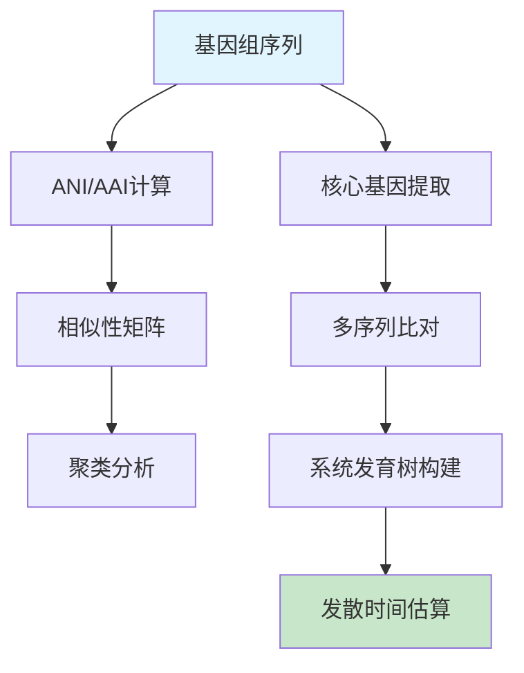

# 微生物基因组学课程 - 实践操作指南

---

# 实践操作：全基因组系统发育分析

**课程**：微生物基因组学  
**第5次课实践部分**  
**时长**：2小时  
**难度**：⭐⭐⭐⭐☆

---

## 📋 操作概览

### 实践目标
本次实践操作旨在让学生：
- 🎯 **掌握** ANI/AAI计算方法和结果解释
- 🎯 **理解** 全基因组系统发育树构建流程  
- 🎯 **应用** 分子钟方法估算发散时间
- 🎯 **分析** 基因组相似性与分类学关系

### 知识前提
- ✅ 已完成第5次课理论学习
- ✅ 熟悉基本的系统发育学概念
- ✅ 具备命令行操作基础

### 预期成果
- 📊 生成基因组相似性矩阵和聚类分析
- 📈 完成全基因组系统发育树构建
- 📝 撰写发散时间估算报告

---

## 🛠️ 环境准备

### 硬件要求
- **内存**：至少8GB RAM（推荐16GB）
- **存储**：至少15GB可用空间
- **处理器**：多核处理器（推荐4核以上）

### 软件环境

#### 必需软件
```bash
# 核心软件列表
- FastANI (版本 >= 1.3)
- CompareM (版本 >= 0.1.2)  
- MASH (版本 >= 2.3)
- IQ-TREE (版本 >= 2.0)
- FigTree (版本 >= 1.4)
```

#### 安装检查
```bash
# 验证软件安装
fastANI --version
comparem --version
mash --version
iqtree --version

# 预期输出示例
# FastANI version 1.33
# CompareM v0.1.2
# Mash 2.3
# IQ-TREE multicore version 2.1.0
```

### 脚本文件准备

#### 脚本目录结构
```
第5次课-微生物系统发育基因组学/
├── scripts/
│   ├── ani_calculator.py
│   ├── phylogeny_builder.py
│   ├── divergence_estimator.py
│   └── visualization_generator.py
├── data/
├── results/
└── figures/
```

#### 脚本文件说明
| 脚本名称 | 功能描述 | 输入 | 输出 |
|----------|----------|------|------|
| ani_calculator.py | ANI/AAI批量计算 | 基因组文件列表 | 相似性矩阵 |
| phylogeny_builder.py | 系统发育树构建 | 核心基因序列 | 系统发育树 |
| divergence_estimator.py | 发散时间估算 | 系统发育树+校准点 | 时间树 |
| visualization_generator.py | 结果可视化 | 分析结果 | 图表文件 |

**💡 重要说明**
- 所有程序代码均保存在独立的脚本文件中
- 操作指南中只包含脚本调用命令和参数说明
- 学生可以查看和修改脚本文件进行深入学习

### 数据准备

#### 下载数据集
```bash
# 创建工作目录
mkdir -p ~/genomics_course/lesson5
cd ~/genomics_course/lesson5

# 下载示例基因组数据（大肠杆菌属代表菌株）
wget https://ftp.ncbi.nlm.nih.gov/genomes/all/GCF/000/005/825/GCF_000005825.2_ASM582v2/GCF_000005825.2_ASM582v2_genomic.fna.gz -O E_coli_K12.fna.gz
wget https://ftp.ncbi.nlm.nih.gov/genomes/all/GCF/000/008/865/GCF_000008865.2_ASM886v2/GCF_000008865.2_ASM886v2_genomic.fna.gz -O E_coli_O157H7.fna.gz
wget https://ftp.ncbi.nlm.nih.gov/genomes/all/GCF/000/009/565/GCF_000009565.1_ASM956v1/GCF_000009565.1_ASM956v1_genomic.fna.gz -O S_enterica.fna.gz

# 解压文件
gunzip *.fna.gz

# 验证数据完整性
ls -la *.fna
wc -l *.fna
```

#### 数据文件说明
| 文件名 | 类型 | 大小 | 描述 |
|--------|------|------|------|
| E_coli_K12.fna | FASTA | ~4.6MB | 大肠杆菌K-12参考基因组 |
| E_coli_O157H7.fna | FASTA | ~5.5MB | 大肠杆菌O157:H7致病株 |
| S_enterica.fna | FASTA | ~4.9MB | 沙门氏菌肠炎血清型 |

---

## 📚 背景知识回顾

### 相关理论
- **ANI (Average Nucleotide Identity)**：基因组间平均核苷酸一致性
- **AAI (Average Amino acid Identity)**：基因组间平均氨基酸一致性
- **全基因组系统发育**：基于多基因或全基因组信息的系统发育分析

### 分析流程概述


---

## 🔬 操作步骤

### 第一部分：基因组相似性分析 (40分钟)

#### 步骤1.1：FastANI计算
```bash
# 创建基因组文件列表
ls *.fna > genome_list.txt

# 运行ANI计算脚本
python3 scripts/ani_calculator.py

# 查看ANI结果
cat results/ani_matrix.txt
```

**💡 操作提示**
- ANI值>95%通常认为是同一种
- ANI值85-95%为近缘种关系
- 注意观察对角线值（自身比较应为100%）

**🔧 脚本参数说明**
- 脚本位置：`scripts/ani_calculator.py`
- 主要功能：批量计算基因组间ANI值并生成矩阵
- 可调参数：查看脚本文件中的参数设置部分

#### 步骤1.2：MASH距离计算
```bash
# 创建MASH sketch
mash sketch -s 10000 *.fna

# 计算MASH距离
mash dist *.fna.msh *.fna.msh > results/mash_distances.txt

# 查看距离矩阵
head results/mash_distances.txt
```

**📊 结果检查**
- ✅ ANI矩阵格式正确（对称矩阵）
- ✅ MASH距离合理（0-1之间）
- ✅ 对角线值符合预期

#### 步骤1.3：相似性聚类分析
```bash
# 运行聚类分析
python3 scripts/ani_calculator.py --cluster

# 查看聚类结果
cat results/ani_clustering.txt
ls figures/ani_heatmap.png
```

**🔍 参数说明**
- `--cluster`：执行层次聚类分析
- 聚类方法：UPGMA（非加权配对群法）
- 距离度量：1-ANI值

---

### 第二部分：全基因组系统发育分析 (60分钟)

#### 步骤2.1：核心基因识别
```bash
# 运行核心基因识别
python3 scripts/phylogeny_builder.py --step core_genes

# 查看核心基因统计
cat results/core_genes_stats.txt
ls results/core_genes/
```

**⏱️ 预计运行时间**：10-15分钟

**🎛️ 脚本参数说明**
- 脚本文件：`scripts/phylogeny_builder.py`
- `--step core_genes`：执行核心基因识别步骤
- 核心基因定义：在所有基因组中都存在的单拷贝基因

#### 步骤2.2：多序列比对
```bash
# 执行多序列比对
python3 scripts/phylogeny_builder.py --step alignment

# 检查比对结果
ls results/alignments/
head results/concatenated_alignment.fasta
```

**📈 结果文件说明**
- `core_genes/`：包含各个核心基因的序列文件
- `alignments/`：包含各基因的比对结果
- `concatenated_alignment.fasta`：连接的多基因比对

#### 步骤2.3：系统发育树构建
```bash
# 构建最大似然系统发育树
iqtree -s results/concatenated_alignment.fasta -m MFP -bb 1000 -nt AUTO

# 查看树文件
ls results/concatenated_alignment.fasta.treefile
cat results/concatenated_alignment.fasta.iqtree
```

**🌳 系统发育分析参数**
- `-m MFP`：自动选择最佳进化模型
- `-bb 1000`：1000次bootstrap重采样
- `-nt AUTO`：自动检测CPU核心数

---

### 第三部分：发散时间估算 (20分钟)

#### 步骤3.1：分子钟分析
```bash
# 运行发散时间估算
python3 scripts/divergence_estimator.py

# 查看时间树结果
cat results/timetree.nwk
cat results/divergence_times.txt
```

**📊 关键统计指标**
- **分化时间**：各节点的估算年代
- **置信区间**：时间估算的不确定性范围
- **进化速率**：每百万年的替换率

#### 步骤3.2：结果可视化
```bash
# 生成可视化图表
python3 scripts/visualization_generator.py

# 查看生成的图表
ls figures/
```

**🎨 可视化脚本说明**
- 脚本文件：`scripts/visualization_generator.py`
- 图表类型：系统发育树、ANI热图、时间树
- 输出格式：PNG和PDF格式

**🎨 可视化输出**
- `phylogenetic_tree.png`：展示系统发育关系
- `ani_heatmap.png`：展示基因组相似性
- `timetree.png`：展示发散时间估算

---

## 📊 结果解读

### 预期结果
完成所有操作后，您应该获得：

1. **ANI相似性矩阵**
   - 文件位置：`results/ani_matrix.txt`
   - 关键信息：基因组间相似性百分比
   - 正常范围：同种>95%，近缘种85-95%

2. **系统发育树**
   - 文件位置：`results/concatenated_alignment.fasta.treefile`
   - 关键信息：分支长度和bootstrap支持值
   - 判断标准：bootstrap>70%为可靠分支

3. **发散时间估算**
   - 文件位置：`results/divergence_times.txt`
   - 关键信息：各节点的分化年代
   - 生物学意义：物种分化的时间尺度

### 结果验证
```bash
# 验证结果完整性
ls -la results/
wc -l results/ani_matrix.txt

# 检查系统发育树质量
grep "Bootstrap" results/concatenated_alignment.fasta.iqtree
```

### 生物学解释
- **高ANI值**：表明基因组高度相似，可能属于同一种或近缘种
- **系统发育关系**：反映物种间的进化关系和分化历史
- **发散时间**：提供物种分化的时间框架，有助于理解进化历程

---

## ❗ 常见问题与解决方案

### 问题1：ANI计算失败
**症状**：FastANI报错或输出空文件

**原因**：基因组文件格式问题或序列质量差

**解决方案**：
```bash
# 检查文件格式
file *.fna
head -n 5 *.fna

# 重新下载或转换格式
seqtk seq -A input.fasta > output.fna
```

### 问题2：系统发育分析内存不足
**症状**：IQ-TREE运行中断，提示内存不足

**解决方案**：
- 减少序列长度：`--max-seq-len 50000`
- 使用更简单的模型：`-m GTR+G`
- 减少bootstrap次数：`-bb 100`

### 问题3：发散时间估算不合理
**症状**：估算的分化时间过早或过晚

**检查清单**：
- ✅ 校准点设置是否合理
- ✅ 进化速率估算是否准确
- ✅ 系统发育树拓扑是否正确
- ✅ 分子钟假设是否成立

---

## 🚀 扩展练习

### 基础扩展
1. **参数优化**：尝试不同的ANI计算参数，比较结果差异
2. **数据扩展**：添加更多基因组，观察系统发育关系变化
3. **方法对比**：比较ANI、AAI和MASH距离的结果一致性

### 进阶挑战
1. **多基因分析**：分别构建不同基因的系统发育树，比较拓扑差异
2. **HGT检测**：识别可能发生水平基因转移的基因
3. **分子钟检验**：测试严格分子钟假设是否成立

### 创新探索
1. **新方法尝试**：使用其他系统发育软件（如RAxML、BEAST）
2. **大数据分析**：处理更大规模的基因组数据集
3. **功能关联**：结合基因功能分析系统发育模式

---

## 📝 实践报告要求

### 报告结构
1. **实验目的**（200字）
2. **材料与方法**（300字）
3. **结果与分析**（500字）
4. **讨论与结论**（300字）
5. **参考文献**（至少5篇）

### 必须包含的内容
- [ ] ANI计算结果和生物学解释
- [ ] 系统发育树图（至少2个）
- [ ] 发散时间估算结果分析
- [ ] 方法比较和评价
- [ ] 遇到的问题及解决方案

### 提交要求
- **格式**：PDF文件
- **命名**：`姓名_第5次课实践报告.pdf`
- **截止时间**：下次课前

---

## 📚 参考资料

### 核心文献
1. Jain et al. High throughput ANI analysis of 90K prokaryotic genomes reveals clear species boundaries. *Nature Communications*. 2018; 9: 5114.
2. Parks et al. A standardized bacterial taxonomy based on genome phylogeny substantially revises the tree of life. *Nature Biotechnology*. 2018; 36: 996-1004.
3. Chklovski et al. CheckM2: a rapid, scalable and accurate tool for assessing microbial genome quality using machine learning. *Nature Methods*. 2023; 20: 1203-1212.

### 在线资源
- **FastANI文档**：https://github.com/ParBLiSS/FastANI
- **IQ-TREE教程**：http://www.iqtree.org/doc/
- **GTDB数据库**：https://gtdb.ecogenomic.org/

### 扩展阅读
- **ANI方法比较**：Rodriguez-R & Konstantinidis. The enveomics collection. *PeerJ*. 2016
- **系统发育基因组学**：Delsuc et al. Phylogenomics and the reconstruction of the tree of life. *Nature Reviews Genetics*. 2005
- **分子钟理论**：Kumar & Hedges. Advances in Time Estimation Methods for Molecular Data. *Molecular Biology and Evolution*. 2016

---

## 💬 讨论与反馈

### 课堂讨论点
1. ANI阈值在不同微生物类群中的适用性
2. 全基因组系统发育与16S rRNA系统发育的差异
3. 分子钟在微生物进化研究中的局限性
4. 水平基因转移对系统发育分析的影响

### 反馈收集
- 操作难度评价：⭐⭐⭐⭐☆
- 时间安排合理性：⭐⭐⭐⭐☆
- 内容实用性：⭐⭐⭐⭐⭐
- 改进建议：[具体建议]

---

## 📞 技术支持

### 紧急情况处理
如遇到无法解决的技术问题：
1. 记录错误信息和操作步骤
2. 检查软件版本和依赖关系
3. 查阅官方文档和FAQ
4. 联系老师或同学协助

### 常用命令速查
```bash
# 快速检查文件
head -n 10 filename
wc -l filename
file filename

# 进程监控
top
htop
ps aux | grep process_name

# 磁盘空间检查
df -h
du -sh directory/
```

---

**版本信息**
- 创建日期：2025年
- 最后更新：2025年
- 版本号：v1.0.0
- 更新内容：初始版本

---

*本操作指南遵循开源协议，欢迎改进和分享*