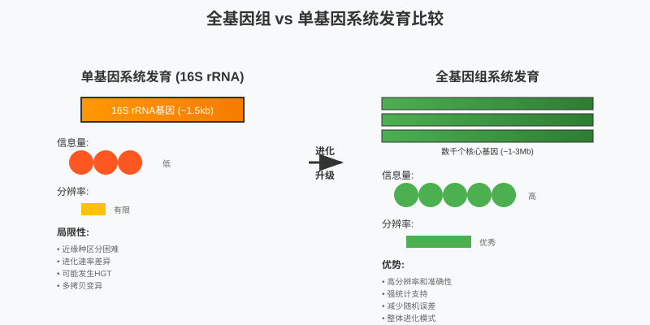
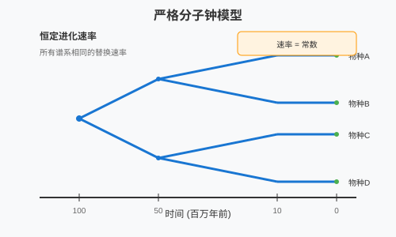
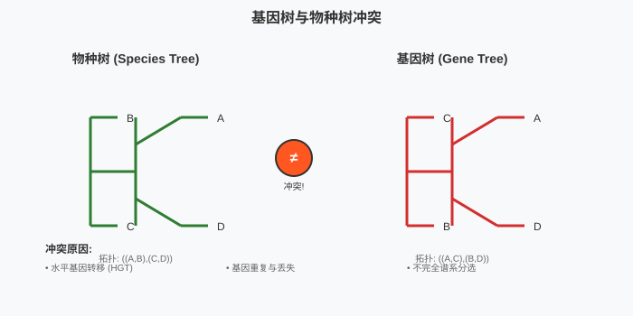
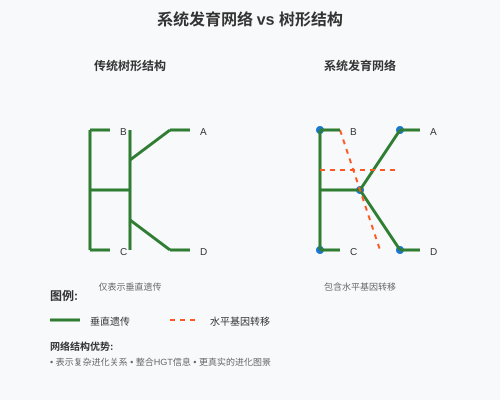
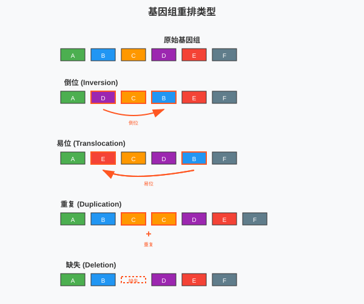

<style>
  .columns {
    display: grid;
    grid-template-columns: repeat(2, minmax(0, 1fr));
    gap: 1rem;
  }
  .small-text {
    font-size: 0.8em;
  }
  .highlight {
    background-color: #fbbf24;
    color: #1f2937;
    padding: 0.2em 0.4em;
    border-radius: 0.25em;
  }
  .code-block {
    background-color: #374151;
    padding: 1em;
    border-radius: 0.5em;
    font-family: 'Courier New', monospace;
  }
  /* 自动缩放内容以适应页面 */
  .auto-fit {
    transform-origin: top left;
    transform: scale(var(--scale-factor, 1));
  }
  /* 紧凑布局 - 减少间距 */
  .compact {
    line-height: 1.2;
  }
  .compact h1, .compact h2, .compact h3 {
    margin: 0.5em 0;
  }
  .compact p, .compact li {
    margin: 0.3em 0;
  }
  /* 小字体变体 */
  .tiny-text {
    font-size: 0.7em;
  }
  .micro-text {
    font-size: 0.6em;
  }
</style>

<!-- _class: lead -->
# 微生物基因组学
## 微生物系统发育基因组学

*王运生*  
**2025**  

---

<!-- _class: lead -->

## 📋 本次课程内容

<div class="columns">

**理论部分 (90分钟)**
- 🔬 全基因组系统发育方法
- 📊 分子钟与发散时间估算
- 🧬 系统发育信号评估
- 💡 基因组进化分析

**互动环节 (30分钟)**
- 💭 思考讨论
- ❓ 问题解答
- 📝 知识检查

</div>

---

## 🎯 学习目标

完成本次课程后，学生应能够：

1. **理解** 全基因组系统发育分析的原理和优势
2. **掌握** 基因组相似性指标的计算和解释
3. **应用** 分子钟方法估算物种发散时间
4. **分析** 系统发育信号与水平基因转移的影响

---

<!-- _class: lead -->
# 第一部分
## 全基因组系统发育方法

---

## 📖 传统方法的局限性

### 16S rRNA基因的问题

- **分辨率不足**：近缘种区分困难
- **进化速率差异**：不同区域进化速率不一致
- **水平转移**：rRNA基因也可能发生HGT
- **拷贝数变异**：多拷贝基因的序列差异

### 单基因系统发育的缺陷

<div class="highlight">
单一基因无法代表整个基因组的进化历史
</div>

---

## 🔬 全基因组系统发育的优势

### 信息量提升



---

### 核心优势

<div class="columns">

**数据量大**
- 数千个基因信息
- 更强的统计支持
- 更高的分辨率

**系统性分析**
- 整体进化模式
- 减少随机误差
- 提高准确性

</div>

---

## 📊 基因组相似性指标

### 平均核苷酸一致性 (ANI)

**定义**：两个基因组间同源序列的平均相似度

<div class="code-block">

```
ANI = Σ(相似度 × 比对长度) / 总比对长度
```

</div>

### ANI阈值标准

| ANI值 | 分类学意义 | 应用场景 |
|-------|------------|----------|
| ≥95% | 同一种 | 种内分析 |
| 85-95% | 近缘种 | 种间比较 |
| <85% | 远缘关系 | 属间分析 |

---

## 🧬 数字DNA-DNA杂交 (dDDH)

### 原理与计算

**传统DDH的数字化替代**
- 基于基因组序列相似性
- 与湿实验DDH高度相关
- 标准化的分类学工具

---

### dDDH公式

<div class="small-text">

$$dDDH = \frac{HSP_{length} \times identity^2}{genome_{length}}$$

其中：
- HSP: High-scoring Segment Pairs
- identity: 序列一致性
- genome_length: 基因组长度

</div>

---

<!-- _class: lead -->
# 💭 思考时间

---

## 🤔 讨论问题

### 问题1
为什么全基因组方法比16S rRNA更适合微生物系统发育分析？

### 问题2  
ANI和dDDH在微生物分类中的应用有何异同？

**讨论时间：5分钟**

---

<!-- _class: lead -->
# 第二部分
## 分子钟与发散时间估算

---

## 🧬 分子钟理论基础

### 分子钟假设

- **中性进化理论**：大部分突变是中性的
- **恒定进化速率**：在长时间尺度上相对稳定
- **校准点需求**：需要化石或地质事件校准

---

### 进化速率的影响因素

<div class="columns">

**内在因素**
- DNA修复效率
- 复制保真度
- 基因功能重要性

**外在因素**
- 环境压力
- 种群大小
- 生活史特征

</div>

---

## ⏰ 分子钟类型

### 严格分子钟

**假设**：所有谱系具有相同的进化速率



### 松弛分子钟

**特点**：
- 允许速率在谱系间变化
- 更符合实际进化情况
- 需要更复杂的统计模型

---

## 📈 校准点选择

### 化石校准

**要求**：
- 可靠的化石年代
- 明确的系统发育位置
- 保守的年龄估计

---

### 地质事件校准

<div class="small-text">

**生物地理事件**
- 大陆漂移
- 海平面变化
- 气候事件

**分子事件**
- 基因重复
- 基因组重排
- 内共生事件

</div>

---

## 🔢 发散时间计算方法

### 贝叶斯方法

**BEAST软件包**
- 同时估计系统发育和发散时间
- 整合多种先验信息
- 提供置信区间

### 最大似然方法

<div class="code-block">

```
发散时间 = 遗传距离 / (2 × 进化速率)
```

</div>

**注意**：需要独立估计进化速率

---

<!-- _class: lead -->
# 第三部分
## 系统发育信号评估

---

## 📊 基因树与物种树冲突

### 冲突的原因

**生物学原因**
- 水平基因转移 (HGT)
- 基因重复与丢失
- 不完全谱系分选

**方法学原因**
- 采样偏差
- 模型假设违背
- 数据质量问题

---

### 冲突检测方法



---

## 🔄 水平基因转移检测

### HGT的系统发育信号

**特征**：
- 基因树与物种树显著不一致
- 异常的GC含量
- 密码子使用偏好差异
- 系统发育位置异常

### 检测方法

<div class="columns">

**基于系统发育**
- 基因树比较
- 拓扑结构分析
- 支持值评估

**基于序列特征**
- 组成偏差分析
- 密码子使用分析
- 同义替换分析

</div>

---

## 🌐 系统发育网络分析

### 网络vs树形结构

**树形结构局限**：
- 只能表示垂直遗传
- 忽略基因流动
- 简化复杂进化历史

**网络结构优势**：
- 表示复杂进化关系
- 整合HGT信息
- 更真实的进化图景

---

### 网络构建方法



---

## 📈 系统发育信号强度评估

### 信号强度指标

**树长度 (Tree Length)**
- 总的进化变化量
- 反映信息含量

**一致性指数 (CI)**
- 同源vs同塑性变化比例
- 评估数据质量

---

### 支持值类型

| 方法 | 含义 | 阈值 |
|------|------|------|
| Bootstrap | 重采样支持度 | >70% |
| Posterior | 贝叶斯后验概率 | >0.95 |
| SH-aLRT | 似然比检验 | >80% |

---

<!-- _class: lead -->
# ❓ 知识检查

---

<!-- _class: compact -->
## 📝 快速测验

<!-- fit -->

### 选择题

**1. ANI值为90%的两个基因组最可能属于：**
A) 同一菌株  
B) 同一种的不同菌株  
C) 近缘种  
D) 不同属

### 简答题

**2. 请简述松弛分子钟相比严格分子钟的优势**

**答题时间：3分钟**

---

<!-- _class: lead -->
# 第四部分
## 微生物基因组进化分析

---

## 🚀 基因组进化模式

### 进化速率差异

**快速进化基因**
- 表面蛋白基因
- 毒力相关基因
- 代谢酶基因

**保守基因**
- 核糖体蛋白基因
- DNA修复基因
- 基本代谢基因

### 功能约束与进化

<div class="highlight">
基因功能重要性与进化速率呈负相关
</div>

---

## 🔬 基因组重排分析

### 重排类型



---

**主要类型**：
- 倒位 (Inversion)
- 易位 (Translocation)  
- 重复 (Duplication)
- 缺失 (Deletion)

### 重排的进化意义

- 基因表达调控
- 代谢通路优化
- 环境适应机制

---

## 📊 比较基因组学方法

### 共线性分析

**定义**：基因在不同基因组中的排列顺序保守性

**应用**：
- 识别同源区域
- 检测重排事件
- 预测功能关联

---

### 句法分析 (Synteny)

<div class="small-text">

**局部句法**：小范围基因顺序保守
**全局句法**：大尺度基因组结构保守

句法保守性随进化距离增加而降低

</div>

---

## 🌟 进化基因组学应用

### 病原菌进化追踪

<div class="columns">

**疫情溯源**
- 传播路径重建
- 变异速率估算
- 毒力进化分析

**抗性进化**  
- 抗性基因起源
- 传播机制分析
- 进化压力评估

</div>

---

### 工业菌株改良

- 代谢工程靶点识别
- 进化稳定性评估
- 适应性进化指导

---

## 🔗 多组学整合分析

### 基因组-转录组整合

**进化-表达关联**：
- 高表达基因进化较慢
- 组织特异性基因进化较快
- 调控区域进化模式

---

### 基因组-代谢组整合

**代谢-进化关联**：
- 代谢通路保守性
- 酶活性与序列进化
- 代谢网络拓扑进化

---

<!-- _class: lead -->
# 📚 课程总结

---

## 🎯 关键要点回顾

### 核心概念

1. **全基因组系统发育** - 信息量大、分辨率高、准确性强
2. **基因组相似性指标** - ANI、AAI、dDDH的应用和阈值
3. **分子钟分析** - 发散时间估算的原理和方法

### 技术方法

- ANI/AAI计算：基因组相似性评估
- 分子钟分析：进化时间尺度重建
- HGT检测：复杂进化历史解析

---

## 🔄 知识体系连接

### 与前序课程的联系

- 建立在比较基因组学基础上
- 深化了对基因组进化的理解
- 整合了分子进化理论

### 为后续课程的准备

- 为代谢网络重建提供进化背景
- 为功能基因挖掘提供系统发育框架
- 为群落基因组学奠定理论基础

---

## 📖 扩展阅读

### 必读文献

1. Konstantinidis & Tiedje. Genomic insights that advance the species definition for prokaryotes. *PNAS*. 2005
2. Richter & Rosselló-Móra. Shifting the genomic gold standard for the prokaryotic species definition. *PNAS*. 2009
3. Parks et al. A standardized bacterial taxonomy based on genome phylogeny substantially revises the tree of life. *Nature Biotechnology*. 2018

### 推荐资源

- **在线工具**：JSpeciesWS、ANI Calculator、TimeTree
- **软件包**：FastANI、GTDB-Tk、BEAST2
- **数据库**：GTDB、TimeTree、OrthoDB

---

<!-- _class: lead -->
# 🔜 下次课预告

---

## 📅 第6次课：微生物代谢网络重建

### 主要内容

- **理论部分**：代谢重建理论、营养需求预测、代谢模型构建
- **实践部分**：KEGG使用、ModelSEED重建、网络可视化

### 预习要求

- 复习生物化学代谢通路
- 了解KEGG数据库结构
- 安装Cytoscape软件

---

## 📝 课后作业

### 必做作业

1. **文献阅读**：阅读GTDB分类系统文献并撰写500字总结
2. **概念梳理**：绘制系统发育基因组学方法比较图

### 选做作业

1. **软件体验**：使用FastANI计算几个基因组的ANI值
2. **案例分析**：选择一个微生物类群进行系统发育分析

---

<!-- _class: lead -->
# 💬 讨论与答疑

---

## ❓ 问题讨论

### 开放性问题

- 全基因组系统发育在微生物分类中的应用前景？
- 如何处理基因树与物种树的冲突？
- 分子钟在微生物进化研究中的局限性？

---

### 交流

- 分享系统发育分析经验
- 讨论软件工具使用心得
- 探讨方法学发展趋势