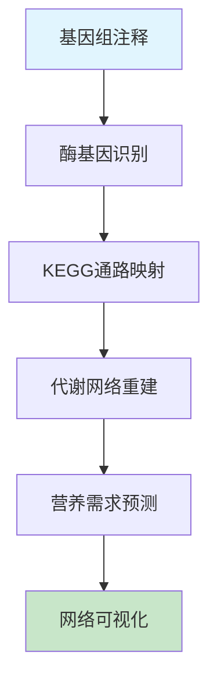

# 微生物基因组学课程 - 实践操作指南

---

# 实践操作：代谢通路重建与分析

**课程**：微生物基因组学  
**第6次课实践部分**  
**时长**：2小时  
**难度**：⭐⭐⭐⭐☆

---

## 📋 操作概览

### 实践目标
本次实践操作旨在让学生：
- 🎯 **掌握** KEGG数据库深入使用技巧
- 🎯 **理解** 代谢通路重建的系统性方法  
- 🎯 **应用** ModelSEED进行自动化代谢网络重建
- 🎯 **分析** 微生物营养类型和代谢特征

### 知识前提
- ✅ 已完成第6次课理论学习
- ✅ 熟悉基本的基因组注释结果
- ✅ 具备生物化学代谢通路基础知识

### 预期成果
- 📊 生成完整的代谢网络图
- 📈 完成营养需求预测分析
- 📝 撰写代谢特征分析报告

---

## 🛠️ 环境准备

### 硬件要求
- **内存**：至少8GB RAM（推荐16GB）
- **存储**：至少15GB可用空间
- **处理器**：多核处理器（推荐4核以上）
- **网络**：稳定的互联网连接

### 软件环境

#### 必需软件
```bash
# 核心软件列表
- Python (版本 >= 3.8)
- BioPython (版本 >= 1.78)
- pandas (版本 >= 1.3.0)
- matplotlib (版本 >= 3.3.0)
- seaborn (版本 >= 0.11.0)
- networkx (版本 >= 2.6)
- requests (版本 >= 2.25.0)
```

#### 安装检查
```bash
# 验证软件安装
python3 --version
python3 -c "import Bio; print(Bio.__version__)"
python3 -c "import pandas; print(pandas.__version__)"
python3 -c "import matplotlib; print(matplotlib.__version__)"
python3 -c "import networkx; print(networkx.__version__)"

# 预期输出示例
# Python 3.8.x
# 1.78
# 1.3.x
# 3.3.x
# 2.6.x
```

### 脚本文件准备

#### 脚本目录结构
```
第6次课-微生物代谢网络重建/
├── scripts/
│   ├── kegg_pathway_analyzer.py
│   ├── metabolic_reconstructor.py
│   ├── nutrition_predictor.py
│   └── network_visualizer.py
├── data/
├── results/
└── figures/
```

#### 脚本文件说明
| 脚本名称 | 功能描述 | 输入 | 输出 |
|----------|----------|------|------|
| kegg_pathway_analyzer.py | KEGG通路分析和注释 | 基因组注释文件 | 通路完整性报告 |
| metabolic_reconstructor.py | 代谢网络重建 | 酶基因列表 | 代谢网络文件 |
| nutrition_predictor.py | 营养需求预测 | 代谢网络 | 营养需求报告 |
| network_visualizer.py | 网络可视化 | 代谢网络文件 | 网络图片 |

**💡 重要说明**
- 所有程序代码均保存在独立的脚本文件中
- 操作指南中只包含脚本调用命令和参数说明
- 学生可以查看和修改脚本文件进行深入学习

### 数据准备

#### 下载数据集
```bash
# 创建工作目录
mkdir -p ~/genomics_course/lesson6
cd ~/genomics_course/lesson6

# 下载示例基因组注释数据
wget https://ftp.ncbi.nlm.nih.gov/genomes/all/GCF/000/005/825/GCF_000005825.2_ASM582v2/GCF_000005825.2_ASM582v2_protein.faa.gz -O ecoli_proteins.faa.gz
wget https://ftp.ncbi.nlm.nih.gov/genomes/all/GCF/000/005/825/GCF_000005825.2_ASM582v2/GCF_000005825.2_ASM582v2_feature_table.txt.gz -O ecoli_features.txt.gz

# 解压数据文件
gunzip *.gz

# 验证数据完整性
wc -l ecoli_features.txt
grep -c ">" ecoli_proteins.faa
```

#### 数据文件说明
| 文件名 | 类型 | 大小 | 描述 |
|--------|------|------|------|
| ecoli_proteins.faa | FASTA | ~1.5MB | 大肠杆菌蛋白质序列 |
| ecoli_features.txt | 表格 | ~2MB | 基因功能注释信息 |

---

## 📚 背景知识回顾

### 相关理论
- **代谢网络**：由代谢物和酶反应构成的生化反应网络
- **KEGG数据库**：京都基因与基因组百科全书，包含代谢通路信息
- **营养类型**：根据碳源和能源利用方式对微生物的分类

### 分析流程概述


---

## 🔬 操作步骤

### 第一部分：KEGG数据库深入使用 (40分钟)

#### 步骤1.1：基因功能注释提取
```bash
# 提取酶基因信息
python3 scripts/kegg_pathway_analyzer.py --extract-enzymes

# 查看提取结果
head -n 20 results/enzyme_genes.txt

# 预期输出格式
# Gene_ID    EC_Number    Gene_Name    Function
# b0001      1.1.1.1      dnaA         chromosomal replication initiator
```

**💡 操作提示**
- 注意EC编号的完整性，不完整的EC编号可能影响通路分析
- 如果某些基因缺少EC编号，可以通过序列相似性进行补充注释

#### 步骤1.2：KEGG通路映射分析
```bash
# 运行通路映射脚本
python3 scripts/kegg_pathway_analyzer.py --pathway-mapping

# 检查通路分析结果
ls -la results/pathway_analysis/

# 预期输出文件
# pathway_completeness.txt: 通路完整性统计
# missing_enzymes.txt: 缺失酶基因列表
# pathway_coverage.txt: 各通路覆盖度
```

**🔧 脚本参数说明**
- 脚本位置：`scripts/kegg_pathway_analyzer.py`
- 主要功能：KEGG通路分析和酶基因映射
- 可调参数：查看脚本文件中的配置部分

**📊 结果检查**
- ✅ 识别出的酶基因数量合理（预期300-500个）
- ✅ 主要代谢通路覆盖度 > 70%
- ✅ 核心代谢通路基本完整

#### 步骤1.3：通路完整性评估
```bash
# 分析关键代谢通路
python3 scripts/kegg_pathway_analyzer.py --assess-completeness \
  --pathways glycolysis,tca_cycle,amino_acid_synthesis

# 查看完整性报告
cat results/pathway_completeness_report.txt
```

**🔍 关键通路分析**
- `糖酵解通路`：葡萄糖分解的核心通路
- `TCA循环`：柠檬酸循环，能量代谢中心
- `氨基酸合成`：20种氨基酸的合成能力

---

### 第二部分：代谢网络重建 (50分钟)

#### 步骤2.1：自动化网络重建
```bash
# 运行代谢网络重建脚本
python3 scripts/metabolic_reconstructor.py --auto-reconstruct

# 查看重建进度（如果有进度条）
tail -f results/reconstruction.log
```

**⏱️ 预计运行时间**：15-20分钟

**🎛️ 脚本参数说明**
- 脚本文件：`scripts/metabolic_reconstructor.py`
- 重建方法：基于KEGG反应数据库的自动重建
- 输出格式：SBML格式的代谢模型

#### 步骤2.2：网络质量验证
```bash
# 验证重建网络的质量
python3 scripts/metabolic_reconstructor.py --validate-network

# 检查验证结果
cat results/network_validation.txt
```

**📈 质量指标**
- `反应数量`：预期范围800-1200个反应
- `代谢物数量`：预期范围600-1000个代谢物
- `连通性`：网络应该是连通的
- `质量平衡`：反应的化学计量平衡

#### 步骤2.3：手工网络优化
```bash
# 识别网络中的问题
python3 scripts/metabolic_reconstructor.py --identify-gaps

# 手工添加缺失反应
python3 scripts/metabolic_reconstructor.py --add-reactions \
  --reaction-file data/additional_reactions.txt

# 生成最终网络模型
python3 scripts/metabolic_reconstructor.py --finalize-model
```

**🔧 网络优化要点**
- 填补代谢间隙（metabolic gaps）
- 添加转运反应
- 平衡生物量方程
- 验证网络连通性

---

### 第三部分：营养需求预测与分析 (30分钟)

#### 步骤3.1：营养类型预测
```bash
# 运行营养需求预测
python3 scripts/nutrition_predictor.py --predict-requirements

# 查看预测结果
cat results/nutrition_prediction.txt
```

**📊 预测内容**
- **碳源利用**：可利用的碳源类型
- **氮源需求**：氮素营养需求
- **生长因子**：必需的维生素和辅因子
- **无机盐**：矿物质营养需求

#### 步骤3.2：氨基酸合成能力分析
```bash
# 分析氨基酸合成通路
python3 scripts/nutrition_predictor.py --amino-acid-synthesis

# 生成氨基酸需求报告
python3 scripts/nutrition_predictor.py --generate-aa-report
```

**🧬 氨基酸分类预测**
- **可合成氨基酸**：具有完整合成通路
- **部分合成**：通路不完整，可能需要前体物质
- **必需氨基酸**：无合成能力，必须从环境获取

#### 步骤3.3：代谢能力比较
```bash
# 与参考菌株比较代谢能力
python3 scripts/nutrition_predictor.py --compare-metabolism \
  --reference data/reference_metabolism.json

# 生成比较报告
python3 scripts/nutrition_predictor.py --comparison-report
```

---

### 第四部分：网络可视化与分析 (20分钟)

#### 步骤4.1：代谢网络可视化
```bash
# 生成网络可视化图
python3 scripts/network_visualizer.py --visualize-network

# 查看生成的图片
ls -la figures/
```

**🎨 可视化脚本说明**
- 脚本文件：`scripts/network_visualizer.py`
- 图表类型：网络图、通路图、热图
- 输出格式：PNG、PDF、SVG格式

**🎨 可视化输出**
- `metabolic_network.png`：完整代谢网络图
- `pathway_heatmap.png`：通路完整性热图
- `nutrition_summary.png`：营养需求总结图

#### 步骤4.2：通路特异性分析
```bash
# 分析特定通路
python3 scripts/network_visualizer.py --pathway-specific \
  --pathway glycolysis

# 生成通路详细图
python3 scripts/network_visualizer.py --detailed-pathway \
  --pathway tca_cycle
```

---

## 📊 结果解读

### 预期结果
完成所有操作后，您应该获得：

1. **代谢网络模型**
   - 文件位置：`results/metabolic_model.xml`
   - 关键信息：包含800-1200个反应的SBML模型
   - 质量标准：网络连通，质量平衡

2. **营养需求预测**
   - 文件位置：`results/nutrition_requirements.txt`
   - 关键信息：碳源、氮源、生长因子需求
   - 判断标准：与已知生理特征一致

3. **通路完整性分析**
   - 文件位置：`results/pathway_completeness.txt`
   - 关键信息：各代谢通路的完整程度
   - 生物学意义：反映微生物的代谢能力

### 结果验证
```bash
# 验证结果完整性
ls -la results/
wc -l results/metabolic_model.xml

# 检查预测准确性
python3 scripts/nutrition_predictor.py --validate-predictions \
  --literature-data data/known_phenotypes.txt
```

### 生物学解释
- **代谢多样性**：不同微生物的代谢网络规模和复杂性差异
- **营养适应**：营养需求与生态位的关系
- **进化优化**：代谢网络的进化压力和优化方向

---

## ❗ 常见问题与解决方案

### 问题1：KEGG API访问限制
**症状**：频繁的网络请求被拒绝或超时

**原因**：KEGG数据库对API访问频率有限制

**解决方案**：
```bash
# 在脚本中添加延时
python3 scripts/kegg_pathway_analyzer.py --slow-mode

# 使用本地KEGG数据库
python3 scripts/kegg_pathway_analyzer.py --local-db data/kegg_local/

# 批量下载后离线分析
python3 scripts/kegg_pathway_analyzer.py --batch-download
```

### 问题2：代谢网络重建不完整
**症状**：网络中存在大量间隙，连通性差

**解决方案**：
- 检查基因注释质量：`--check-annotation-quality`
- 添加转运反应：`--add-transport-reactions`
- 使用多个数据库：`--multi-database-mode`
- 手工填补间隙：`--manual-gap-filling`

### 问题3：营养需求预测不准确
**症状**：预测结果与已知生理特征不符

**检查清单**：
- ✅ 基因注释的准确性
- ✅ 通路数据库的完整性
- ✅ 调控信息的考虑
- ✅ 实验条件的差异

---

## 🚀 扩展练习

### 基础扩展
1. **多菌株比较**：比较不同菌株的代谢网络差异
2. **通路进化**：分析代谢通路的进化保守性
3. **环境适应**：研究代谢网络与环境的关系

### 进阶挑战
1. **动态建模**：构建动态代谢模型
2. **约束优化**：使用FBA进行通量分析
3. **实验验证**：设计实验验证预测结果

### 创新探索
1. **机器学习**：使用ML方法改进预测准确性
2. **多组学整合**：整合转录组和代谢组数据
3. **个性化医学**：应用于病原菌药物靶点发现

---

## 📝 实践报告要求

### 报告结构
1. **实验目的**（200字）
2. **材料与方法**（400字）
3. **结果与分析**（600字）
4. **讨论与结论**（400字）
5. **参考文献**（至少8篇）

### 必须包含的内容
- [ ] 代谢网络重建的详细过程
- [ ] 营养需求预测结果及验证
- [ ] 关键代谢通路分析（至少3个）
- [ ] 网络可视化图表（至少5个）
- [ ] 与文献报道的比较分析
- [ ] 方法局限性讨论

### 提交要求
- **格式**：PDF文件
- **命名**：`姓名_第6次课实践报告.pdf`
- **截止时间**：下次课前

---

## 📚 参考资料

### 核心文献
1. Kanehisa M, Goto S. KEGG: kyoto encyclopedia of genes and genomes. *Nucleic Acids Res*. 2000; 28(1): 27-30.
2. Thiele I, Palsson BØ. A protocol for generating a high-quality genome-scale metabolic reconstruction. *Nat Protoc*. 2010; 5(1): 93-121.
3. Henry CS, et al. High-throughput generation, optimization and analysis of genome-scale metabolic models. *Nat Biotechnol*. 2010; 28(9): 977-982.

### 在线资源
- **KEGG数据库**：https://www.genome.jp/kegg/
- **ModelSEED**：https://modelseed.org/
- **BioCyc数据库**：https://biocyc.org/

### 扩展阅读
- **代谢建模综述**：Orth JD, et al. What is flux balance analysis? *Nat Biotechnol*. 2010
- **网络分析方法**：Barabási AL, Oltvai ZN. Network biology: understanding the cell's functional organization. *Nat Rev Genet*. 2004
- **营养预测应用**：Monk JM, et al. Genome-scale metabolic reconstructions of multiple Escherichia coli strains highlight strain-specific adaptations. *PLoS Comput Biol*. 2013

---

## 💬 讨论与反馈

### 课堂讨论点
1. 代谢网络重建的准确性如何评估？
2. 不同数据库的整合策略有哪些？
3. 营养需求预测在实际应用中的价值？
4. 如何处理代谢网络中的不确定性？

### 反馈收集
- 操作难度评价：⭐⭐⭐⭐☆
- 时间安排合理性：⭐⭐⭐⭐☆
- 内容实用性：⭐⭐⭐⭐⭐
- 改进建议：[具体建议]

---

## 📞 技术支持

### 紧急情况处理
如遇到无法解决的技术问题：
1. 检查网络连接和数据库访问
2. 查看脚本运行日志文件
3. 联系老师或同学讨论
4. 查阅KEGG和ModelSEED官方文档
5. 必要时可申请延期提交

### 常用调试命令
```bash
# 检查Python环境
python3 -c "import sys; print(sys.path)"

# 测试网络连接
curl -I https://rest.kegg.jp/

# 查看详细错误信息
python3 scripts/kegg_pathway_analyzer.py --debug --verbose
```

---

**版本信息**
- 创建日期：2025年
- 最后更新：2025年
- 版本号：v1.0.0
- 更新内容：初始版本

---

*本操作指南遵循开源协议，欢迎改进和分享*