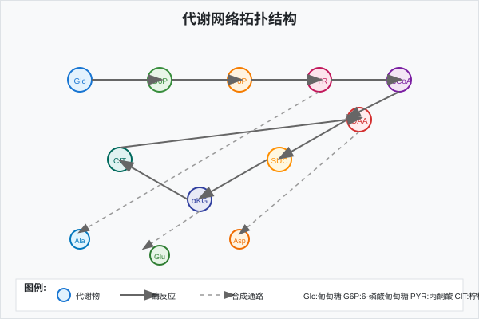
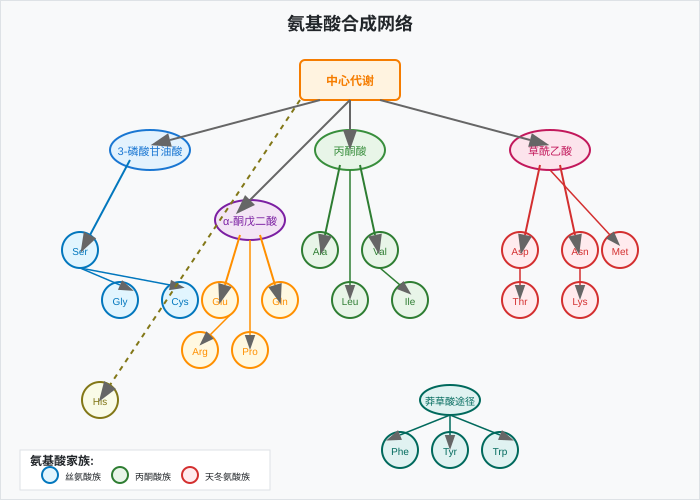
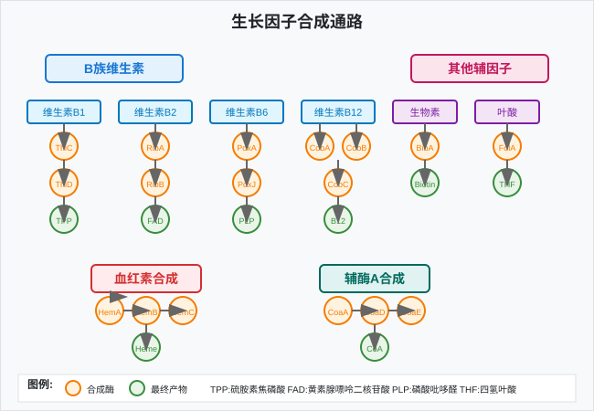
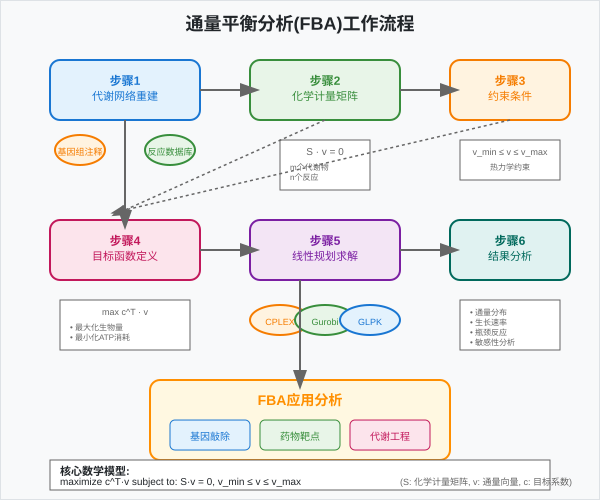
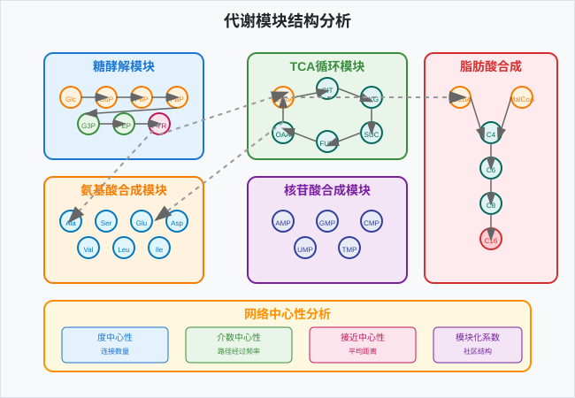

<!-- _class: lead -->
# 微生物基因组学
## 微生物代谢网络重建

*王运生*  
**2025**  

---

<!-- _class: lead -->

## 📋 本次课程内容

**理论部分 (90分钟)**
- 🔬 代谢重建理论基础
- 📊 营养需求预测方法 
- 🧬 代谢模型构建
- 💡 网络分析与比较

**互动环节 (30分钟)**
- 💭 思考讨论
- ❓ 问题解答
- 📝 知识检查

---

## 🎯 学习目标

完成本次课程后，学生应能够：

1. **理解** 从基因组到代谢型的重建原理
2. **掌握** 营养需求预测的生物信息学方法  
3. **应用** 约束代谢模型进行通量分析
4. **分析** 微生物代谢网络的拓扑特征和生物学意义

---

<!-- _class: lead -->
# 第一部分
## 代谢重建理论基础

---

## 📖 从基因组到代谢型

### 核心概念

- **基因型 (Genotype)**：基因组中编码的遗传信息
- **表型 (Phenotype)**：可观察的生物学特征
- **代谢型 (Metabolotype)**：代谢能力和营养需求的总和

### 重建流程

基因组序列 → 基因注释 → 代谢酶识别 → 通路重建 → 代谢网络

---

## 🔬 代谢网络拓扑特征

---

### 网络特征

- **节点 (Nodes)**：代谢物 (Metabolites)
- **边 (Edges)**：酶催化反应 (Enzymatic reactions)
- **路径 (Pathways)**：功能相关的反应序列
- **模块 (Modules)**：紧密连接的反应群

### 拓扑性质

- 小世界网络特征
- 无标度分布
- 高聚类系数
- 短平均路径长度

---

## 📊 必需基因与核心代谢

### 必需基因定义

**实验定义**
- 基因敲除致死
- 生长缺陷显著
- 条件必需性

**计算预测**  
- 通量平衡分析
- 网络拓扑分析
- 进化保守性

---

### 核心代谢通路

| 通路类别 | 主要功能 | 必需性 |
|----------|----------|--------|
| 糖酵解 | 葡萄糖分解 | 高 |
| TCA循环 | 能量代谢 | 中-高 |
| 氨基酸合成 | 蛋白质合成 | 高 |
| 核苷酸合成 | DNA/RNA合成 | 高 |

---

<!-- _class: lead -->
# 💭 思考时间

---

## 🤔 讨论问题

### 问题1
为什么不同微生物的必需基因数量差异很大？这与它们的生活方式有什么关系？

### 问题2  
如何解释某些极端环境微生物具有相对简化的代谢网络，但仍能在恶劣条件下生存？

**讨论时间：5分钟**

---

<!-- _class: lead -->
# 第二部分
## 营养需求预测方法

---

## 🧬 氨基酸合成通路分析

### 20种标准氨基酸

---

**分类依据**
- **必需氨基酸**：无法自主合成
- **非必需氨基酸**：可自主合成
- **条件必需**：特定条件下需要

### 预测策略

- 关键酶基因存在性检查
- 通路完整性评估
- 调控基因分析
- 转运蛋白识别

---

## ⚙️ 辅因子合成能力预测

### 主要辅因子类别

| 辅因子 | 功能 | 关键酶 | 预测难度 |
|--------|------|--------|----------|
| 维生素B1 (硫胺素) | 碳代谢 | ThiC, ThiD | 中 |
| 维生素B2 (核黄素) | 电子传递 | RibA, RibB | 低 |
| 维生素B6 (吡哆醇) | 氨基酸代谢 | PdxA, PdxJ | 中 |
| 维生素B12 (钴胺素) | 甲基转移 | CobA, CobB | 高 |

---

### 预测挑战

- 多条合成途径存在
- 基因功能注释不完整
- 调控机制复杂
- 环境获取vs自主合成

---

## 📈 碳源利用谱预测

### 碳源分类

**简单碳源**
- 葡萄糖
- 果糖
- 甘油
- 乙酸

**复杂碳源**  
- 淀粉
- 纤维素
- 几丁质
- 木质素

---

### 预测方法

1. **转运系统识别**
   - PTS系统 (磷酸烯醇式丙酮酸转移酶系统)
   - ABC转运蛋白
   - 主要促进子超家族 (MFS)

2. **分解酶检测**
   - 糖苷水解酶
   - 多糖裂解酶
   - 酯酶

---

## 🔗 生长因子需求分析

### 常见生长因子

---

**维生素类**
- 生物素 (Biotin)
- 叶酸 (Folate)
- 泛酸 (Pantothenate)

**其他因子**
- 血红素 (Heme)
- 胆固醇 (Cholesterol)
- 脂肪酸

---

### 需求预测流程

1. 合成基因完整性检查
2. 转运蛋白存在性分析
3. 调控基因识别
4. 文献证据整合

---

<!-- _class: lead -->
# 第三部分
## 代谢模型构建

---

## 🌟 约束代谢模型原理

### 基本概念

- **化学计量矩阵 (S)**：反应的化学计量关系
- **通量向量 (v)**：各反应的通量值
- **约束条件**：热力学和容量限制

### 数学表示

$$S \cdot v = 0$$

其中：
- S: m×n 化学计量矩阵 (m个代谢物，n个反应)
- v: n×1 通量向量
- 0: m×1 零向量 (稳态假设)

---

## ⚙️ 通量平衡分析 (FBA)

### FBA原理

---

**优化目标**
- 最大化生物量产生
- 最小化ATP消耗
- 最大化产物合成

### 数学公式

$$\max c^T v$$
$$\text{subject to: } S \cdot v = 0$$
$$v_{min} \leq v \leq v_{max}$$

---

## 📊 基因敲除模拟

### 敲除策略

**单基因敲除**
- 设置对应反应通量为0
- 评估生长影响
- 识别必需基因

**多基因敲除**  
- 组合敲除分析
- 合成致死效应
- 代谢工程应用

---

### 表型预测

| 敲除效果 | 生长率变化 | 生物学意义 |
|----------|------------|------------|
| 致死 | = 0 | 必需基因 |
| 严重缺陷 | < 20% | 重要基因 |
| 轻微影响 | 20-80% | 有益基因 |
| 无影响 | > 80% | 冗余基因 |

---

## 🔗 代谢网络比较

### 比较维度

1. **网络规模**
   - 反应数量
   - 代谢物数量
   - 基因数量

2. **功能模块**
   - 通路完整性
   - 关键节点
   - 瓶颈反应

3. **进化特征**
   - 保守核心
   - 可变外围
   - 适应性变异

---

### 比较方法

- 网络对齐算法
- 拓扑相似性度量
- 功能富集分析
- 系统发育映射

---

<!-- _class: lead -->
# ❓ 知识检查

---

<!-- _class: compact -->
## 📝 快速测验

<!-- fit -->

### 选择题

**1. 通量平衡分析(FBA)的核心假设是什么？**
A) 所有反应都是可逆的  
B) 系统处于稳态  
C) 所有基因都是必需的  
D) 代谢物浓度恒定

### 简答题

**2. 请简述从基因组序列预测微生物营养需求的主要步骤**

**答题时间：3分钟**

---

<!-- _class: lead -->
# 第四部分
## 网络分析与比较方法

---

## 🚀 网络拓扑分析

### 中心性度量

- **度中心性 (Degree Centrality)**
  - 节点连接数
  - 反映代谢物重要性

- **介数中心性 (Betweenness Centrality)**  
  - 最短路径经过频率
  - 识别关键中介代谢物

- **接近中心性 (Closeness Centrality)**
  - 到其他节点平均距离
  - 反映全局可达性

---

### 模块化分析

---

## 🔗 跨物种代谢比较

### 比较策略

**结构比较**
- 网络拓扑相似性
- 关键节点保守性
- 模块组织差异

**功能比较**  
- 通路完整性
- 代谢能力差异
- 环境适应特征

---

### 进化分析

- 代谢网络进化模式
- 基因获得与丢失
- 水平基因转移影响
- 环境驱动的适应

---

## 📈 代谢工程应用

### 工程目标

1. **产物合成优化**
   - 目标产物通路强化
   - 竞争通路削弱
   - 辅因子平衡

2. **生长性能改善**
   - 营养需求简化
   - 代谢负担减轻
   - 环境耐受性提高

---

### 设计策略

- 基因敲除/敲入
- 启动子工程
- 代谢通量重分配
- 异源通路引入

---

## 🌟 前沿技术与发展

### 新兴方法

- **13C代谢通量分析**
  - 同位素标记实验
  - 通量分布测定
  - 模型验证

- **单细胞代谢组学**
  - 细胞异质性分析
  - 动态代谢监测
  - 空间代谢分布

---

### 整合组学

基因组学 + 转录组学 + 蛋白质组学 + 代谢组学 = 系统生物学

---

<!-- _class: lead -->
# 📚 课程总结

---

## 🎯 关键要点回顾

### 核心概念

1. **代谢重建** - 从基因组到代谢网络的系统性构建
2. **营养预测** - 基于基因组信息预测微生物营养需求  
3. **约束模型** - 利用FBA进行代谢通量分析和表型预测

### 技术方法

- 基因功能注释：酶基因识别和通路重建
- 网络分析：拓扑特征分析和模块识别
- 比较分析：跨物种代谢能力比较

---

## 🔄 知识体系连接

### 与前序课程的联系

- 建立在基因注释基础上
- 深化了对微生物功能的理解

### 为后续课程的准备

- 为功能基因挖掘提供代谢背景
- 支撑微生物群落功能分析

---

## 📖 扩展阅读

### 必读文献

1. Thiele I, Palsson BØ. A protocol for generating a high-quality genome-scale metabolic reconstruction. *Nat Protoc*. 2010
2. Orth JD, Thiele I, Palsson BØ. What is flux balance analysis? *Nat Biotechnol*. 2010

### 推荐资源

- **在线资源**：KEGG数据库、BioCyc数据库
- **软件工具**：COBRApy、ModelSEED、KBase
- **数据集**：BiGG Models数据库

---

<!-- _class: lead -->
# 🔜 下次课预告

---

## 📅 第7次课：功能基因挖掘与应用

### 主要内容

- **理论部分**：生物技术基因挖掘、次级代谢产物分析、抗性毒力机制
- **实践部分**：antiSMASH分析、CARD数据库使用、毒力因子分析

### 预习要求

- 阅读：次级代谢产物生物合成相关文献
- 准备：了解抗生素抗性机制基础知识
- 安装：antiSMASH本地版本或熟悉在线版本

---

## 📝 课后作业

### 必做作业

1. **代谢网络重建**：选择一个微生物基因组，完成基本代谢网络重建
2. **营养需求预测**：预测该微生物的营养需求并与文献对比

### 选做作业

1. **FBA分析**：使用COBRApy进行通量平衡分析
2. **比较分析**：比较两个相关微生物的代谢差异

---

<!-- _class: lead -->
# 💬 讨论与答疑

---

## ❓ 问题讨论

### 开放性问题

- 代谢网络重建的主要挑战是什么？
- 如何提高营养需求预测的准确性？
- FBA方法的局限性有哪些？

---

### 交流

- 分享代谢建模经验
- 讨论实际应用案例
- 探讨方法改进方向