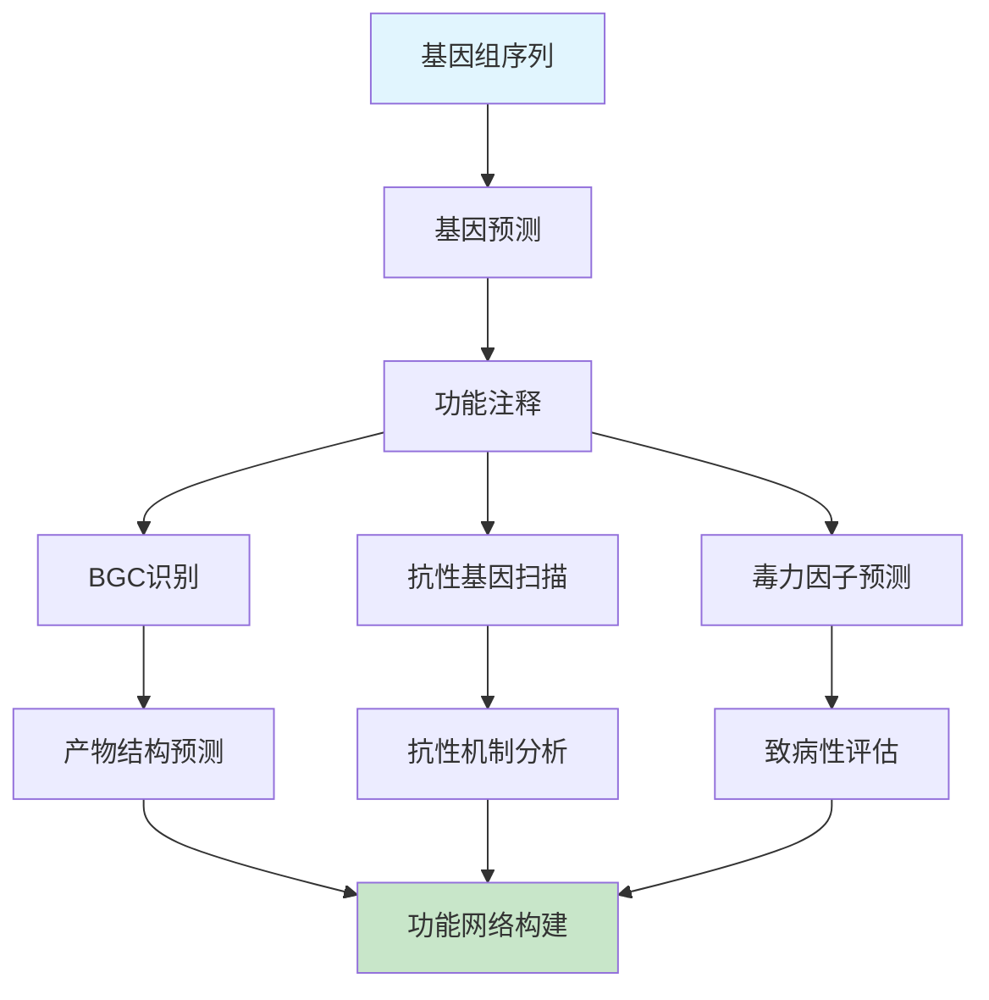

# 微生物基因组学课程 - 实践操作指南

---

# 实践操作：次级代谢与抗性基因分析

**课程**：微生物基因组学  
**第7次课实践部分**  
**时长**：2小时  
**难度**：⭐⭐⭐⭐☆

---

## 📋 操作概览

### 实践目标
本次实践操作旨在让学生：
- 🎯 **掌握** antiSMASH进行次级代谢基因簇分析的方法
- 🎯 **理解** CARD数据库在抗性基因注释中的应用  
- 🎯 **应用** 毒力因子数据库进行病原性分析
- 🎯 **分析** 基因簇比较和功能网络构建方法

### 知识前提
- ✅ 已完成第7次课理论学习
- ✅ 熟悉基本的基因组注释流程
- ✅ 具备生物信息学软件使用基础

### 预期成果
- 📊 生成次级代谢基因簇预测报告
- 📈 完成抗性基因功能注释
- 📝 撰写毒力因子分析总结

---

## 🛠️ 环境准备

### 硬件要求
- **内存**：至少8GB RAM（推荐16GB）
- **存储**：至少15GB可用空间
- **处理器**：多核处理器（推荐4核以上）
- **网络**：稳定的互联网连接（在线工具使用）

### 软件环境

#### 必需软件
```bash
# 核心软件列表
- Python (版本 >= 3.8)
- BLAST+ (版本 >= 2.10.0)
- HMMER (版本 >= 3.3)
- Prodigal (版本 >= 2.6.3)
- Diamond (版本 >= 2.0.0)
```

#### 安装检查
```bash
# 验证软件安装
python3 --version
blastp -version
hmmsearch -h
prodigal -v
diamond version

# 预期输出示例
# Python 3.8.x
# blastp: 2.10.0+
# HMMER 3.3.x
# Prodigal V2.6.3
# diamond v2.0.x
```

### 脚本文件准备

#### 脚本目录结构
```
第7次课-功能基因挖掘与应用/
├── scripts/
│   ├── bgc_analyzer.py
│   ├── resistance_annotator.py
│   ├── virulence_scanner.py
│   └── network_builder.py
├── data/
├── results/
└── figures/
```

#### 脚本文件说明
| 脚本名称 | 功能描述 | 输入 | 输出 |
|----------|----------|------|------|
| bgc_analyzer.py | BGC分析和比较 | 基因组序列 | BGC预测结果 |
| resistance_annotator.py | 抗性基因注释 | 蛋白序列 | 抗性基因列表 |
| virulence_scanner.py | 毒力因子扫描 | 基因组序列 | 毒力基因报告 |
| network_builder.py | 功能网络构建 | 注释结果 | 网络图文件 |

**💡 重要说明**
- 所有程序代码均保存在独立的脚本文件中
- 操作指南中只包含脚本调用命令和参数说明
- 学生可以查看和修改脚本文件进行深入学习

### 数据准备

#### 下载数据集
```bash
# 创建工作目录
mkdir -p ~/genomics_course/lesson7
cd ~/genomics_course/lesson7

# 下载示例基因组数据
wget https://ftp.ncbi.nlm.nih.gov/genomes/all/GCF/000/005/825/GCF_000005825.2_ASM582v2/GCF_000005825.2_ASM582v2_genomic.fna.gz -O streptomyces_coelicolor.fna.gz
wget https://ftp.ncbi.nlm.nih.gov/genomes/all/GCF/000/009/605/GCF_000009605.1_ASM960v1/GCF_000009605.1_ASM960v1_genomic.fna.gz -O staphylococcus_aureus.fna.gz

# 解压文件
gunzip *.fna.gz

# 验证数据完整性
wc -l *.fna
grep -c ">" *.fna
```

#### 数据文件说明
| 文件名 | 类型 | 大小 | 描述 |
|--------|------|------|------|
| streptomyces_coelicolor.fna | FASTA | ~8.7MB | 链霉菌基因组（次级代谢丰富） |
| staphylococcus_aureus.fna | FASTA | ~2.8MB | 金黄色葡萄球菌（抗性基因丰富） |

---

## 📚 背景知识回顾

### 相关理论
- **次级代谢基因簇**：PKS/NRPS模块化合成机制
- **抗生素抗性**：酶修饰、靶点改变、外排泵机制
- **毒力因子**：粘附、侵袭、毒素、免疫逃逸因子

### 分析流程概述


---

## 🔬 操作步骤

### 第一部分：次级代谢基因簇分析 (45分钟)

#### 步骤1.1：antiSMASH在线分析
```bash
# 准备输入文件
head -n 20 streptomyces_coelicolor.fna

# 文件格式检查
grep -c ">" streptomyces_coelicolor.fna
# 预期输出：1（单个染色体）

# 计算序列长度
grep -v ">" streptomyces_coelicolor.fna | wc -c
# 预期输出：约8,700,000 bp
```

**💡 操作提示**
- 访问antiSMASH网站：https://antismash.secondarymetabolites.org
- 上传streptomyces_coelicolor.fna文件
- 选择分析参数：
  - 检测所有已知基因簇类型
  - 启用基因簇比较功能
  - 开启ClusterBlast和KnownClusterBlast

#### 步骤1.2：运行本地BGC分析脚本
```bash
# 运行BGC分析脚本
python3 scripts/bgc_analyzer.py \
    --input streptomyces_coelicolor.fna \
    --output results/bgc_analysis \
    --threads 4

# 检查输出结果
ls -la results/bgc_analysis/
```

**🔧 脚本参数说明**
- 脚本位置：`scripts/bgc_analyzer.py`
- 主要功能：本地BGC预测和基本分析
- 可调参数：
  - `--min_cluster_size`：最小基因簇大小（默认5个基因）
  - `--evalue`：BLAST搜索E值阈值（默认1e-5）
  - `--coverage`：序列覆盖度阈值（默认50%）

**📊 结果检查**
- ✅ BGC预测结果文件生成
- ✅ 基因簇类型统计完成
- ✅ 核心基因识别准确

#### 步骤1.3：BGC结果解读
```bash
# 查看BGC统计结果
cat results/bgc_analysis/cluster_summary.txt

# 分析基因簇类型分布
python3 scripts/bgc_analyzer.py --mode summary \
    --input results/bgc_analysis/clusters.gbk \
    --output results/bgc_analysis/statistics.txt
```

**🔍 关键结果指标**
- **基因簇数量**：预期发现20-30个BGC
- **主要类型**：PKS、NRPS、Terpene、Bacteriocin
- **完整性**：完整基因簇比例 > 70%
- **新颖性**：与已知基因簇相似性 < 80%

---

### 第二部分：抗性基因注释分析 (35分钟)

#### 步骤2.1：CARD数据库搜索
```bash
# 首先进行基因预测
prodigal -i staphylococcus_aureus.fna \
    -o results/genes.gff \
    -a results/proteins.faa \
    -d results/genes.fna \
    -f gff

# 检查预测结果
grep -c ">" results/proteins.faa
# 预期输出：约2,800个蛋白质
```

#### 步骤2.2：运行抗性基因注释脚本
```bash
# 运行抗性基因注释
python3 scripts/resistance_annotator.py \
    --proteins results/proteins.faa \
    --genome staphylococcus_aureus.fna \
    --output results/resistance_analysis \
    --database CARD

# 查看注释结果
ls -la results/resistance_analysis/
head -20 results/resistance_analysis/resistance_genes.txt
```

**🎛️ 脚本参数说明**
- 脚本文件：`scripts/resistance_annotator.py`
- 关键参数：
  - `--identity`：序列一致性阈值（默认80%）
  - `--coverage`：覆盖度阈值（默认70%）
  - `--evalue`：E值阈值（默认1e-10）

#### 步骤2.3：抗性机制分类
```bash
# 按抗性机制分类
python3 scripts/resistance_annotator.py --mode classify \
    --input results/resistance_analysis/resistance_genes.txt \
    --output results/resistance_analysis/mechanism_summary.txt

# 生成抗性谱预测
python3 scripts/resistance_annotator.py --mode predict \
    --input results/resistance_analysis/resistance_genes.txt \
    --output results/resistance_analysis/resistance_profile.txt
```

**📈 结果文件说明**
- `resistance_genes.txt`：检测到的抗性基因列表
- `mechanism_summary.txt`：按机制分类的统计
- `resistance_profile.txt`：预测的抗生素抗性谱

---

### 第三部分：毒力因子分析 (30分钟)

#### 步骤3.1：VFDB数据库搜索
```bash
# 运行毒力因子扫描
python3 scripts/virulence_scanner.py \
    --genome staphylococcus_aureus.fna \
    --proteins results/proteins.faa \
    --output results/virulence_analysis \
    --database VFDB

# 检查扫描结果
ls -la results/virulence_analysis/
```

**🔬 毒力因子分类**
- **粘附因子**：表面蛋白、菌毛蛋白
- **侵袭因子**：透明质酸酶、胶原酶
- **毒素**：溶血素、肠毒素、TSST-1
- **免疫逃逸**：蛋白A、荚膜多糖

#### 步骤3.2：毒力岛预测
```bash
# 预测病原性岛
python3 scripts/virulence_scanner.py --mode island \
    --genome staphylococcus_aureus.fna \
    --output results/virulence_analysis/pathogenicity_islands.txt

# 分析毒力基因分布
python3 scripts/virulence_scanner.py --mode distribution \
    --input results/virulence_analysis/virulence_factors.txt \
    --genome staphylococcus_aureus.fna \
    --output results/virulence_analysis/gene_distribution.txt
```

#### 步骤3.3：致病性评估
```bash
# 综合致病性评估
python3 scripts/virulence_scanner.py --mode assessment \
    --virulence results/virulence_analysis/virulence_factors.txt \
    --resistance results/resistance_analysis/resistance_genes.txt \
    --output results/pathogenicity_assessment.txt
```

---

### 第四部分：功能网络构建与可视化 (30分钟)

#### 步骤4.1：数据整合
```bash
# 整合所有分析结果
python3 scripts/network_builder.py --mode integrate \
    --bgc results/bgc_analysis/cluster_summary.txt \
    --resistance results/resistance_analysis/resistance_genes.txt \
    --virulence results/virulence_analysis/virulence_factors.txt \
    --output results/integrated_analysis.txt
```

#### 步骤4.2：功能网络构建
```bash
# 构建基因功能网络
python3 scripts/network_builder.py --mode network \
    --input results/integrated_analysis.txt \
    --output results/functional_network.graphml \
    --format graphml

# 生成网络统计
python3 scripts/network_builder.py --mode stats \
    --network results/functional_network.graphml \
    --output results/network_statistics.txt
```

**🎨 网络可视化脚本说明**
- 脚本文件：`scripts/network_builder.py`
- 输出格式：GraphML（可用Cytoscape打开）
- 节点类型：基因、基因簇、功能类别
- 边类型：共定位、功能相关、调控关系

#### 步骤4.3：结果可视化
```bash
# 生成可视化图表
python3 scripts/network_builder.py --mode visualize \
    --network results/functional_network.graphml \
    --output figures/ \
    --format png

# 查看生成的图表
ls -la figures/
```

**🎨 可视化输出**
- `bgc_distribution.png`：BGC类型分布图
- `resistance_mechanisms.png`：抗性机制分类图
- `virulence_categories.png`：毒力因子分类图
- `functional_network.png`：功能关联网络图

---

## 📊 结果解读

### 预期结果
完成所有操作后，您应该获得：

1. **次级代谢基因簇分析结果**
   - 文件位置：`results/bgc_analysis/`
   - 关键信息：发现20-30个BGC，主要包括PKS、NRPS类型
   - 生物学意义：链霉菌具有丰富的次级代谢潜力

2. **抗性基因注释结果**
   - 文件位置：`results/resistance_analysis/`
   - 关键信息：检测到多重抗药性基因
   - 判断标准：mecA基因存在表明MRSA特征

3. **毒力因子分析结果**
   - 文件位置：`results/virulence_analysis/`
   - 关键信息：多种毒力因子共存
   - 生物学意义：高致病性潜力评估

### 结果验证
```bash
# 验证结果完整性
find results/ -name "*.txt" -exec wc -l {} \;

# 检查关键基因
grep -i "mecA\|vanA\|blaZ" results/resistance_analysis/resistance_genes.txt
grep -i "hla\|hlb\|tst" results/virulence_analysis/virulence_factors.txt
```

### 生物学解释
- **链霉菌BGC多样性**：反映其作为抗生素生产菌的天然优势
- **金葡菌多重抗性**：临床分离株常携带多种抗性机制
- **毒力-抗性关联**：病原菌中毒力和抗性基因常共存

---

## ❗ 常见问题与解决方案

### 问题1：antiSMASH在线分析失败
**症状**：网站无法访问或分析中断

**原因**：网络连接问题或服务器负载过高

**解决方案**：
```bash
# 使用本地替代方案
python3 scripts/bgc_analyzer.py --mode local \
    --input streptomyces_coelicolor.fna \
    --output results/local_bgc_analysis

# 或使用其他在线工具
# 访问：https://prism.adapsyn.com/
```

### 问题2：数据库搜索速度慢
**症状**：BLAST搜索耗时过长

**解决方案**：
- 调整参数：`--threads 8`（增加线程数）
- 使用Diamond：`--aligner diamond`（更快的比对工具）
- 减小数据库：`--database_subset core`

### 问题3：内存不足错误
**症状**：程序因内存不足而终止

**检查清单**：
- ✅ 可用内存 > 8GB
- ✅ 关闭其他大型程序
- ✅ 使用分批处理模式
- ✅ 调整参数减少内存使用

---

## 🚀 扩展练习

### 基础扩展
1. **参数优化**：尝试不同的相似性阈值，观察结果变化
2. **数据库比较**：使用不同数据库（ResFinder vs CARD）比较结果
3. **物种对比**：分析不同菌株的功能基因差异

### 进阶挑战
1. **自定义数据库**：构建特定领域的功能基因数据库
2. **进化分析**：分析功能基因的系统发育关系
3. **表达分析**：结合转录组数据分析基因表达

### 创新探索
1. **机器学习**：使用ML方法预测新的功能基因
2. **网络分析**：深入分析基因功能关联网络
3. **应用开发**：设计特定功能基因的筛选策略

---

## 📝 实践报告要求

### 报告结构
1. **实验目的**（200字）
2. **材料与方法**（400字）
3. **结果与分析**（600字）
4. **讨论与结论**（400字）
5. **参考文献**（至少8篇）

### 必须包含的内容
- [ ] antiSMASH分析结果截图和解读
- [ ] 抗性基因分类统计表
- [ ] 毒力因子功能注释结果
- [ ] 功能网络图及其生物学意义
- [ ] 不同数据库结果的比较分析
- [ ] 对临床或应用意义的讨论

### 提交要求
- **格式**：PDF文件
- **命名**：`姓名_第7次课实践报告.pdf`
- **截止时间**：下次课前
- **附件**：关键结果文件打包

---

## 📚 参考资料

### 核心文献
1. Blin K, et al. antiSMASH 6.0: improving cluster detection and comparison capabilities. *Nucleic Acids Res*. 2021; 49(W1): W29-W35.
2. Alcock BP, et al. CARD 2020: antibiotic resistome surveillance with the comprehensive antibiotic resistance database. *Nucleic Acids Res*. 2020; 48(D1): D517-D525.
3. Liu B, et al. VFDB 2019: a comparative pathogenomic platform with an interactive web interface. *Nucleic Acids Res*. 2019; 47(D1): D687-D692.

### 在线资源
- **antiSMASH**：https://antismash.secondarymetabolites.org
- **CARD数据库**：https://card.mcmaster.ca
- **VFDB数据库**：http://www.mgc.ac.cn/VFs
- **ResFinder**：https://cge.cbs.dtu.dk/services/ResFinder

### 扩展阅读
- **BGC综述**：Natural product discovery using type II polyketide synthases
- **抗性机制**：Mechanisms of antibiotic resistance in bacteria
- **毒力进化**：Evolution of bacterial virulence factors

---

## 💬 讨论与反馈

### 课堂讨论点
1. 不同BGC预测工具的优缺点比较
2. 抗性基因水平转移的检测方法
3. 毒力因子与抗性基因的共进化关系
4. 功能基因挖掘在药物开发中的应用

### 反馈收集
- 操作难度评价：⭐⭐⭐⭐☆
- 时间安排合理性：⭐⭐⭐⭐☆
- 内容实用性：⭐⭐⭐⭐⭐
- 改进建议：[具体建议]

### 实际应用思考
- 如何将BGC分析应用于新抗生素发现？
- 抗性基因监测在临床中的重要性？
- 毒力因子分析如何指导疫苗设计？

---

## 📞 技术支持

### 常用命令速查
```bash
# 快速检查文件
head -5 filename.txt
wc -l filename.txt
grep -c "pattern" filename.txt

# 进程监控
top -p $(pgrep python)
ps aux | grep python

# 磁盘空间检查
df -h
du -sh results/
```

### 紧急情况处理
如遇到无法解决的技术问题：
1. 记录错误信息和操作步骤
2. 检查日志文件：`tail -50 results/analysis.log`
3. 联系老师或同学讨论
4. 查阅工具官方文档
5. 必要时可申请延期提交

---

**版本信息**
- 创建日期：2025年
- 最后更新：2025年
- 版本号：v1.0.0
- 更新内容：初始版本，包含完整的功能基因分析流程

---

*本操作指南遵循开源协议，欢迎改进和分享*