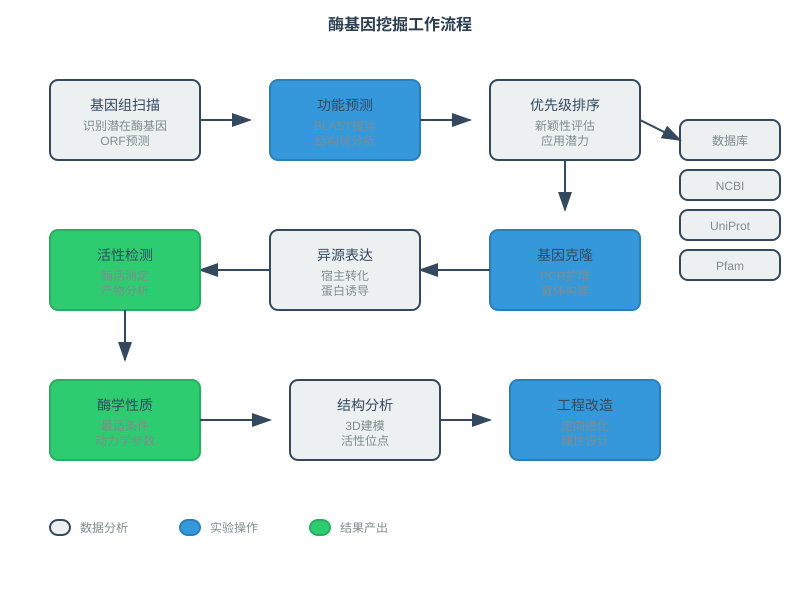
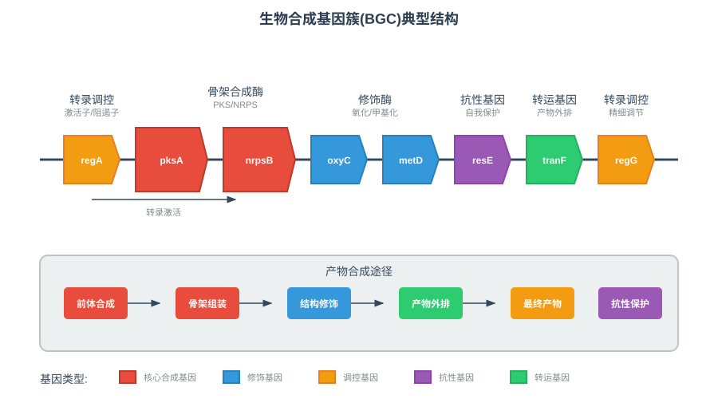
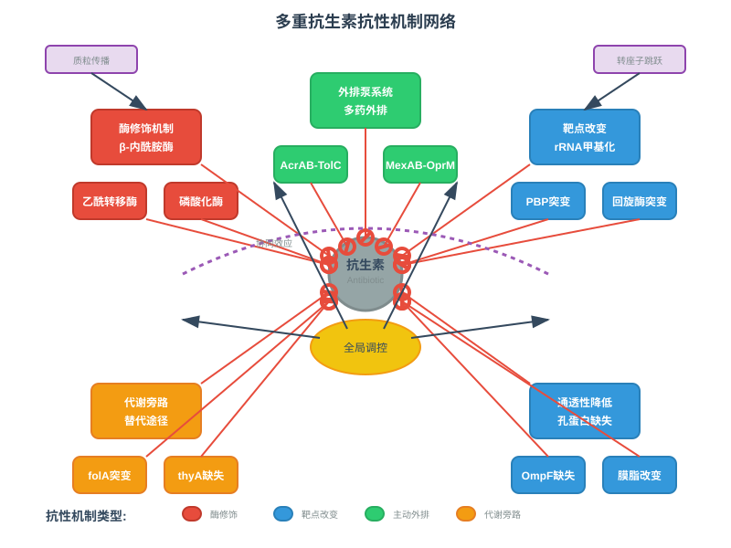
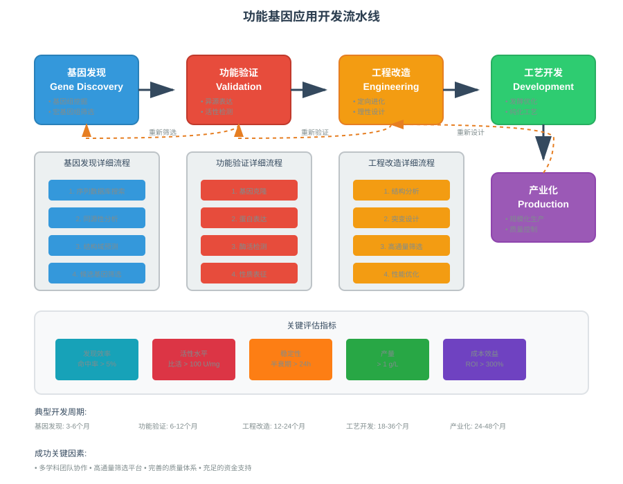

<style>
  .columns {
    display: grid;
    grid-template-columns: repeat(2, minmax(0, 1fr));
    gap: 1rem;
  }
  .small-text {
    font-size: 0.8em;
  }
  .highlight {
    background-color: #fbbf24;
    color: #1f2937;
    padding: 0.2em 0.4em;
    border-radius: 0.25em;
  }
  .code-block {
    background-color: #374151;
    padding: 1em;
    border-radius: 0.5em;
    font-family: 'Courier New', monospace;
  }
  .auto-fit {
    transform-origin: top left;
    transform: scale(var(--scale-factor, 1));
  }
  .compact {
    line-height: 1.2;
  }
  .compact h1, .compact h2, .compact h3 {
    margin: 0.5em 0;
  }
  .compact p, .compact li {
    margin: 0.3em 0;
  }
  .tiny-text {
    font-size: 0.7em;
  }
  .micro-text {
    font-size: 0.6em;
  }
</style>

<!-- _class: lead -->
# 微生物基因组学
## 功能基因挖掘与应用

*王运生*  
**2025**  

---

<!-- _class: lead -->

## 📋 本次课程内容

<div class="columns">

**理论部分 (90分钟)**
- 🔬 生物技术基因挖掘策略
- 🧬 次级代谢产物基因簇分析
- 🛡️ 抗性与毒力机制解析
- 💡 功能基因发现与验证

**互动环节 (30分钟)**
- 💭 案例分析讨论
- ❓ 应用前景探讨
- 📝 知识整合检查

</div>

---

## 🎯 学习目标

完成本次课程后，学生应能够：

1. **掌握** 生物技术相关功能基因的挖掘策略和预测方法
2. **理解** 次级代谢产物生物合成基因簇的结构特征和分析方法
3. **分析** 微生物抗性和毒力机制的分子基础
4. **应用** 功能基因挖掘技术解决实际生物技术问题

---

<!-- _class: lead -->
# 第一部分
## 生物技术基因挖掘策略

---

## 🔬 酶基因功能预测

### 基于序列同源性的预测

- **直接同源性搜索**：BLAST相似性阈值（>40%身份，>70%覆盖度）
- **保守结构域分析**：Pfam、COG、TIGRFAM数据库
- **活性位点识别**：催化三联体、金属结合位点
- **三维结构预测**：AlphaFold、ChimeraX结构分析

### 功能注释质量评估

<div class="highlight">
高质量功能注释需要多重证据支持：序列相似性 + 结构域 + 系统发育 + 基因组上下文
</div>

---

## ⚙️ 新酶活性发现策略

### 基于基因组挖掘的方法



---

**系统性筛选流程**
1. **基因组扫描**：识别潜在酶基因
2. **功能预测**：多数据库注释整合
3. **优先级排序**：新颖性和应用潜力评估
4. **实验验证**：异源表达和活性检测

---

## 🧪 酶工程改造靶点识别

### 关键氨基酸位点分析

<div class="columns">

**催化效率改进**
- 活性中心优化
- 底物结合口袋改造
- 产物释放通道设计

**稳定性增强**
- 二硫键引入
- 疏水核心加强
- 表面电荷优化

</div>

---

### 定向进化靶点

| 改造目标 | 关键区域 | 常用策略 | 预期效果 |
|----------|----------|----------|----------|
| 热稳定性 | 环区、末端 | 脯氨酸引入 | 提高Tm 10-20°C |
| pH稳定性 | 表面残基 | 电荷平衡 | 扩大pH范围 |
| 底物特异性 | 结合口袋 | 定点突变 | 改变Km值 |

---

## 🏭 工业酶基因挖掘案例

### 极端环境酶的发现

**嗜热酶挖掘**
- 来源：深海热泉、火山环境微生物
- 特征：高GC含量、紧密折叠结构
- 应用：高温工业过程、PCR技术

**嗜冷酶开发**
- 来源：极地、深海低温环境
- 特征：柔性结构、低温活性
- 应用：洗涤剂、食品加工

<div class="small-text">

*案例：从Pyrococcus furiosus发现的超嗜热DNA聚合酶，耐受温度超过100°C*

</div>

---

<!-- _class: lead -->
# 💭 思考时间

---

## 🤔 讨论问题

### 问题1
如何从基因组序列信息预测一个未知蛋白质的酶活性？需要考虑哪些关键因素？

### 问题2  
为什么极端环境微生物是工业酶基因挖掘的重要来源？这些酶有什么独特优势？

**讨论时间：5分钟**

---

<!-- _class: lead -->
# 第二部分
## 次级代谢产物基因簇分析

---

## 🧬 生物合成基因簇结构

### BGC基本组织模式



---

**核心组件**
- **骨架合成酶**：PKS（聚酮合酶）、NRPS（非核糖体肽合酶）
- **修饰酶**：氧化酶、甲基转移酶、糖基转移酶
- **调控基因**：转录激活子、阻遏子
- **抗性基因**：自我保护机制
- **转运基因**：产物外排系统

---

## 🔍 PKS/NRPS基因识别

### 序列特征识别

<div class="code-block">

```bash
# PKS关键结构域
- 酰基载体蛋白(ACP)：磷酸泛酰巯基乙胺结合
- 酮合酶(KS)：C-C键形成
- 酰基转移酶(AT)：底物选择性

# NRPS关键结构域  
- 肽基载体蛋白(PCP)：氨基酸载体
- 腺苷化酶(A)：氨基酸激活
- 缩合酶(C)：肽键形成
```

</div>

---

### 模块化组织原理

- **共线性规律**：基因顺序对应产物结构
- **模块预测**：每个模块对应一个单体单元
- **底物特异性**：A结构域决定氨基酸选择性

---

## 📊 产物结构预测方法

### 基于序列的预测

| 预测工具 | 功能 | 准确性 | 适用范围 |
|----------|------|--------|----------|
| antiSMASH | 全面BGC分析 | 85-90% | 所有BGC类型 |
| NRPSpredictor | NRPS底物预测 | 80-85% | 非核糖体肽 |
| PKS/NRPS Analyzer | 结构域分析 | 75-80% | PKS/NRPS |
| PRISM | 产物结构预测 | 70-75% | 复杂产物 |

---

### 结构预测流程

1. **基因簇识别**：边界确定和基因注释
2. **模块分析**：结构域组织和功能预测
3. **底物预测**：单体单元识别
4. **结构组装**：产物骨架构建
5. **修饰预测**：后修饰反应预测

---

## 🆕 新化合物发现策略

### 基因组挖掘优势

<div class="highlight">
基因组挖掘可以发现传统培养方法无法获得的"沉默"基因簇
</div>

**发现策略**
- **比较基因组学**：识别物种特异性BGC
- **进化分析**：追踪BGC水平转移
- **表达分析**：激活沉默基因簇
- **异源表达**：在模式宿主中重构BGC

---

### 成功案例分析

**Teixobactin发现**
- 来源：土壤不可培养细菌
- 方法：iChip培养技术 + 基因组分析
- 特点：新型抗生素作用机制
- 意义：对抗多重耐药菌

---

<!-- _class: lead -->
# 第三部分
## 抗性与毒力机制解析

---

## 🛡️ 抗生素抗性基因分类

### 按作用机制分类

<div class="columns">

**酶修饰型**
- β-内酰胺酶：破坏β-内酰胺环
- 氨基糖苷修饰酶：乙酰化、磷酸化
- 氯霉素乙酰转移酶：失活氯霉素

**靶点改变型**
- rRNA甲基化：链霉素抗性
- DNA回旋酶突变：喹诺酮抗性
- 核糖体蛋白变异：大环内酯抗性

</div>

---

### 按传播方式分类

- **染色体抗性**：点突变、基因缺失
- **质粒抗性**：可移动遗传元件
- **转座子抗性**：跳跃基因传播
- **整合子抗性**：基因盒重组

---

## ⚔️ 抗性机制多样性

### 多重抗性机制



---

**协同抗性策略**
1. **多靶点保护**：同时保护多个作用靶点
2. **多重外排**：不同外排泵协同作用
3. **代谢旁路**：绕过被抑制的代谢途径
4. **应激响应**：全局调控系统激活

---

## 🦠 毒力因子进化分析

### 毒力因子分类系统

| 类型 | 功能 | 代表因子 | 作用机制 |
|------|------|----------|----------|
| 粘附因子 | 宿主结合 | 菌毛、胶原结合蛋白 | 初期定植 |
| 侵袭因子 | 细胞入侵 | 侵袭素、内化素 | 胞内感染 |
| 毒素 | 细胞损伤 | 溶血素、肠毒素 | 直接致病 |
| 免疫逃逸 | 逃避免疫 | 荚膜、蛋白A | 持续感染 |

---

### 毒力基因进化模式

- **水平获得**：毒力岛、噬菌体整合
- **基因重复**：毒力基因家族扩张
- **相位变异**：表面抗原快速变化
- **调控进化**：毒力表达精细调控

---

## 🏝️ 病原性岛识别方法

### 病原性岛特征

<div class="code-block">

```bash
# 序列特征
- GC含量偏差：与宿主基因组差异>5%
- 密码子使用偏好：外源基因特征
- 重复序列：IS元件、直接重复序列

# 基因组位置特征
- tRNA基因附近：整合热点
- 基因组岛边界：整合酶基因
- 可移动性：完整或缺失的移动元件
```

</div>

---

### 预测工具比较

- **IslandViewer**：综合多种方法的在线平台
- **SIGI-HMM**：基于密码子使用的HMM模型
- **PAI-IDA**：病原性岛数据库和预测工具
- **GIPSy**：基因组岛预测系统

---

<!-- _class: lead -->
# ❓ 知识检查

---

<!-- _class: compact -->
## 📝 快速测验

<!-- fit -->

### 选择题

**1. PKS/NRPS基因簇产物结构预测主要基于什么原理？**
A) 基因表达水平  
B) 模块共线性规律  
C) GC含量分析  
D) 系统发育关系

### 简答题

**2. 请简述抗生素抗性基因的主要传播机制，并举例说明**

**答题时间：3分钟**

---

<!-- _class: lead -->
# 第四部分
## 功能基因发现与验证

---

## 🔬 高通量筛选策略

### 基因组规模功能筛选

**宏基因组文库构建**
- 环境DNA提取和片段化
- 载体克隆和文库构建
- 功能筛选和阳性克隆分离
- 基因定位和序列分析

**异源表达系统**
- 大肠杆菌表达系统：快速筛选
- 酵母表达系统：真核蛋白折叠
- 杆状病毒系统：复杂蛋白表达
- 无细胞表达：毒性蛋白表达

---

## 🧪 功能验证实验设计

### 体外酶活性检测

<div class="columns">

**定性检测**
- 平板显色反应
- 凝胶电泳分析
- 薄层色谱法
- 质谱检测

**定量分析**
- 分光光度法
- 荧光检测法
- 高效液相色谱
- 酶联免疫吸附

</div>

---

### 体内功能互补

- **缺陷株互补**：基因敲除株功能恢复
- **异源表达**：在异种宿主中表达
- **表型分析**：生长、代谢、抗性表型
- **分子标记**：报告基因融合表达

---

## 📈 功能基因应用开发

### 生物技术应用流程



---

**开发阶段**
1. **基因发现**：筛选和克隆目标基因
2. **功能验证**：确认基因功能和特性
3. **工程改造**：优化基因性能
4. **工艺开发**：建立生产工艺
5. **产业化**：规模化生产应用

---

## 🌟 成功应用案例

### 工业酶开发案例

**Taq DNA聚合酶**
- 来源：Thermus aquaticus
- 发现：1976年，嗜热菌筛选
- 特性：95°C稳定，5'-3'外切酶活性
- 应用：PCR技术核心酶，年产值数十亿美元

**洗涤剂蛋白酶**
- 来源：Bacillus licheniformis
- 改造：定向进化提高稳定性
- 特性：碱性条件活性，去污能力强
- 应用：洗衣粉添加剂，环保替代化学洗涤剂

---

## 🔮 前沿技术与发展趋势

### 人工智能辅助发现

<div class="highlight">
机器学习和深度学习正在革命性地改变功能基因发现效率
</div>

**AI应用领域**
- **蛋白质结构预测**：AlphaFold2突破性进展
- **功能注释**：基于深度学习的功能预测
- **酶设计**：计算机辅助酶工程
- **代谢工程**：智能代谢途径设计

---

### 合成生物学整合

- **标准化生物元件**：BioBrick标准化基因元件
- **模块化设计**：可组合的功能模块
- **自动化构建**：DNA合成和组装自动化
- **定向进化**：高通量筛选和优化

---

<!-- _class: lead -->
# 📚 课程总结

---

## 🎯 关键要点回顾

### 核心概念

1. **功能基因挖掘** - 从基因组到功能的系统性发现策略
2. **次级代谢基因簇** - PKS/NRPS模块化生物合成机制
3. **抗性毒力机制** - 微生物适应和致病的分子基础

### 技术方法

- 基因组挖掘：序列分析和功能预测
- 实验验证：异源表达和活性检测
- 工程改造：定向进化和理性设计

---

## 🔄 知识体系连接

### 与前序课程的联系

- 建立在基因预测和功能注释基础上
- 深化了对微生物代谢多样性的理解
- 整合了比较基因组学的分析方法

### 为后续课程的准备

- 为微生物群落功能分析提供单基因视角
- 为合成生物学应用奠定基因资源基础
- 为生物技术开发提供理论和方法支撑

---

## 📖 扩展阅读

### 必读文献

1. Medema MH, et al. antiSMASH: rapid identification, annotation and analysis of secondary metabolite biosynthesis gene clusters. *Nucleic Acids Res*. 2011
2. McArthur AG, et al. The comprehensive antibiotic resistance database. *Antimicrob Agents Chemother*. 2013
3. Chen L, et al. VFDB: a reference database for bacterial virulence factors. *Nucleic Acids Res*. 2005

### 推荐资源

- **在线工具**：antiSMASH (https://antismash.secondarymetabolites.org)
- **数据库**：CARD (https://card.mcmaster.ca), VFDB (http://www.mgc.ac.cn/VFs)
- **软件包**：BiG-SCAPE, clinker, BiG-SLiCE

---

<!-- _class: lead -->
# 🔜 下次课预告

---

## 📅 第8次课：微生物群落基因组学

### 主要内容

- **理论部分**：宏基因组vs单菌基因组、群落功能分析、环境基因组学应用
- **实践部分**：MAG分析、群落功能重建、环境应用案例

### 预习要求

- 阅读：宏基因组学综述文章
- 准备：了解微生物群落基本概念
- 安装：宏基因组分析软件包

---

## 📝 课后作业

### 必做作业

1. **文献阅读**：阅读一篇次级代谢产物发现的研究论文，分析其基因挖掘策略
2. **案例分析**：选择一个抗生素抗性基因，分析其结构、功能和传播机制

### 选做作业

1. **数据库探索**：使用antiSMASH分析一个链霉菌基因组的BGC
2. **工具比较**：比较不同抗性基因预测工具的结果差异

---

<!-- _class: lead -->
# 💬 讨论与答疑

---

## ❓ 问题讨论

### 开放性问题

- 如何平衡功能基因挖掘的效率和准确性？
- 人工智能在功能基因发现中的应用前景如何？
- 功能基因的产业化应用面临哪些挑战？

### 实际应用思考

- 在你的研究领域中，哪些功能基因具有重要应用价值？
- 如何设计实验验证一个预测的功能基因？
- 功能基因挖掘如何与合成生物学结合？

---

### 交流与分享

- 分享功能基因研究经验
- 讨论技术应用心得
- 探讨产业化发展方向