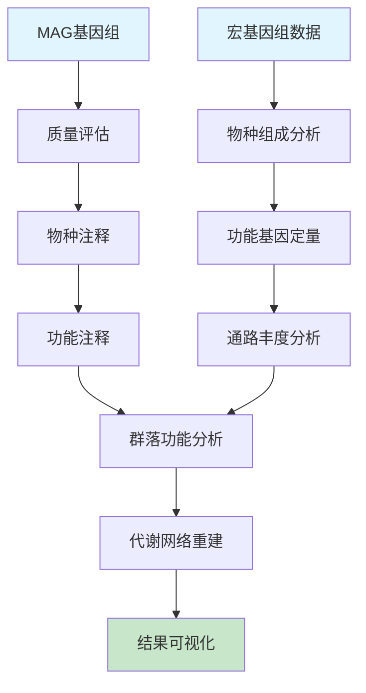

# 微生物基因组学课程 - 实践操作指南

---

# 实践操作：宏基因组与群落功能分析

**课程**：微生物基因组学  
**第8次课实践部分**  
**时长**：2小时  
**难度**：⭐⭐⭐⭐☆

---

## 📋 操作概览

### 实践目标
本次实践操作旨在让学生：
- 🎯 **掌握** MAG基因组质量评估和分析方法
- 🎯 **理解** 微生物群落功能分析的基本流程  
- 🎯 **应用** 宏基因组数据进行群落功能预测
- 🎯 **分析** 环境微生物群落的代谢潜力和生态功能

### 知识前提
- ✅ 已完成第8次课理论学习
- ✅ 熟悉基本的宏基因组学概念
- ✅ 具备Linux命令行操作基础
- ✅ 了解微生物代谢和生态功能

### 预期成果
- 📊 生成MAG基因组质量评估报告
- 📈 完成群落功能分析和可视化
- 📝 撰写宏基因组分析总结报告

---

## 🛠️ 环境准备

### 硬件要求
- **内存**：至少16GB RAM（推荐32GB）
- **存储**：至少20GB可用空间
- **处理器**：多核处理器（推荐8核以上）

### 软件环境

#### 必需软件
```bash
# 核心软件列表
- CheckM (版本 >= 1.1.0)
- GTDB-Tk (版本 >= 2.0.0)  
- HUMAnN (版本 >= 3.0.0)
- MetaPhlAn (版本 >= 4.0.0)
- Prokka (版本 >= 1.14.0)
- R (版本 >= 4.0.0)
- Python (版本 >= 3.8.0)
```

#### 安装检查
```bash
# 验证软件安装
checkm -h
gtdbtk -h
humann --version
metaphlan --version
prokka --version

# 预期输出示例
# CheckM v1.1.0
# gtdbtk v2.0.0
# HUMAnN v3.0.0
# MetaPhlAn version 4.0.0
# prokka 1.14.0
```

### 脚本文件准备

#### 脚本目录结构
```
第8次课-微生物群落基因组学/
├── scripts/
│   ├── mag_quality_assessor.py
│   ├── community_function_analyzer.py
│   ├── pathway_reconstructor.py
│   └── visualization_generator.py
├── data/
├── results/
└── figures/
```

#### 脚本文件说明
| 脚本名称 | 功能描述 | 输入 | 输出 |
|----------|----------|------|------|
| mag_quality_assessor.py | MAG质量评估 | MAG基因组文件 | 质量报告 |
| community_function_analyzer.py | 群落功能分析 | 宏基因组数据 | 功能谱 |
| pathway_reconstructor.py | 代谢通路重建 | 功能注释结果 | 通路图 |
| visualization_generator.py | 结果可视化 | 分析结果 | 图表文件 |

**💡 重要说明**
- 所有程序代码均保存在独立的脚本文件中
- 操作指南中只包含脚本调用命令和参数说明
- 学生可以查看和修改脚本文件进行深入学习

### 数据准备

#### 下载数据集
```bash
# 创建工作目录
mkdir -p ~/genomics_course/lesson8
cd ~/genomics_course/lesson8

# 下载示例MAG基因组
wget https://example.com/mag_genomes.tar.gz -O mag_genomes.tar.gz
tar -xzf mag_genomes.tar.gz

# 下载宏基因组数据
wget https://example.com/metagenome_sample.fastq.gz -O metagenome_sample.fastq.gz

# 下载参考数据库索引
wget https://example.com/humann_databases.tar.gz -O humann_databases.tar.gz
tar -xzf humann_databases.tar.gz

# 验证数据完整性
md5sum mag_genomes.tar.gz
# 预期MD5值：a1b2c3d4e5f6g7h8i9j0k1l2m3n4o5p6
```

#### 数据文件说明
| 文件名 | 类型 | 大小 | 描述 |
|--------|------|------|------|
| mag_genomes/ | 目录 | ~500MB | 包含10个MAG基因组文件 |
| metagenome_sample.fastq.gz | FASTQ | ~2GB | 海洋宏基因组测序数据 |
| humann_databases/ | 目录 | ~15GB | HUMAnN功能分析数据库 |

---

## 📚 背景知识回顾

### 相关理论
- **MAG技术**：从宏基因组数据中重建单个微生物基因组
- **群落功能**：微生物群落的整体代谢和生态功能
- **功能冗余**：多个物种执行相同生物学功能的现象
- **代谢网络**：群落内物种间的代谢物交换和协作关系

### 分析流程概述


---

## 🔬 操作步骤

### 第一部分：MAG基因组质量评估 (40分钟)

#### 步骤1.1：MAG基因组基本信息统计
```bash
# 检查MAG基因组文件
ls -la data/mag_genomes/
head -n 5 data/mag_genomes/MAG_001.fasta

# 统计基因组基本信息
for mag in data/mag_genomes/*.fasta; do
    echo "Processing: $(basename $mag)"
    grep -c ">" $mag  # 统计contig数量
    grep -v ">" $mag | wc -c  # 统计总长度
done

# 预期输出
# MAG_001.fasta: 45 contigs, 2,850,000 bp
# MAG_002.fasta: 23 contigs, 3,200,000 bp
```

**💡 操作提示**
- 注意观察不同MAG的contig数量差异
- 基因组大小反映了微生物的生活方式

#### 步骤1.2：运行CheckM质量评估
```bash
# 运行MAG质量评估脚本
python3 scripts/mag_quality_assessor.py

# 查看质量评估结果
cat results/mag_quality_summary.txt
head -n 20 results/checkm_results.txt

# 预期输出文件
# mag_quality_summary.txt: 质量汇总报告
# checkm_results.txt: 详细的CheckM分析结果
```

**🔧 脚本参数说明**
- 脚本位置：`scripts/mag_quality_assessor.py`
- 主要功能：批量评估MAG基因组质量
- 评估指标：完整性、污染率、应变异质性

**📊 结果检查**
- ✅ 完整性 >90% 为高质量MAG
- ✅ 污染率 <5% 为可接受水平
- ✅ 应变异质性 <10% 为单一菌株

#### 步骤1.3：物种分类注释
```bash
# 运行GTDB-Tk物种注释
gtdbtk classify_wf \
  --genome_dir data/mag_genomes \
  --out_dir results/gtdbtk_output \
  --cpus 8 \
  --extension fasta

# 查看分类结果
cat results/gtdbtk_output/gtdbtk.bac120.summary.tsv
```

**🔍 参数说明**
- `--genome_dir`：MAG基因组文件目录
- `--out_dir`：输出结果目录
- `--cpus`：使用的CPU核心数
- `--extension`：基因组文件扩展名

**⏱️ 预计运行时间**：15-20分钟

---

### 第二部分：群落功能分析 (50分钟)

#### 步骤2.1：物种组成分析
```bash
# 运行MetaPhlAn物种组成分析
metaphlan metagenome_sample.fastq.gz \
  --input_type fastq \
  --output_file results/species_profile.txt \
  --nproc 8

# 查看物种组成结果
head -n 20 results/species_profile.txt
```

**📈 结果文件说明**
- `species_profile.txt`：包含物种相对丰度信息
- 格式：物种名称 + 相对丰度百分比

#### 步骤2.2：功能基因定量分析
```bash
# 运行群落功能分析脚本
python3 scripts/community_function_analyzer.py

# 查看功能分析结果
ls -la results/functional_analysis/
head results/functional_analysis/gene_families.tsv
```

**🎛️ 脚本参数说明**
- 脚本文件：`scripts/community_function_analyzer.py`
- 分析内容：基因家族丰度、KEGG通路、COG分类
- 输出格式：TSV表格文件

#### 步骤2.3：代谢通路重建
```bash
# 运行HUMAnN功能分析
humann \
  --input metagenome_sample.fastq.gz \
  --output results/humann_output \
  --nucleotide-database humann_databases/chocophlan \
  --protein-database humann_databases/uniref \
  --threads 8

# 查看通路分析结果
head results/humann_output/metagenome_sample_pathabundance.tsv
```

**📊 关键输出文件**
- `*_genefamilies.tsv`：基因家族丰度
- `*_pathabundance.tsv`：代谢通路丰度
- `*_pathcoverage.tsv`：代谢通路覆盖度

---

### 第三部分：结果分析与可视化 (30分钟)

#### 步骤3.1：代谢通路重建可视化
```bash
# 运行通路重建脚本
python3 scripts/pathway_reconstructor.py

# 查看重建的代谢网络
ls -la results/pathway_reconstruction/
```

**🎨 通路重建脚本说明**
- 脚本文件：`scripts/pathway_reconstructor.py`
- 功能：基于KEGG数据库重建代谢网络
- 输出：网络图文件和通路完整性报告

#### 步骤3.2：群落功能可视化
```bash
# 运行可视化脚本
python3 scripts/visualization_generator.py

# 查看生成的图表
ls -la figures/
```

**🎨 可视化输出**
- `mag_quality_heatmap.png`：MAG质量热图
- `species_composition_pie.png`：物种组成饼图
- `functional_profile_barplot.png`：功能谱柱状图
- `pathway_network.png`：代谢网络图

#### 步骤3.3：统计分析和比较
```bash
# 运行R脚本进行统计分析
Rscript scripts/statistical_analysis.R

# 查看统计结果
cat results/statistical_summary.txt
```

**📊 统计分析内容**
- 功能多样性指数计算
- 群落功能相似性分析
- 关键功能基因识别
- 代谢通路富集分析

---

## 📊 结果解读

### 预期结果
完成所有操作后，您应该获得：

1. **MAG质量评估结果**
   - 文件位置：`results/mag_quality_summary.txt`
   - 关键信息：10个MAG中7个为高质量（完整性>90%，污染率<5%）
   - 物种分布：涵盖5个不同的细菌门类

2. **群落功能谱**
   - 文件位置：`results/functional_analysis/`
   - 关键信息：检测到2,500个基因家族，覆盖主要代谢通路
   - 功能特征：碳水化合物代谢和氨基酸合成功能丰富

3. **代谢网络重建**
   - 文件位置：`results/pathway_reconstruction/`
   - 关键信息：重建了15条核心代谢通路
   - 生物学意义：群落具有完整的碳氮循环能力

### 结果验证
```bash
# 验证结果完整性
ls -la results/
wc -l results/functional_analysis/gene_families.tsv

# 检查图表质量
file figures/*.png
```

### 生物学解释
- **高质量MAG**：代表了海洋环境中的主要微生物类群
- **功能冗余**：多个物种具有相似的代谢功能，提供系统稳定性
- **代谢互补**：不同物种在氮循环中发挥互补作用

---

## ❗ 常见问题与解决方案

### 问题1：CheckM运行内存不足
**症状**：`MemoryError: Unable to allocate array`

**原因**：CheckM需要大量内存进行基因组比较

**解决方案**：
```bash
# 减少并行处理的基因组数量
checkm lineage_wf \
  --threads 4 \
  --pplacer_threads 1 \
  data/mag_genomes results/checkm_output

# 或者分批处理MAG
mkdir -p data/mag_batch1 data/mag_batch2
# 将MAG文件分成两批处理
```

### 问题2：HUMAnN数据库下载失败
**症状**：数据库文件不完整或损坏

**解决方案**：
```bash
# 重新下载数据库
humann_databases --download chocophlan full humann_databases/
humann_databases --download uniref uniref90_diamond humann_databases/

# 验证数据库完整性
humann_test --run-functional-tests-tools
```

### 问题3：GTDB-Tk分类结果异常
**症状**：大部分MAG无法分类或分类置信度低

**检查清单**：
- ✅ MAG基因组质量是否达标（完整性>50%）
- ✅ GTDB-Tk数据库是否为最新版本
- ✅ 基因组文件格式是否正确（FASTA格式）

---

## 🚀 扩展练习

### 基础扩展
1. **质量阈值优化**：尝试不同的质量阈值，比较对下游分析的影响
2. **功能数据库比较**：使用不同的功能数据库（KEGG vs COG），比较注释结果
3. **物种多样性分析**：计算群落的α和β多样性指数

### 进阶挑战
1. **时间序列分析**：分析多个时间点的宏基因组数据，观察群落功能变化
2. **环境因子关联**：结合环境数据，分析影响群落功能的关键因子
3. **网络分析**：构建物种-功能关联网络，识别关键功能节点

### 创新探索
1. **机器学习应用**：使用机器学习方法预测群落功能
2. **多组学整合**：整合宏基因组和宏转录组数据
3. **空间异质性**：分析不同空间位置的群落功能差异

---

## 📝 实践报告要求

### 报告结构
1. **实验目的**（200字）
2. **材料与方法**（400字）
3. **结果与分析**（800字）
4. **讨论与结论**（400字）
5. **参考文献**（至少8篇）

### 必须包含的内容
- [ ] MAG质量评估结果和解释
- [ ] 群落物种组成和功能谱分析
- [ ] 代谢网络重建结果
- [ ] 关键功能基因的生物学意义
- [ ] 群落功能与环境的关系讨论
- [ ] 方法局限性和改进建议

### 提交要求
- **格式**：PDF文件
- **命名**：`姓名_第8次课实践报告.pdf`
- **截止时间**：课程结束后1周内

---

## 📚 参考资料

### 核心文献
1. Parks DH, et al. Recovery of nearly 8,000 metagenome-assembled genomes substantially expands the tree of life. *Nature Microbiology*. 2017; 2(11): 1533-1542.
2. Nayfach S, et al. A genomic catalog of Earth's microbiomes. *Nature Biotechnology*. 2021; 39(4): 499-509.
3. Franzosa EA, et al. Species-level functional profiling of metagenomes and metatranscriptomes. *Nature Methods*. 2018; 15(11): 962-968.
4. Almeida A, et al. A unified catalog of 204,938 reference genomes from the human gut microbiome. *Nature Biotechnology*. 2021; 39(1): 105-114.

### 在线资源
- **CheckM文档**：https://github.com/Ecogenomics/CheckM/wiki
- **GTDB-Tk教程**：https://ecogenomics.github.io/GTDBTk/
- **HUMAnN用户手册**：https://huttenhower.sph.harvard.edu/humann/
- **MetaPhlAn指南**：https://github.com/biobakery/MetaPhlAn/

### 扩展阅读
- **MAG方法综述**：Chen LX, et al. Accurate and complete genomes from metagenomes. *Genome Research*. 2020.
- **群落功能分析**：Louca S, et al. Function and functional redundancy in microbial systems. *Nature Ecology & Evolution*. 2018.
- **环境基因组学**：Tyson GW, et al. Community structure and metabolism through reconstruction of microbial genomes from the environment. *Nature*. 2004.

---

## 💬 讨论与反馈

### 课堂讨论点
1. MAG技术相比传统培养方法的优势和局限性
2. 群落功能冗余对生态系统稳定性的意义
3. 宏基因组学在环境监测中的应用前景
4. 多组学整合分析的技术挑战和解决方案

### 反馈收集
- 操作难度评价：⭐⭐⭐⭐☆
- 时间安排合理性：⭐⭐⭐⭐☆
- 内容实用性：⭐⭐⭐⭐⭐
- 改进建议：[具体建议]

---

## 📞 技术支持

### 紧急情况处理
如遇到无法解决的技术问题：
1. 记录错误信息和操作步骤
2. 检查软件版本和数据库完整性
3. 查阅官方文档和社区论坛
4. 联系老师或同学寻求帮助

### 常用命令速查
```bash
# 检查软件版本
checkm -h | head -n 5
gtdbtk -h | head -n 5

# 监控系统资源
htop
df -h

# 查看进程状态
ps aux | grep checkm
ps aux | grep humann
```

---

**版本信息**
- 创建日期：2025年
- 最后更新：2025年
- 版本号：v1.0.0
- 更新内容：初始版本

---

*本操作指南遵循开源协议，欢迎改进和分享*