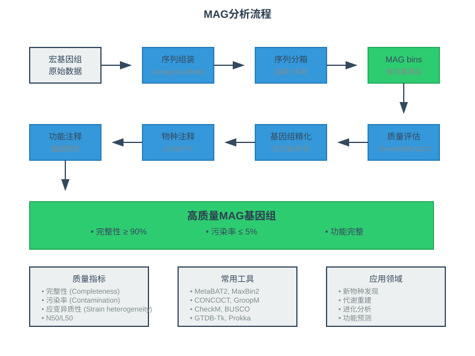
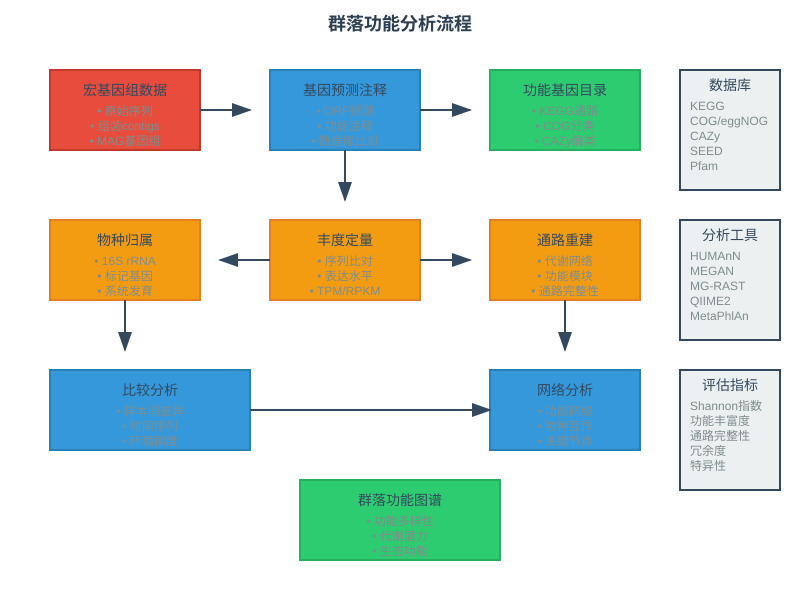
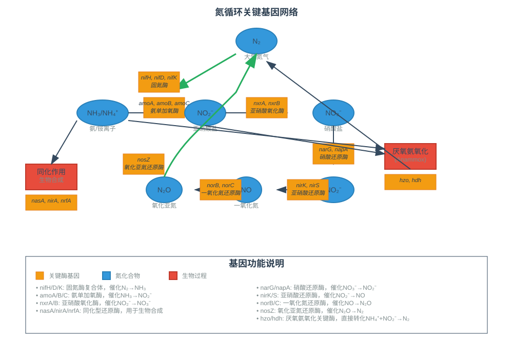
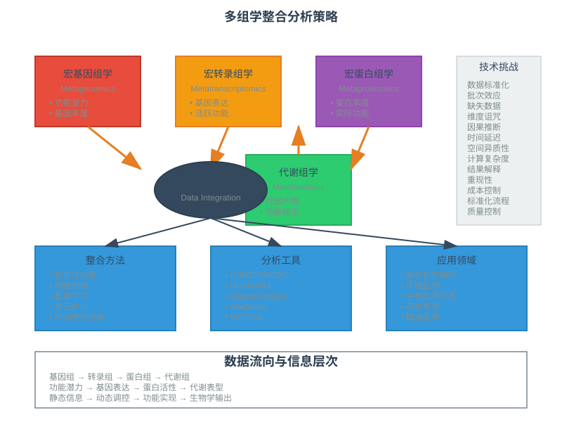

<style>
  .columns {
    display: grid;
    grid-template-columns: repeat(2, minmax(0, 1fr));
    gap: 1rem;
  }
  .small-text {
    font-size: 0.8em;
  }
  .highlight {
    background-color: #fbbf24;
    color: #1f2937;
    padding: 0.2em 0.4em;
    border-radius: 0.25em;
  }
  .code-block {
    background-color: #374151;
    padding: 1em;
    border-radius: 0.5em;
    font-family: 'Courier New', monospace;
  }
  /* 自动缩放内容以适应页面 */
  .auto-fit {
    transform-origin: top left;
    transform: scale(var(--scale-factor, 1));
  }
  /* 紧凑布局 - 减少间距 */
  .compact {
    line-height: 1.2;
  }
  .compact h1, .compact h2, .compact h3 {
    margin: 0.5em 0;
  }
  .compact p, .compact li {
    margin: 0.3em 0;
  }
  /* 小字体变体 */
  .tiny-text {
    font-size: 0.7em;
  }
  .micro-text {
    font-size: 0.6em;
  }
</style>

<!-- _class: lead -->
# 微生物基因组学
## 微生物群落基因组学

*王运生*  
**2025**  

---

<!-- _class: lead -->

## 📋 本次课程内容

<div class="columns">

**理论部分 (90分钟)**
- 🔬 宏基因组vs单菌基因组
- 📊 微生物群落功能分析
- 🧬 环境基因组学应用
- 💡 前沿技术与发展趋势

**互动环节 (30分钟)**
- 💭 思考讨论
- ❓ 问题解答
- 📝 知识检查

</div>

---

## 🎯 学习目标

完成本次课程后，学生应能够：

1. **理解** 宏基因组与单菌基因组的区别和联系
2. **掌握** 微生物群落功能分析的基本方法
3. **应用** 环境基因组学解决实际问题
4. **分析** 群落基因组学的前沿技术和应用前景

---

<!-- _class: lead -->
# 第一部分
## 宏基因组vs单菌基因组

---

## 📖 培养vs非培养微生物

### 微生物"暗物质"问题

- **可培养微生物**：<1% 的环境微生物
- **非培养微生物**：>99% 的微生物多样性
- **培养偏向性**：快速生长、营养要求简单的种类

### 技术突破的意义

<div class="highlight">
宏基因组学开启了探索微生物"暗物质"的新时代
</div>

---

## 🔬 宏基因组组装基因组（MAG）




---

### 关键技术步骤

- **序列分箱（Binning）**：基于组成和丰度特征
- **质量评估**：完整性和污染水平检测
- **物种注释**：系统发育位置确定
- **功能分析**：代谢潜力预测

---

## 📊 MAG质量标准

### 质量分级体系

| 质量等级 | 完整性 | 污染率 | 应用场景 |
|----------|--------|--------|----------|
| 高质量 | ≥90% | ≤5% | 系统发育、代谢重建 |
| 中等质量 | ≥50% | ≤10% | 功能分析、比较研究 |
| 低质量 | <50% | >10% | 初步分析、方法验证 |

### 评估工具

- **CheckM**：基于单拷贝标记基因
- **BUSCO**：基于保守基因家族
- **GUNC**：基于基因组一致性

---

## ⚙️ 单细胞基因组技术

### 技术优势

<div class="columns">

**解决问题**
- 避免群落复杂性
- 获得纯净基因组
- 研究稀有微生物

**技术挑战**
- DNA扩增偏向性
- 基因组覆盖不均
- 成本相对较高

</div>

---

### 应用场景

- 新物种发现
- 极端环境微生物
- 共生微生物研究
- 病原菌单细胞分析

---

<!-- _class: lead -->
# 💭 思考时间

---

## 🤔 讨论问题

### 问题1
为什么说宏基因组学是研究微生物多样性的"革命性"技术？它解决了哪些传统培养方法无法解决的问题？

### 问题2  
MAG技术在获得高质量基因组方面还面临哪些挑战？如何进一步提高MAG的质量？

**讨论时间：5分钟**

---

<!-- _class: lead -->
# 第二部分
## 微生物群落功能

---

## 🧬 群落代谢网络

### 网络复杂性特征

- **功能冗余**：多个物种执行相同功能
- **功能互补**：不同物种协作完成复杂过程
- **代谢交联**：物种间代谢产物交换
- **调控网络**：群落水平的调控机制

### 网络稳定性机制

<div class="highlight">
功能冗余提供稳定性，功能互补提高效率
</div>

---

## ⚙️ 群落功能分析方法



---

**分析步骤**

| 步骤 | 方法 | 输出结果 | 生物学意义 |
|------|------|----------|------------|
| 1 | 基因预测注释 | 功能基因目录 | 群落功能潜力 |
| 2 | 丰度定量 | 基因表达水平 | 功能活跃程度 |
| 3 | 通路重建 | 代谢网络图 | 功能模块组织 |
| 4 | 比较分析 | 差异功能 | 环境适应机制 |

---

## 📈 关键物种识别

### 识别策略

**基于网络拓扑**
- 度中心性：连接数最多的节点
- 介数中心性：信息传递的关键节点
- 紧密中心性：与其他节点距离最短

**基于功能重要性**
- 独特功能基因携带者
- 关键代谢通路的执行者
- 群落稳定性的维持者

---

### 实际应用

- 益生菌筛选
- 病原菌控制
- 生物修复设计

---

## 🔗 功能冗余与互补

### 冗余机制分析

<div class="columns">

**功能冗余**
- 多个物种具有相同功能
- 提供系统稳定性
- 抵抗环境扰动

**功能互补**
- 不同物种协作完成功能
- 提高资源利用效率
- 增强群落适应性

</div>

---

### 量化方法

- **冗余指数**：功能/物种比值
- **互补指数**：协作网络密度
- **稳定性指数**：扰动响应能力

---

<!-- _class: lead -->
# 第三部分
## 环境基因组学应用

---

## 🌍 生物地球化学循环

### 碳循环相关基因

**碳固定途径**
- RuBisCO：卡尔文循环关键酶
- 3-HP途径：厌氧碳固定
- rTCA循环：还原性柠檬酸循环

**碳分解过程**
- 纤维素酶：植物纤维分解
- 甲烷单加氧酶：甲烷氧化
- 乙酸激酶：发酵产物利用

---

### 氮循环网络



---

## 🏭 污染修复基因

### 重金属抗性机制

<div class="code-block">

```bash
# 重金属抗性基因类型
- 外排泵基因：主动排出重金属离子
- 螯合蛋白：结合并隔离重金属
- 还原酶：将有毒形式转化为无毒形式
- 转运蛋白：调节重金属离子平衡
```

</div>

---

### 有机污染物降解

| 污染物类型 | 关键酶基因 | 降解途径 | 环境应用 |
|------------|------------|----------|----------|
| 多环芳烃 | 双加氧酶 | 芳香环开环 | 土壤修复 |
| 氯代化合物 | 脱氯酶 | 还原脱氯 | 地下水处理 |
| 石油烃类 | 烷烃羟化酶 | 氧化分解 | 海洋溢油 |

---

## 🌡️ 极端环境适应

### 高温适应机制

**蛋白质稳定性**
- 热激蛋白：蛋白质折叠辅助
- DNA修复酶：热损伤修复
- 膜脂合成酶：膜稳定性维持

**代谢适应**
- 热稳定酶：高温催化活性
- 渗透调节：细胞水分平衡
- 能量代谢：高效ATP合成

---

### 极端pH适应

<div class="highlight">
极端环境微生物是生物技术的重要资源库
</div>

---

## 🌊 气候变化响应

### 海洋酸化影响

**钙化生物响应**
- 碳酸钙沉积基因表达变化
- pH调节机制增强
- 能量代谢重新分配

**群落结构变化**
- 耐酸物种增加
- 敏感物种减少
- 功能基因丰度变化

---

### 温度升高效应

- 代谢速率加快
- 物种分布变化
- 生物地球化学循环加速

---

<!-- _class: lead -->
# ❓ 知识检查

---

<!-- _class: compact -->
## 📝 快速测验

<!-- fit -->

### 选择题

**1. MAG技术主要解决了什么问题？**
A) 基因组组装质量  
B) 非培养微生物研究  
C) 测序成本控制  
D) 数据分析效率

### 简答题

**2. 请简述微生物群落中功能冗余和功能互补的区别及其生态意义**

**答题时间：3分钟**

---

<!-- _class: lead -->
# 第四部分
## 前沿技术与应用前景

---

## 🚀 新兴技术发展

### 长读长宏基因组学

**技术优势**
- 更好的基因组组装
- 重复序列解析
- 结构变异检测
- 质粒完整组装

---

**应用前景**
- 高质量MAG获得
- 移动遗传元件研究
- 基因组结构变异
- 抗性基因传播机制

### 空间宏基因组学

- 原位基因表达分析
- 空间异质性研究
- 微环境功能解析
- 群落空间组织

---

## 🔬 多组学整合分析




---

**数据类型整合**

| 组学类型 | 信息内容 | 分析方法 | 生物学意义 |
|----------|----------|----------|------------|
| 宏基因组 | 功能潜力 | 基因注释 | 群落能力 |
| 宏转录组 | 基因表达 | 表达定量 | 活跃功能 |
| 宏蛋白组 | 蛋白丰度 | 质谱分析 | 实际功能 |
| 代谢组 | 代谢产物 | 化学分析 | 功能输出 |

---

## 🌟 实际应用前景

### 精准医学应用

<div class="columns">

**疾病诊断**
- 微生物组标志物
- 疾病风险预测
- 个性化治疗

**药物开发**
- 微生物来源药物
- 药物代谢预测
- 副作用评估

</div>

---

### 农业生物技术

- 土壤健康评估
- 植物微生物组工程
- 生物肥料设计
- 病害生物防控

---

## 🔄 合成生物学结合

### 设计原则

**自下而上设计**
- 功能模块构建
- 人工群落组装
- 功能优化调控

**自上而下改造**
- 天然群落简化
- 关键物种筛选
- 功能强化改进

---

### 应用案例

- 人工微生物组治疗
- 环境修复微生物群落
- 工业发酵群落优化

---

## 📊 大数据与人工智能

### 数据挑战

**数据规模**
- PB级数据存储
- 高维数据分析
- 实时数据处理

**分析复杂性**
- 多变量关联分析
- 时空动态建模
- 因果关系推断

---

### AI应用

- 机器学习功能预测
- 深度学习模式识别
- 知识图谱构建
- 智能实验设计

---

<!-- _class: lead -->
# 📚 课程总结

---

## 🎯 关键要点回顾

### 核心概念

1. **宏基因组学** - 非培养微生物研究的革命性技术
2. **MAG技术** - 从复杂群落中重建单个基因组
3. **群落功能** - 功能冗余与互补的生态意义
4. **环境应用** - 生物地球化学循环和污染修复

### 技术方法

- MAG分析：从分箱到质量评估的完整流程
- 功能分析：基因丰度到网络重建的系统方法
- 多组学整合：从基因型到表型的全面解析

---

## 🔄 知识体系连接

### 与前序课程的联系

- 建立在单菌基因组分析基础上
- 深化了对微生物多样性的理解
- 扩展了功能基因组学的应用范围

### 为后续研究的准备

- 为微生物生态学研究奠定基础
- 提供合成生物学设计思路
- 支撑环境生物技术应用

---

## 📖 扩展阅读

### 必读文献

1. Nayfach S, et al. A genomic catalog of Earth's microbiomes. *Nature Biotechnology*. 2021
2. Parks DH, et al. Recovery of nearly 8,000 metagenome-assembled genomes substantially expands the tree of life. *Nature Microbiology*. 2017
3. Almeida A, et al. A unified catalog of 204,938 reference genomes from the human gut microbiome. *Nature Biotechnology*. 2021

---

### 推荐资源

- **在线资源**：IMG/M数据库、MGnify数据库
- **软件工具**：MetaBAT2、MaxBin2、CONCOCT
- **数据集**：Earth Microbiome Project、Human Microbiome Project

---


## 📝 期末项目要求

### 项目选择

1. **单菌基因组分析**：完整的基因组分析流程
2. **比较基因组研究**：多个相关物种的比较分析
3. **群落基因组分析**：环境样本的宏基因组研究
4. **功能基因挖掘**：特定功能基因的发现与分析

### 提交要求

- **报告格式**：学术论文格式，8000-10000字
- **提交时间**：课程结束后2周内
- **答辩安排**：个人汇报15分钟+问答5分钟
