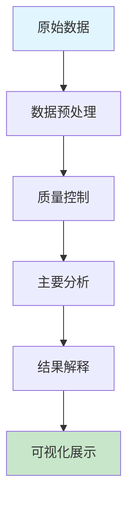

# 微生物基因组学课程 - 实践操作指南模板

<!-- 
模板使用说明：
1. 复制此模板到对应课程目录
2. 修改操作主题和具体内容
3. 确保所有命令和代码经过测试
4. 提供完整的操作步骤和预期结果
-->

---

# 实践操作：[具体操作主题名称]

**课程**：微生物基因组学  
**第X次课实践部分**  
**时长**：2小时  
**难度**：⭐⭐⭐☆☆

---

## 📋 操作概览

### 实践目标
本次实践操作旨在让学生：
- 🎯 **掌握** [具体技能1]
- 🎯 **理解** [具体概念1]  
- 🎯 **应用** [具体方法1]
- 🎯 **分析** [具体结果1]

### 知识前提
- ✅ 已完成第X次课理论学习
- ✅ 熟悉基本的[相关基础知识]
- ✅ 具备[必要技能]基础

### 预期成果
- 📊 生成[具体分析结果]
- 📈 完成[具体数据处理]
- 📝 撰写[具体报告内容]

---

## 🛠️ 环境准备

### 硬件要求
- **内存**：至少8GB RAM（推荐16GB）
- **存储**：至少10GB可用空间
- **处理器**：多核处理器（推荐4核以上）

### 软件环境

#### 必需软件
```bash
# 核心软件列表
- [软件名称1] (版本 >= X.X.X)
- [软件名称2] (版本 >= X.X.X)  
- [软件名称3] (版本 >= X.X.X)
```

#### 安装检查
```bash
# 验证软件安装
[软件名称1] --version
[软件名称2] --help
[软件名称3] -v

# 预期输出示例
# [软件名称1] version X.X.X
# [软件名称2] help information
# [软件名称3] vX.X.X
```

### 脚本文件准备

#### 脚本目录结构
```
第X次课-[课程主题]/
├── scripts/
│   ├── [主要分析脚本].py
│   ├── [数据处理脚本].py
│   ├── [可视化脚本].py
│   └── [辅助工具脚本].py
├── data/
├── results/
└── figures/
```

#### 脚本文件说明
| 脚本名称 | 功能描述 | 输入 | 输出 |
|----------|----------|------|------|
| [脚本1].py | [功能描述] | [输入文件] | [输出文件] |
| [脚本2].py | [功能描述] | [输入文件] | [输出文件] |

**💡 重要说明**
- 所有程序代码均保存在独立的脚本文件中
- 操作指南中只包含脚本调用命令和参数说明
- 学生可以查看和修改脚本文件进行深入学习

### 数据准备

#### 下载数据集
```bash
# 创建工作目录
mkdir -p ~/genomics_course/lesson[X]
cd ~/genomics_course/lesson[X]

# 下载示例数据
wget [数据下载链接1] -O [本地文件名1]
wget [数据下载链接2] -O [本地文件名2]

# 验证数据完整性
md5sum [本地文件名1]
# 预期MD5值：[具体MD5值]
```

#### 数据文件说明
| 文件名 | 类型 | 大小 | 描述 |
|--------|------|------|------|
| [文件名1] | [格式] | [大小] | [用途描述] |
| [文件名2] | [格式] | [大小] | [用途描述] |

---

## 📚 背景知识回顾

### 相关理论
- **[核心概念1]**：[简要解释]
- **[核心概念2]**：[简要解释]
- **[核心概念3]**：[简要解释]

### 分析流程概述


---

## 🔬 操作步骤

### 第一部分：数据预处理 (30分钟)

#### 步骤1.1：数据质量检查
```bash
# 检查数据文件格式
head -n 10 [输入文件名]

# 统计基本信息
wc -l [输入文件名]
grep -c ">" [输入文件名]  # 如果是FASTA格式

# 预期输出
# [具体预期结果描述]
```

**💡 操作提示**
- 注意观察[具体注意事项]
- 如果出现[异常情况]，请[处理方法]

#### 步骤1.2：运行数据处理脚本
```bash
# 运行主要分析脚本
python3 scripts/[主要分析脚本].py

# 检查脚本输出
ls -la results/

# 预期输出文件
# [输出文件1]: [文件描述]
# [输出文件2]: [文件描述]
```

**🔧 脚本参数说明**
- 脚本位置：`scripts/[主要分析脚本].py`
- 主要功能：[功能描述]
- 可调参数：查看脚本文件中的参数设置部分

**📊 结果检查**
- ✅ 输出文件大小合理（约[预期大小]）
- ✅ 格式正确无误
- ✅ 数据完整性保持

#### 步骤1.3：质量过滤
```bash
# 质量过滤参数设置
[过滤工具] \
  --input [输入文件] \
  --output [输出文件] \
  --quality-threshold [阈值] \
  --min-length [最小长度] \
  --threads [线程数]

# 查看过滤统计
cat [统计文件]
```

**🔍 参数说明**
- `--quality-threshold`：质量阈值，推荐值[具体数值]
- `--min-length`：最小序列长度，推荐值[具体数值]
- `--threads`：并行线程数，根据CPU核心数设置

---

### 第二部分：核心分析 (60分钟)

#### 步骤2.1：[主要分析步骤1]
```bash
# 运行分析脚本
python3 scripts/[分析脚本名称].py

# 查看运行日志（如果有）
tail -f [日志文件]
```

**⏱️ 预计运行时间**：15-20分钟

**🎛️ 脚本参数说明**
- 脚本文件：`scripts/[分析脚本名称].py`
- 关键参数：查看脚本文件开头的参数配置部分
- 自定义设置：可编辑脚本文件修改参数值

#### 步骤2.2：[主要分析步骤2]
```bash
# 进一步分析
[分析工具2] \
  --input [上一步输出] \
  --reference [参考文件] \
  --output [输出文件] \
  --format [输出格式]

# 检查输出结果
ls -la [输出目录]
head [主要结果文件]
```

**📈 结果文件说明**
- `[结果文件1]`：包含[具体内容]
- `[结果文件2]`：包含[具体内容]
- `[结果文件3]`：包含[具体内容]

#### 步骤2.3：结果整合
```bash
# 整合多个分析结果
[整合工具] \
  --input-dir [输入目录] \
  --output [整合结果文件] \
  --summary-stats

# 生成汇总报告
[报告工具] --input [整合结果文件] --output [报告文件]
```

---

### 第三部分：结果分析与可视化 (30分钟)

#### 步骤3.1：统计分析
```bash
# 基本统计
[统计工具] --input [结果文件] --stats basic

# 高级统计分析
[统计工具] --input [结果文件] --stats advanced --plot
```

**📊 关键统计指标**
- **[指标1]**：正常范围[数值范围]，意义[解释]
- **[指标2]**：正常范围[数值范围]，意义[解释]
- **[指标3]**：正常范围[数值范围]，意义[解释]

#### 步骤3.2：数据可视化
```bash
# 运行可视化脚本
python3 scripts/[可视化脚本].py

# 查看生成的图表
ls -la figures/
```

**🎨 可视化脚本说明**
- 脚本文件：`scripts/[可视化脚本].py`
- 图表类型：可在脚本中自定义图表样式和类型
- 输出格式：默认PNG格式，可修改为PDF或SVG

**🎨 可视化输出**
- `[图片1]`：展示[具体内容]
- `[图片2]`：展示[具体内容]
- `[图片3]`：展示[具体内容]

---

## 📊 结果解读

### 预期结果
完成所有操作后，您应该获得：

1. **[结果类型1]**
   - 文件位置：`[具体路径]`
   - 关键信息：[具体描述]
   - 正常范围：[数值范围]

2. **[结果类型2]**
   - 文件位置：`[具体路径]`
   - 关键信息：[具体描述]
   - 判断标准：[具体标准]

3. **[结果类型3]**
   - 文件位置：`[具体路径]`
   - 关键信息：[具体描述]
   - 生物学意义：[具体解释]

### 结果验证
```bash
# 验证结果完整性
ls -la [输出目录]
wc -l [关键结果文件]

# 检查结果质量
[质量检查工具] --input [结果文件] --report [质量报告]
```

### 生物学解释
- **[发现1]**：[生物学意义和解释]
- **[发现2]**：[生物学意义和解释]
- **[发现3]**：[生物学意义和解释]

---

## ❗ 常见问题与解决方案

### 问题1：[常见错误描述]
**症状**：[具体错误信息或现象]

**原因**：[可能的原因分析]

**解决方案**：
```bash
# 解决步骤
[解决命令1]
[解决命令2]

# 验证修复
[验证命令]
```

### 问题2：[性能问题]
**症状**：程序运行缓慢或内存不足

**解决方案**：
- 调整参数：`--threads [较小值]`
- 分批处理：`--batch-size [较小值]`
- 增加交换空间：`sudo swapon [交换文件]`

### 问题3：[数据问题]
**症状**：结果异常或不符合预期

**检查清单**：
- ✅ 输入数据格式正确
- ✅ 参数设置合理
- ✅ 软件版本兼容
- ✅ 参考数据库更新

---

## 🚀 扩展练习

### 基础扩展
1. **参数优化**：尝试不同的参数组合，比较结果差异
2. **数据比较**：使用不同的输入数据，观察结果变化
3. **方法对比**：尝试替代工具，比较分析效果

### 进阶挑战
1. **流程自动化**：编写脚本自动化整个分析流程
2. **批量处理**：处理多个样本数据
3. **结果整合**：整合多个样本的分析结果

### 创新探索
1. **新方法尝试**：查阅最新文献，尝试新的分析方法
2. **可视化改进**：创建更直观的数据可视化
3. **生物学应用**：结合具体生物学问题进行深入分析

---

## 📝 实践报告要求

### 报告结构
1. **实验目的**（200字）
2. **材料与方法**（300字）
3. **结果与分析**（500字）
4. **讨论与结论**（300字）
5. **参考文献**（至少5篇）

### 必须包含的内容
- [ ] 关键参数设置及理由
- [ ] 主要结果图表（至少3个）
- [ ] 结果的生物学解释
- [ ] 遇到的问题及解决方案
- [ ] 对方法的评价和改进建议

### 提交要求
- **格式**：PDF文件
- **命名**：`姓名_第X次课实践报告.pdf`
- **截止时间**：下次课前

---

## 📚 参考资料

### 核心文献
1. [作者]. [标题]. *[期刊]*. [年份]; [卷号]([期号]): [页码].
2. [作者]. [标题]. *[期刊]*. [年份]; [卷号]([期号]): [页码].
3. [作者]. [标题]. *[期刊]*. [年份]; [卷号]([期号]): [页码].

### 在线资源
- **官方文档**：[软件官方文档链接]
- **教程网站**：[相关教程网站]
- **数据库**：[相关数据库链接]

### 扩展阅读
- **综述文章**：[综述文章推荐]
- **方法比较**：[方法比较文章]
- **应用案例**：[应用案例文章]

---

## 💬 讨论与反馈

### 课堂讨论点
1. 不同参数设置对结果的影响
2. 该方法的优势和局限性
3. 在实际研究中的应用前景
4. 与其他方法的比较

### 反馈收集
- 操作难度评价：⭐⭐⭐☆☆
- 时间安排合理性：⭐⭐⭐⭐☆
- 内容实用性：⭐⭐⭐⭐⭐
- 改进建议：[具体建议]

---

## 📞 技术支持

### 紧急情况处理
如遇到无法解决的技术问题：
1. 记录错误信息和操作步骤
2. 联系老师或同学
3. 查阅官方文档和社区论坛
4. 必要时可申请延期提交

---

**版本信息**
- 创建日期：[日期]
- 最后更新：[日期]
- 版本号：v1.0.0
- 更新内容：初始版本

---

*本操作指南遵循开源协议，欢迎改进和分享*